## LEVEL 2


1. hint

   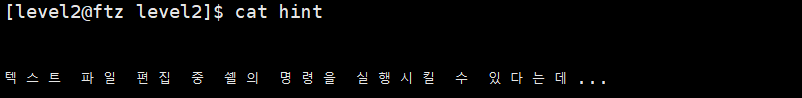

   

2. level 3의 권한을 가진 file 찾기

   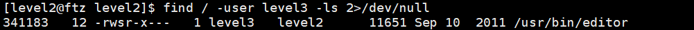

   - setuid bit가 설정되어 있으므로 (s) file을 실행할 때 file 소유자의 권한으로 실행됨

     > setuid bit를 실행 파일에 적용하면 RUID에서 실행 파일 소유자의 ID로 RUID가 변경됨

     

-----------------------------


#### 문제 분석


1. `editor` 파일을 level 2 권한으로 `tmp` 디렉터리에 복사

   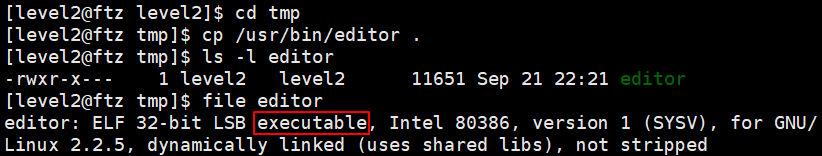


2. gdb 분석

   ```
   [level2@ftz tmp]$ gdb -q editor
   (gdb) disas main
   ```

​		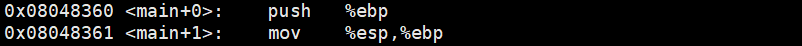

​	→ 함수의 시작 부분. 프롤로그


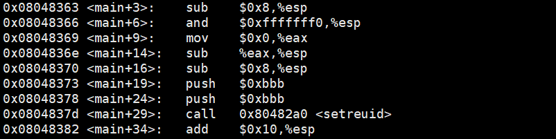

​	→ `and $0xfffffff0, %esp`   명령어로 esp의 주소 값의 맨 뒤 4 bit을 0으로, 즉 esp의 주소 값을 16의 배수로 맞춰준다

​	→ `shell` 명령어를 통해 0xbbb 확인

```
(gdb) shell python -c 'print 0xbbb'
3003
```

​	→ `setreuid` 명령어를 통해  RUID와 EUID를 각각 level3(3003)로 바꿔준다

​	⇒ `setreuid(3003, 3003);`


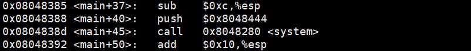

```
(gdb) x/s 0x8048444
0x8048444 <_IO_stdin_used+4>:	 "/bin/vi"
```

​	⇒ `system("/bin/vi");`


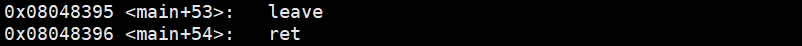

​	→ 함수의 끝 부분. 에필로그


----------------------


#### 의사 코드


```
#include <stdio.h>
#include <sys/types.h>
#include <unistd.h>

int main()
{
    setreuid(3003,3003);
    system("/bin/vi");

    return 0;
}
```


--------


#### 취약점 공략


1. 환경 변수 - PATH

   `echo $PATH`

   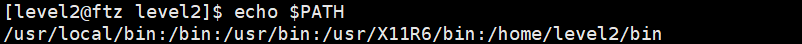

   - `/usr/bin` 이 환경 변수 PATH에 지정되어 있으므로 `/usr/bin`에 있는 `editor` file은 이름만으로 실행 가능

     

2. file (`editor`) 실행

   `editor`

   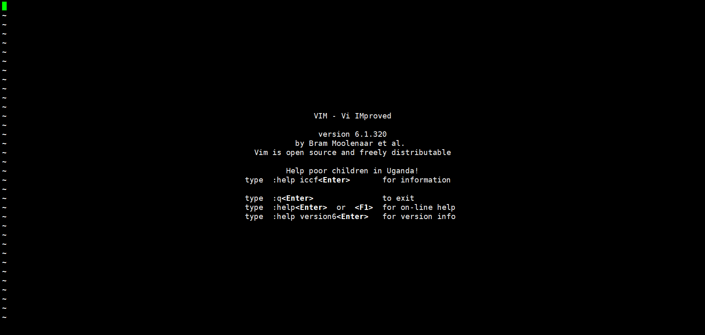


3. 첫번째 공격 방법 : `sh`
   - `:!`  : `vi`에서 외부 명령어를 실행하는 기능의 명령어

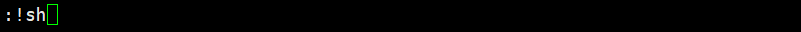

​	→ `editor` file에 sh` 로 level 3의 권한을 가진 shell을 생성하여 떼어낸다

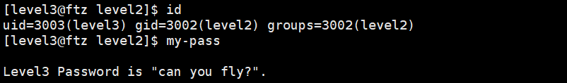

​	→ level 3의 권한으로 `my-pass` 명령어 실행 가능


4. 두번째 공격 방법 : `my-pass`

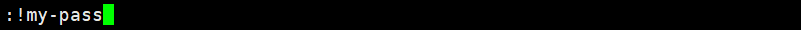

​	→ `editor` file에 setuid bit가 설정되어 있으므로, level 3의 권한으로 바로 `my-pass` 실행 가능

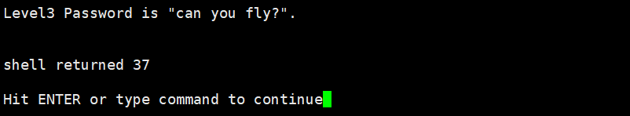

