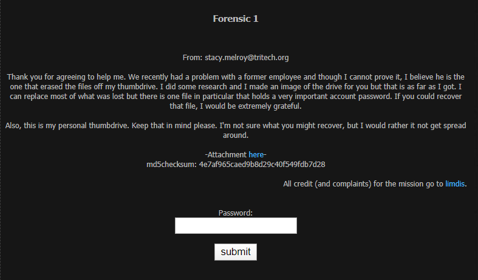
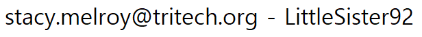
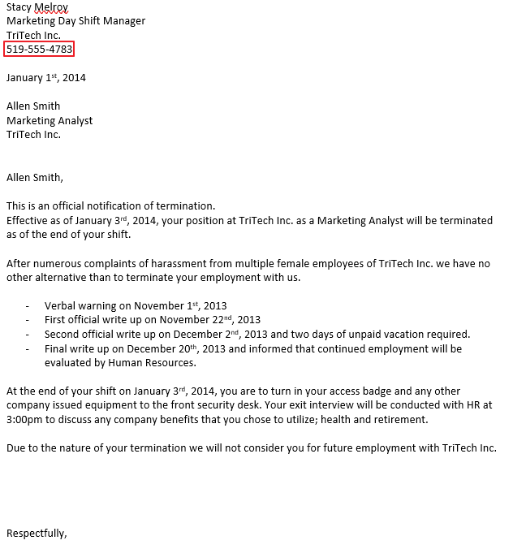
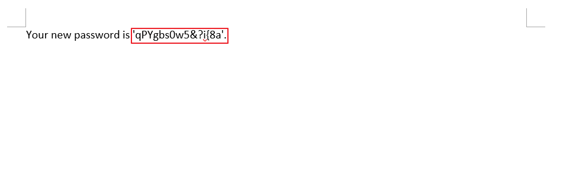

## Forensic 1 : First Time Go

<br>

1. 문제

   

<br>

2. 파일 다운로드

   

<br>

3. 파일 분석

   1) 파일 압축 해제

   <br>

   2) 휴지통에 있는 파일 복구

   <br>
   
   3) Trash-1000/expunged/2026288587/logins.txt 파일 분석
   
   ​		
   
   ​		⇒ Password : `LittleSister92` 
   
   ​			
   
   ​				⇒ 실패
   
   <br>
   
   4) Trash-1000/expunged/2026288587/Voicemail 1.wav 파일 분석
   
   ```
       ...    
       I sent you a new key over to you.    
       Use your phone number to access file.    
       ...
   ```
   
   → new key와 phone number가 들어있는 파일을 찾아야 함
   
   <br>
   
   5) Trash-1000/expunged/2026288587/Termination - Allen Smith.docx 파일 분석
   
   ​	
   
   ​		⇒ phone number 발견 : 519-555-4783
   
   <br>
   
   6) Trash-1000/expunged/2026288587/private/Your new password is.rar 파일 분석
   
   ​	→ new key, 즉 new password가 들어있을 듯한 파일 발견
   
   <br>
   
   
   
   ​										→ 암호가 걸려있음
   
   <br>
   
   → 발견한 phone number로 암호 해제
   
   ⇒ new key : `qPYgbs0w5&?i{8a`

