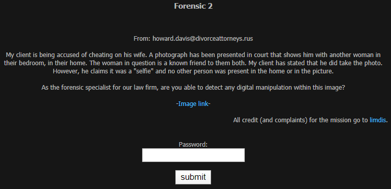
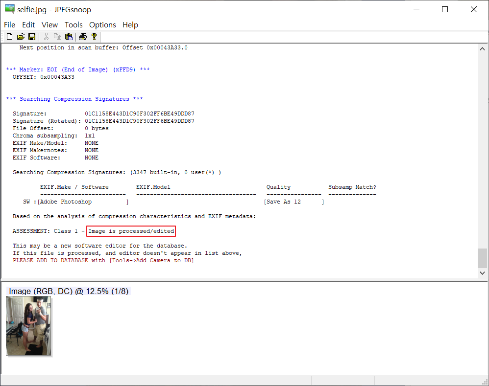
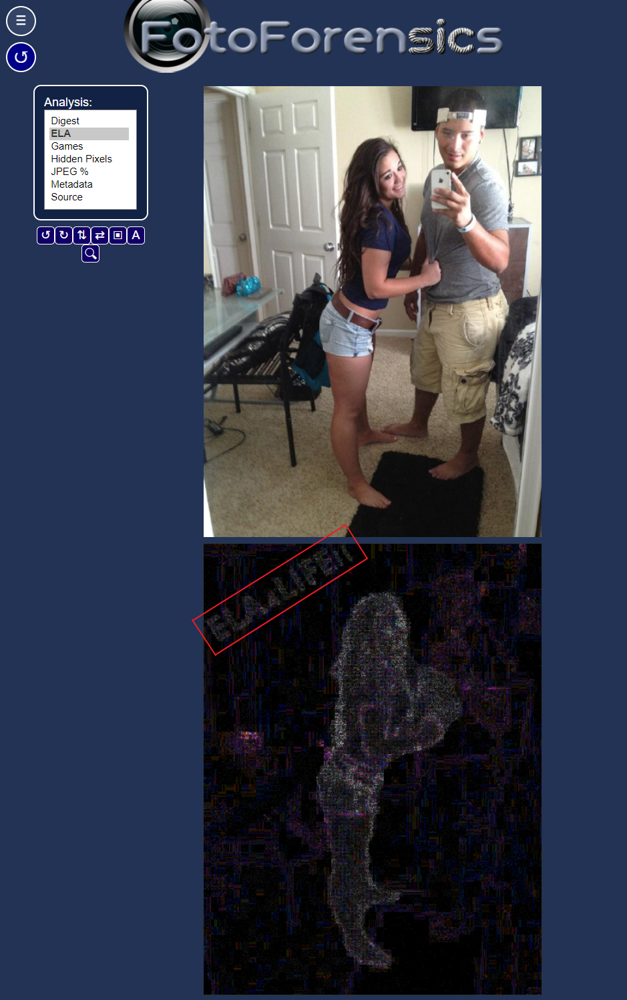

## Forensic 2 : Cheater

 

1. 문제

   

 

2. 파일 다운로드

   

   ​	→ selfie.jpg

 

3. 파일 분석

   - JPEGsnoop 이용

     

     → Image is processed/edited : 이미지 조작 확인

     - Abode Photoshop으로 조작
  - Save As 12 : Quality가 12로 저장되었음

 

4. ELA 분석

   - ELA (Error Level Analysis)

     - 이미지 내에서 서로 다른 압축 수준에 있는 영역을 식별할 수 있도록 하는 분석법

     - JPEG 이미지의 경우, 전체 사진의 압축 수준이 거의 같아야 함

       → 이미지의 섹션이 상당히 다른 오류 수준에 있으면 디지털 편집(조작)을 나타내는 것일 수 있음

    

   - fotoforensics.com 이용

     

     ​	→ 지갑과 여자의 모습이 조작되었음을 확인

     ​	⇒ Password : `ELA4LIFE!!`
