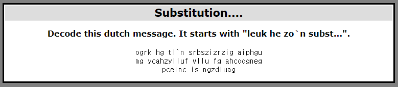

## Cryptography2 : Substitution....

1. 문제

   

 

2. Decoding

   - Python으로 Subtitution Cyper Decoding 알고리즘 구현

     [Substitution_1.py](https://github.com/Lee-YongHa/Forensic-Tool/blob/master/Substitution/Substitution_1.py)
   
     → ogrk hg tl`n srbszizrzig aiphgu mg ycahzylluf vllu fg ahcoogneg pceinc is ngzdluag
   
     → LEUK HE ZO`N SUBSTITUTIE CIPHER mE WACHTWOORD vOOR DE CHALLENGE PAGINA IS NETFORCE
   
     	- 확실한 문자는 대문자로 표시
   
     ⇒ Password : `netforce`

