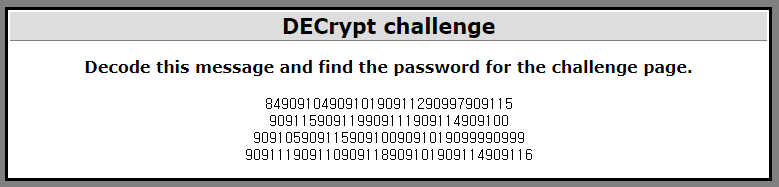
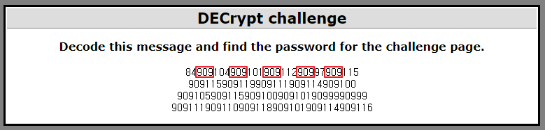

## Cryptography8 : DECrypt challenge

1. 문제

   

   → DEC : Decimal(10진수) 사용 추측

 

2. Decoding

   1) 문자 나누기

   

   → 모든 줄에서 '909'가 반복되어 나타남

   	- 공백으로 추측

   ⇒ 84 104 101 112 97 115 115 119 111 114 100 105 115 100 101 99 99 111 110 118 101 114 116

    

   2) ASCII 변환

   ​	→ The password is decconvert

   ​	⇒ Password : `decconvert`
