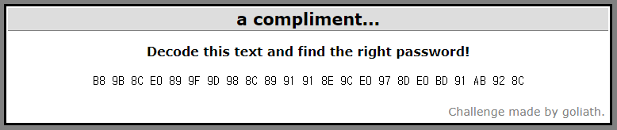

## Cryptography9 : A compliment...

1. 문제

   
   
   → compliment : complement(보수)로 추측

 

2. 2's complement Decoding

   - Python으로 2's complement Decoding 알고리즘 구현
   
     [Complement_1.py](https://github.com/Lee-YongHa/Forensic-Tool/blob/master/Complement/Complement_1.py)
   
     → B8 9B 8C E0 89 9F 9D 98 8C 89 91 91 8E 9C E0 97 8D E0 BD 91 AB 92 8C
   
     → Het wachtwoord is CoUnt
   
     	- 네덜란드어
   
     → the password is CoUnt
   
   ​	⇒ Password : `CoUnt`
