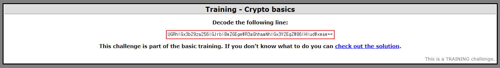
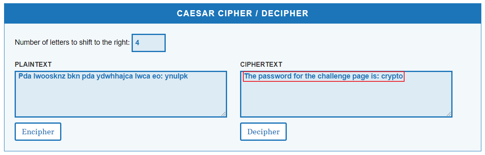

## Cryptography1 : Training - Crypto basics.

1. 문제

   

   → `==` 있는 거 보니 Base64 암호로 추측

 

2. Base64 Decoding

   

   → 대문자, 소문자가 있는걸 보니 Caesar cipher로 추측

 

3. Caesar cipher Decoding

   

   ⇒ Password : `crypto`