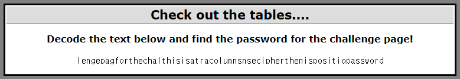

## Cryptography5 : Check out the tables....

1. 문제

   → 부분적으로 완성된 단어들이 보임

   ⇒ transposition cipher(전치 암호) 추측

 

2. Transposition Cipher(전치 암호) Decoding

   - Transposition Cipher : 글자들의 순서를 변경하여 암호화

   1) 문자열 자르기
   
    - 완성된 단어 기준으로 문자열 자르기
      	- lengepag
         	- for
      	- the
      	- chal
      	- this
      	- is
      	- a
      	- tra
      	- columns
      	- nse
      	- cipher
      	- then
      	- is
      	- positio
      	- password
   
    
   
   2) 임의로 글자 재배열
   
   - this (1)
   
   - is (2)
   
   - a (3)
   
   - tra (4)
   
     - transposition cipher로 예상
   
   - nse 
   
     - 분리
   
       - ns (5)
   
       - e (15)
   
   - positio (6)
   - then
     - 분리
       - the (9)
       - n (7)
   - cipher (8)
   - password (10)
   - for (11)
   - chal (12)
     - challenge로 예상
   - lengepag
     - 분리
       - lenge (13)
       - pag (14)
   - is (16)
   - columns (17)
   
   → this is a transposition cipher the password for challenge page is columns
   
   ⇒ Password : `columns`