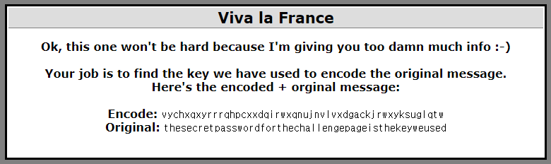
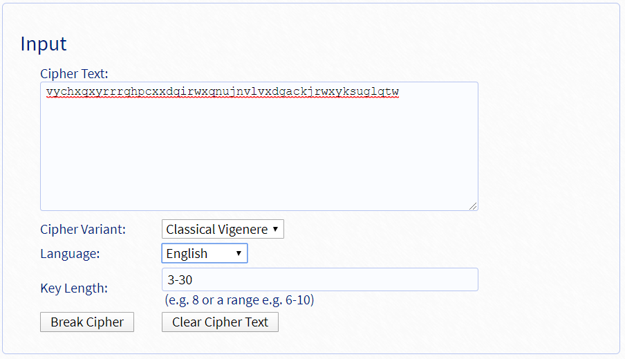
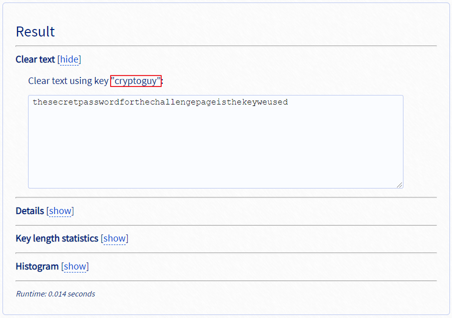

## Cryptography6 : Viva la France

1. 문제

   

   → France

   → key를 찾아야 함
   
   ⇒ Vigenere Cipher 추측

 

2. Decoding

   - https://www.guballa.de/vigenere-solver 이용

     

     → Input 값 설정

      

     

     ⇒ Password : `cryptoguy`