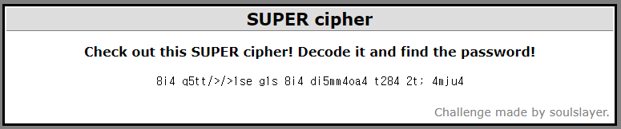

## Cryptography7 : SUPER cipher

1. 문제

   

   → 이전까지의 Decoding 결과를 참고하면 `the password ~ thd challenge ~ `의 형태일 거라고 추측

 

2. Decoding

   - 8i4 q5tt/>/>1se → THE PASSWORD

   - di5mm4oa4 → CHALLENGE

     → 규칙 1 : 숫자들은 각각 (숫자 - 1)의 leetspeak를 반영하고 있음

     	- t의 leetspeak : 7
     	- e's leetspeak = 3
     	- a's leetspeak = 4
     	- o's leetspeak = 0

     → 규칙 2 : 알파벳들은 각각 바로 전 차례의 알파벳을 의미

     	- i → h
     	- q → p
     	- t → s
     	- s → r
     	- e → d

     ⇒ 규칙 1과 규칙 2 적용 :  `the pass*ord for the challen*e site is; elite`

 

3.  추가 Decoding

   - `elite`가 password가 아님

     → 암호화 과정에서 leetspeak이 사용되었으므로 이를 반영해서 추가 Decoding 시도

     ⇒ Password : `3lit3`