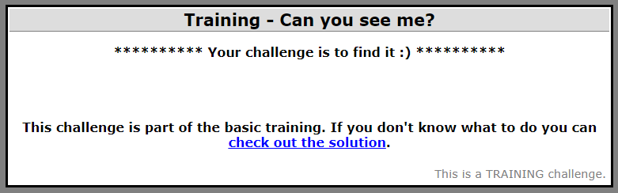
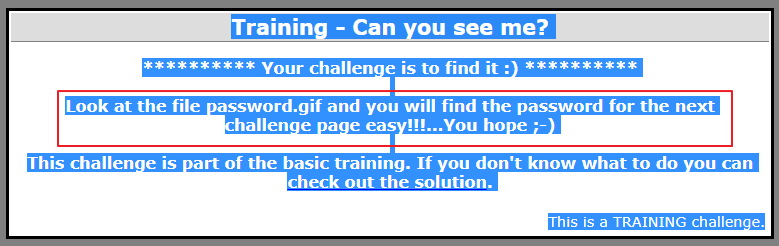
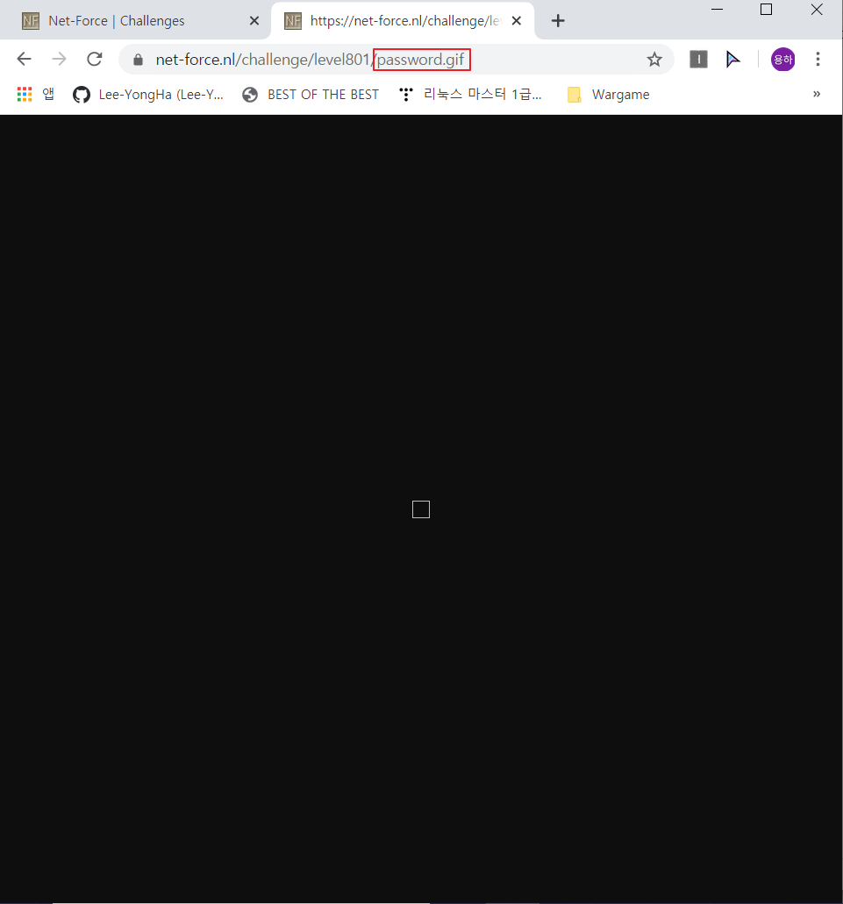
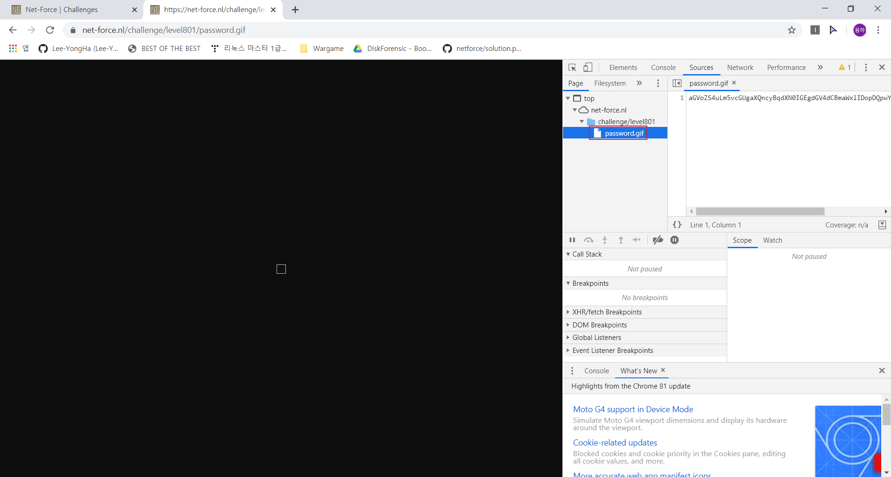
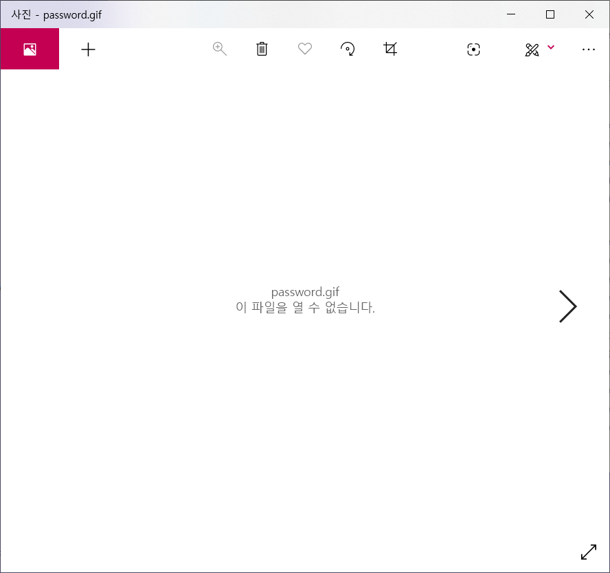
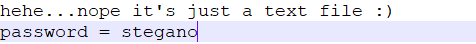

## Steganography1 : Can you see me?

1. 문제

   
   
   → 가운데 빈 공간 의심
   
    
   
   
   
   → 숨겨진 메시지 존재

 

2. password.gif 파일 찾기

   
   
   → 가운데 부분에 이미지가 존재하는 것 같지만, 깨져 보임
   
    
   
   
   
   → 파일 다운로드

 

3. password.gif 파일 분석

   

   → 이미지가 열리지 않음

    

   

   → 텍스트 뷰어로 파일을 열어보니 패스워드 존재

   ​	⇒ Password : `stegano`

