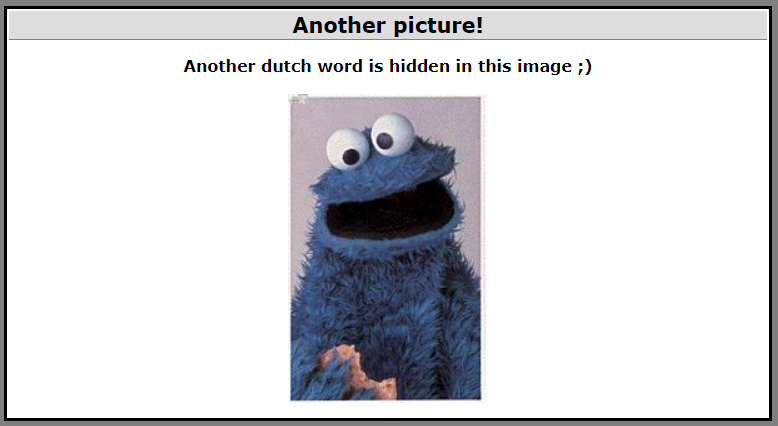
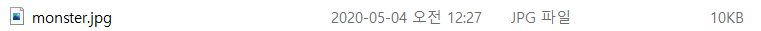
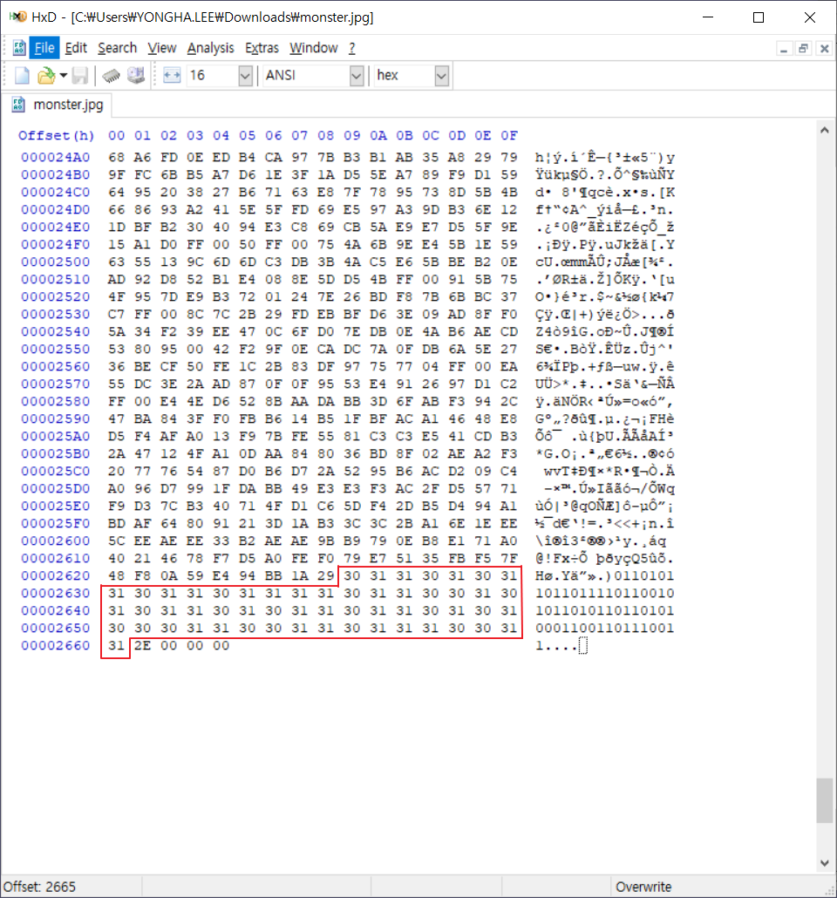
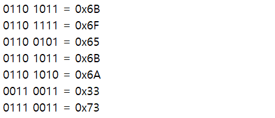
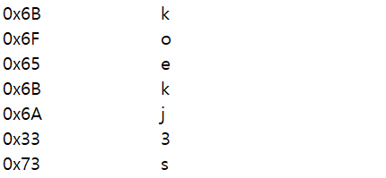

## Steganography3 : Another picture!

1. 문제

   

 

2. 파일 다운로드

   

 

3. 파일 분석

   

   → 수상한 16진수 숫자열 발견

   → 16진수 숫자열이 아스키 코드로 변환되어 있음 (0x30 : 0, 0x31 : 1)

   ⇒ 2진수 숫자열

    

4. 2진수 숫자열 해석

   1) 8bit씩 나누기

   ​	

    

   2) 아스키 코드로 변환

   ​	

   ​	⇒ Password : `koekj3s`

