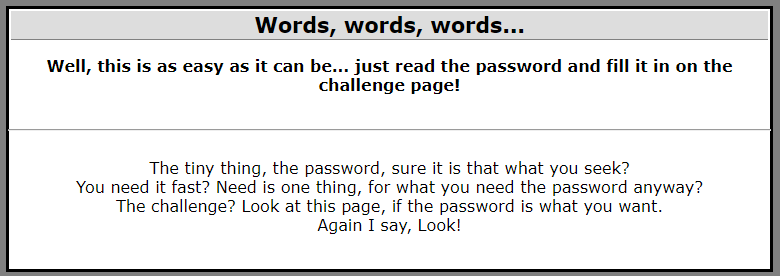
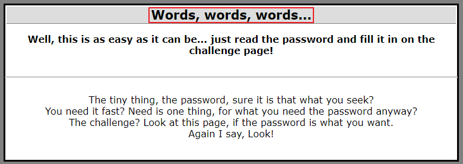
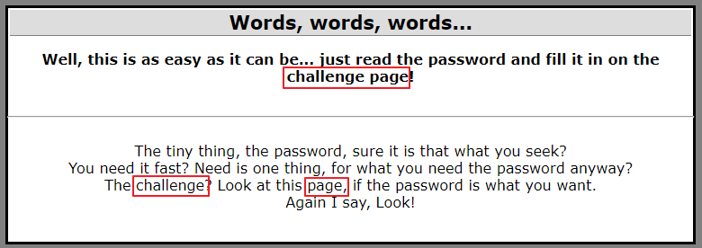
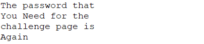

## Steganography4 : Words, words, words...

1. 문제

   

 

2. Hint 분석

   

   → 단어 3개와 관련이 있을 것으로 추측

    

   

   → 문제에 challenge page란 단어가 등장

   → 본문에도 challenge, page 단어가 각각 등장하고, 그 사이에 3개의 단어 존재

   ⇒ 3개의 단어씩 반복해서 지워나가는 식으로 해석

 

3. 본문 분석

   

​	⇒ Password : `Again`

