## Puzzle #1: Ann's Bad AIM

From : http://forensicscontest.com/2009/09/25/puzzle-1-anns-bad-aim

 

1. 문제

   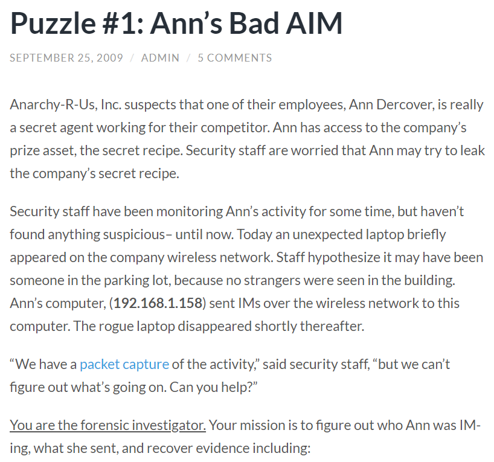
   
   ​	→ IM : Instant Message
   
   ​	⇒ TCP 분석

 

2. 파일 다운로드

   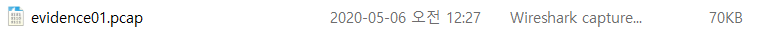

   ​	→ PCAP : Wireshark, TcpDump/WinDump, snort 등 많은 네트워크 툴에서 캡쳐된 네트워크 데이터 저장

 

--------------

 

#### 1. What is the name of Ann's IM buddy?

 

1. 파일 분석

   - Wireshark 이용

   1) TCP stream 분석

   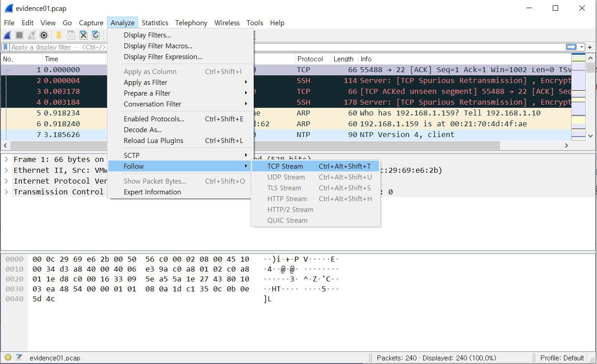

   → Analyze - Follow - TCP stream

    

   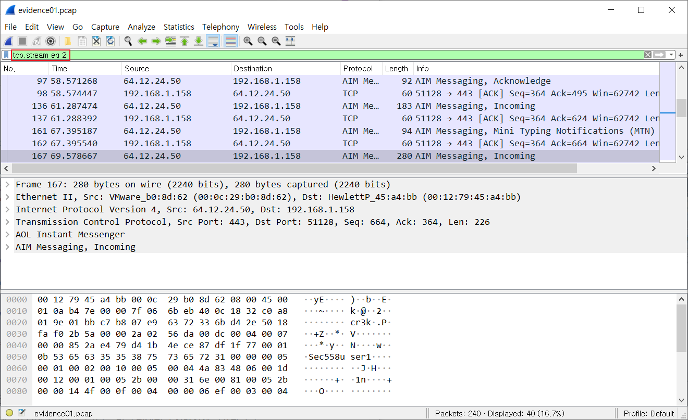

   → 숫자를 하나씩 올려가며 메시지 확인

    

   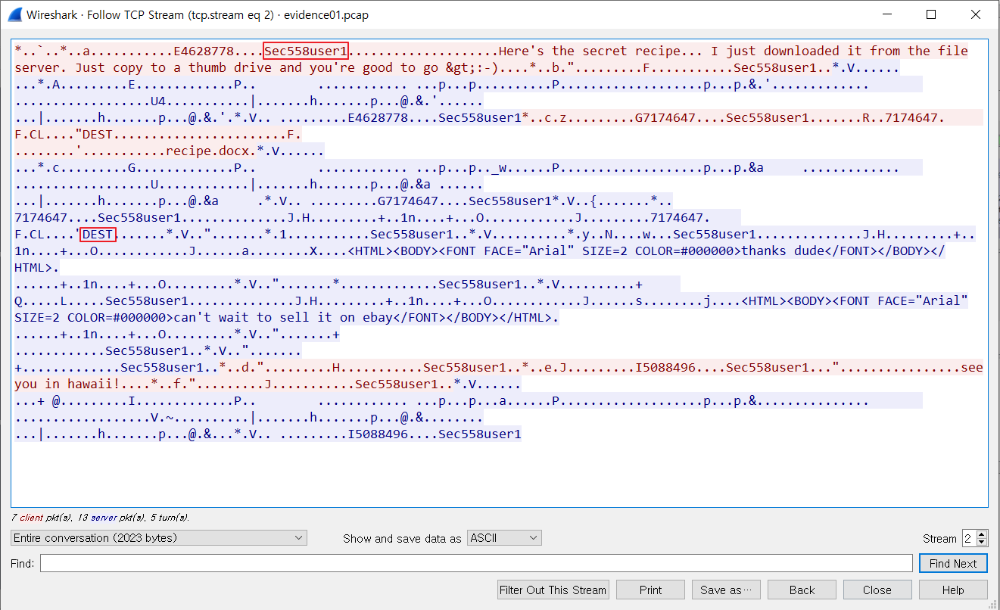

   → 2번 stream에서 이름이 등장

   → `Sec558user1`이 자주 등장하고, `DEST`는 destination을 의미하는 것으로 추측

   ⇒ `Sec58user1`이 수신자일 것으로 추측

    

   2) AIM 메시지 확인

   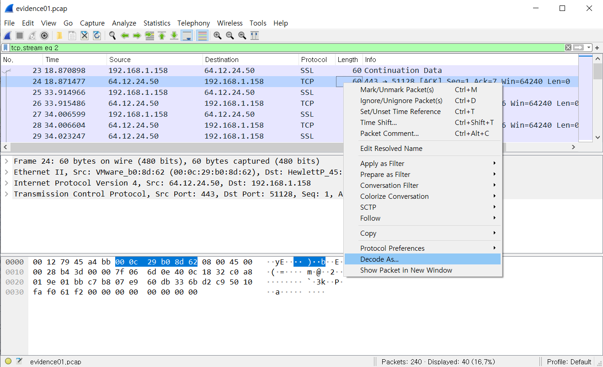

   → 대화 내용 중 하나 선택

   → Decode As

    

   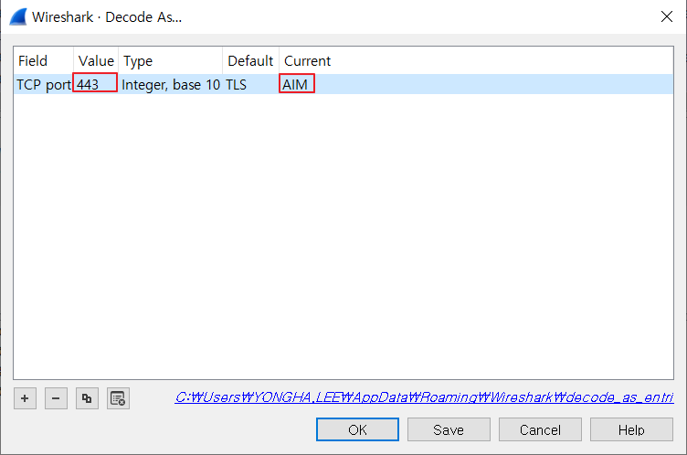

   → Tcp port 443 확인

   → AIM 메시지로 decode

    

   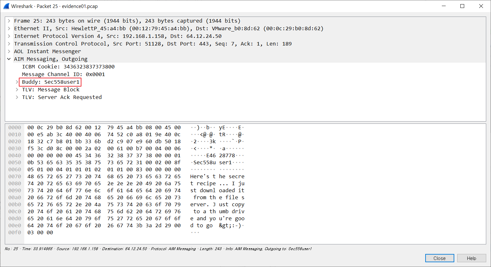

   ⇒ Buddy : `Sec558user1`

 

----------

 

#### 2. What was the first comment in the captured IM conversation?

 

1. 파일 분석

   1) 첫번째 방법 : TCP stream

   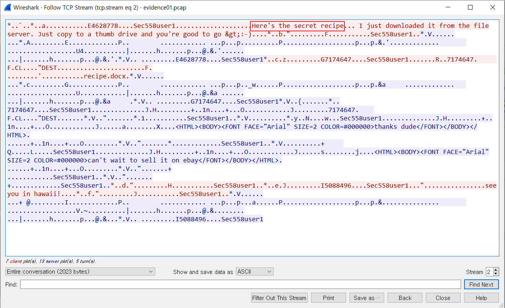

   ⇒ First comment : `Here's the secret recipe`

    

   2) 두번째 방법 : aim.buddyname 필터링

   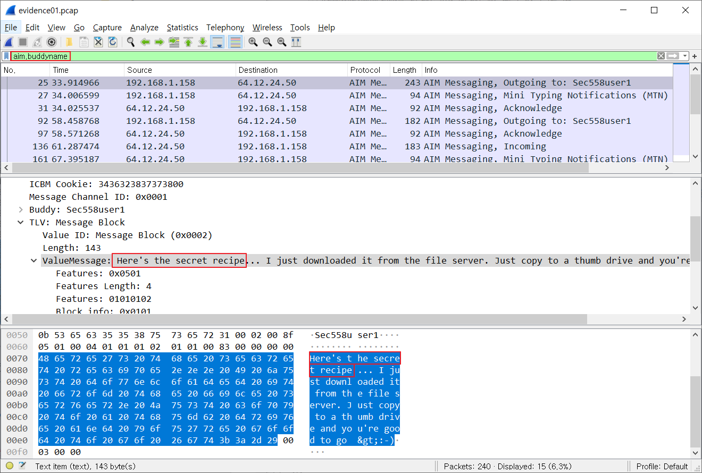

   ⇒ First comment : `Here's the secret recipe`

 

----------

 

#### 3. What is the name of the file Ann transferred?

 

1. 파일 분석

   1) 첫번째 방법 : TCP stream

   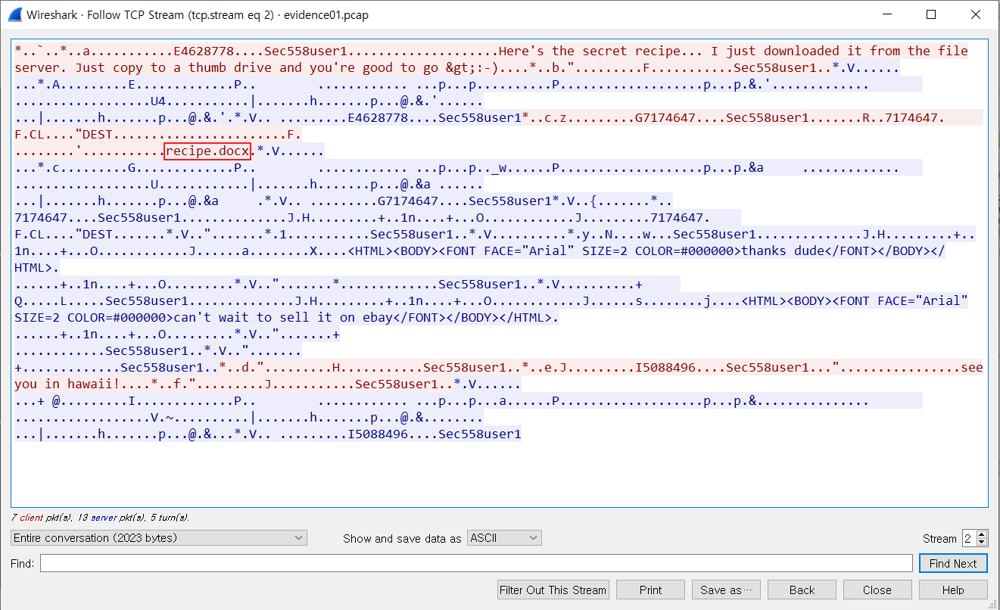

   ⇒ File name : `recipe.docx`

    

   2) 두번째 방법 : aim.buddyname 필터링

   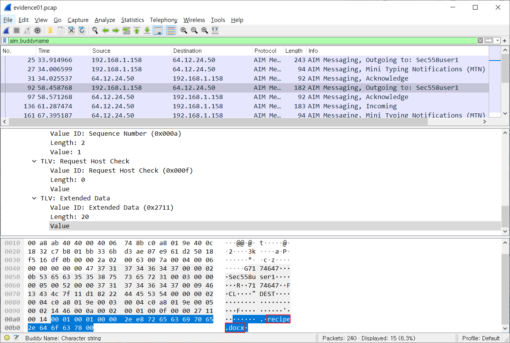

   ⇒ File name : `recipe.docx`

 

----------

 

#### 4. What is the magic number of the file you want to extract (first your bytes)?

 

1. 파일 분석

   1) TCP stream

   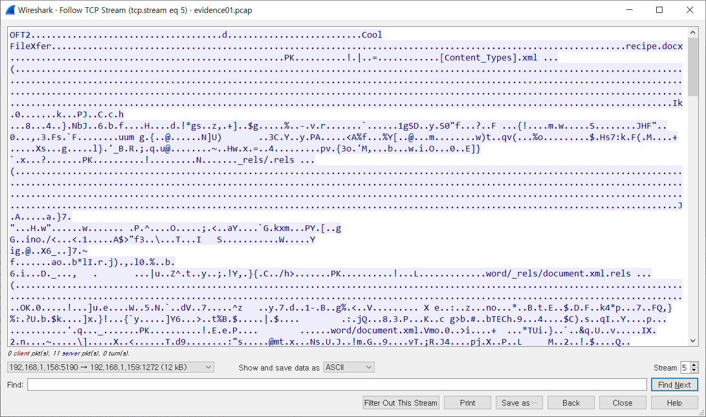

   → 5번 stream에 recipe.docx 등장

    

   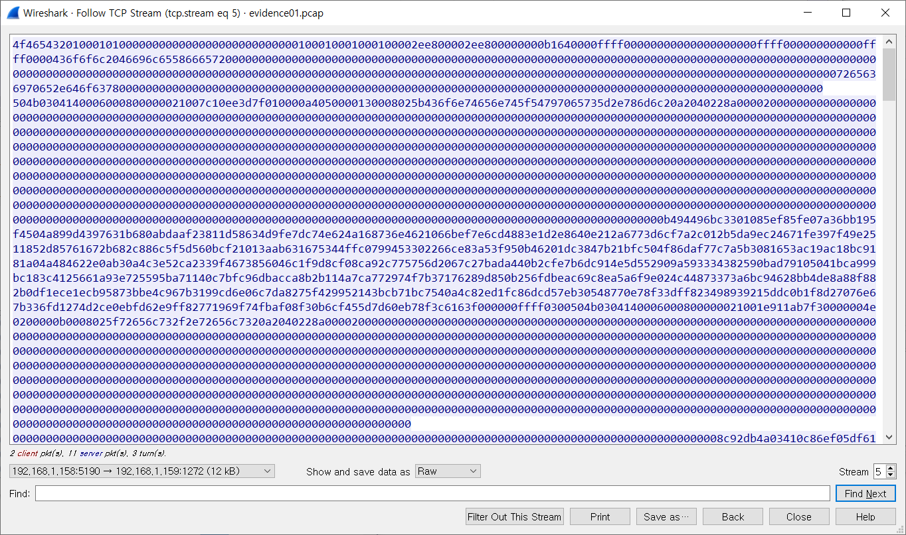

   → 5번 stream의 recipe.docx 부분을 Raw로 Save as

    

   2) 5번 stream 분석

   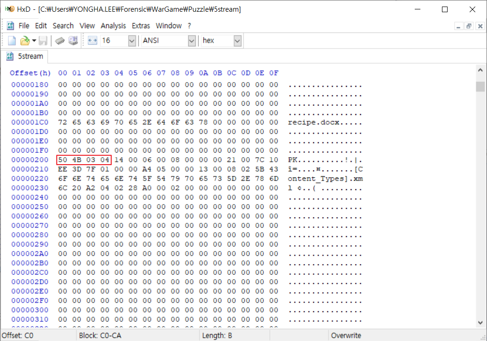

   → File Magic Number = File Signature

   → DOCX 파일의 signature : [50 4B 03 04]

   ⇒ Magic number : `50 4B 03 04`

 

------

 

#### 5. What was the MD5sum of the file?

 

1. recipe.docx 파일 생성

   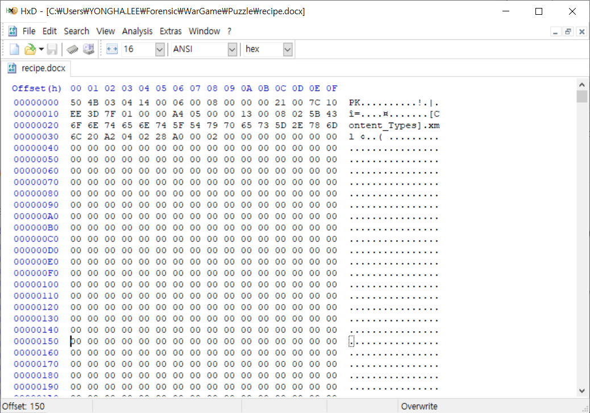

 

2. MD5sum 계산

   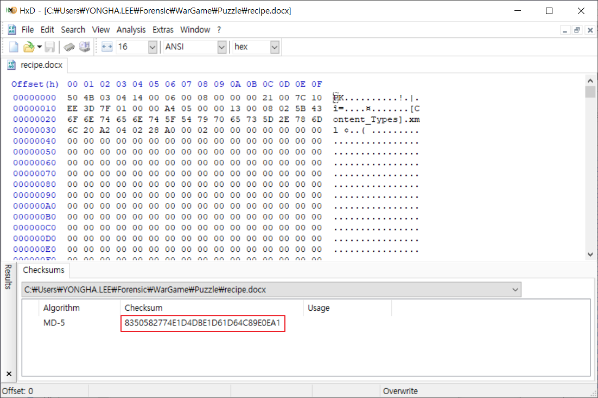

   → Analysis - Checksums - MD-5

   ⇒ MD5sum : `8350582774E1D4DBE1D61D64C89E0EA1`

 

----------

 

#### 6. What is the secret recipe?

 

1. recipe.docx 파일 확인

   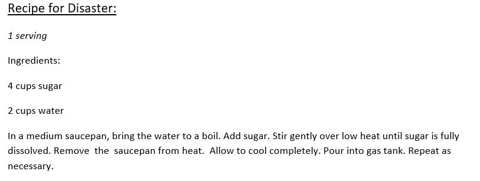