## Puzzle #2: Ann Skips Bail

From : http://forensicscontest.com/2009/10/10/puzzle-2-ann-skips-bail

 

1. 문제

   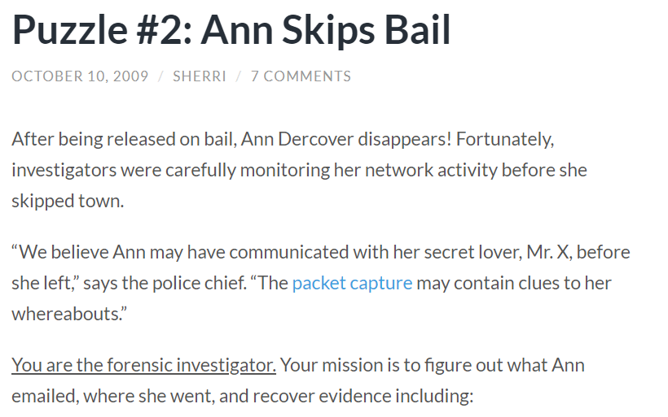
   
   ​	→ email
   
   ​	⇒ SMTP 분석

 

2. 파일 다운로드

   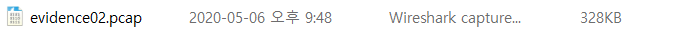

 

--------------

 

#### 1. What is Ann’s email address?

 

1. 파일 분석

   1) 첫번째 방법 : smtp 필터링

   

   → Ann이 로그인했으므로 Ann이 발신인

   ⇒ Ann's email address : `sneakyg33@aol.com`
   
    
   
   2) 두번째 방법 : 메일 복구
   
   - Windows Live Mail 이용
   
   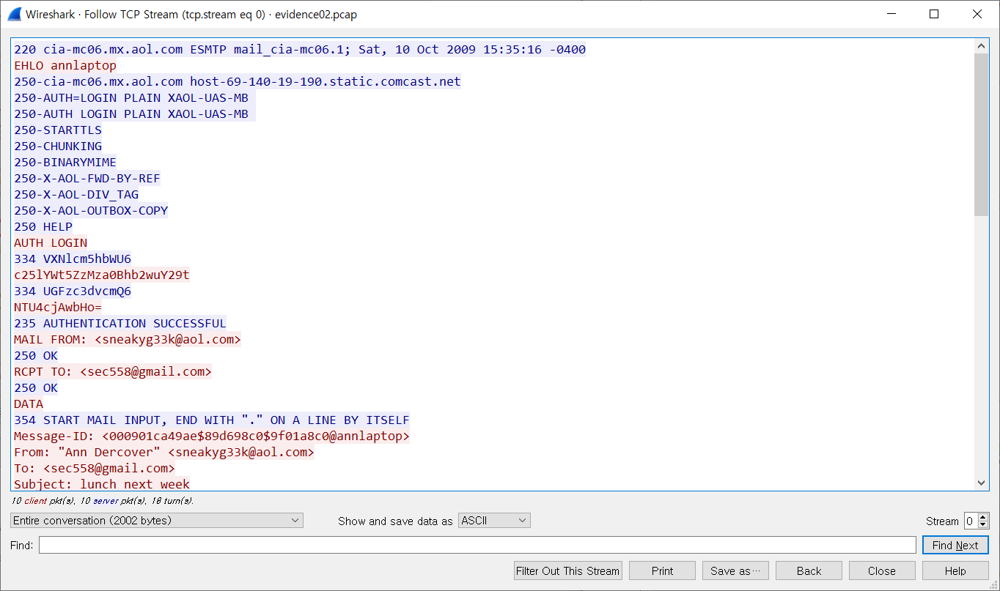
   
   → TCP Stream : 0번 stream
   
    
   
   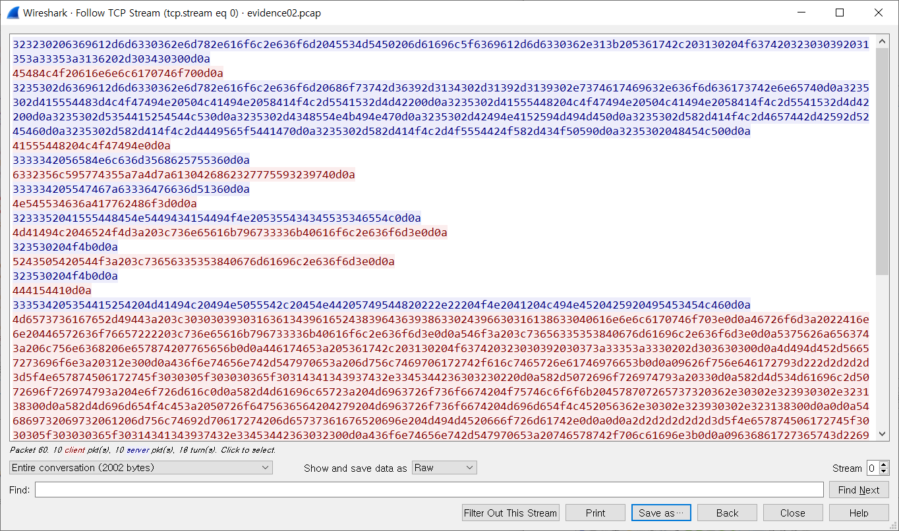
   
   → Raw 데이터 
   
   → mail을 원본형식 그대로 저장한 확장자인 EML 파일로 저장
   
    
   
   
   
    
   
   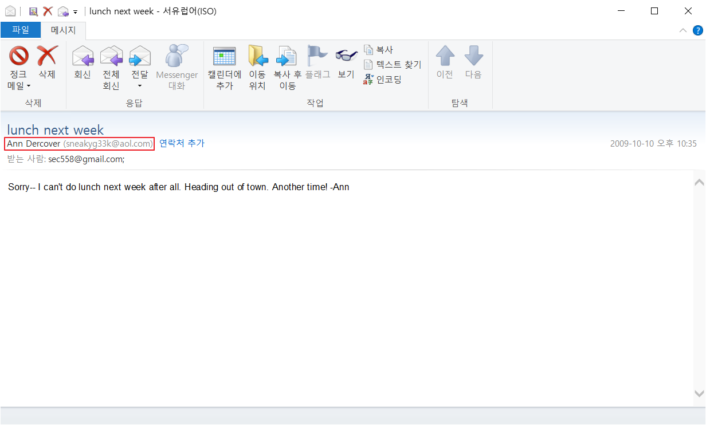
   
   ⇒ Ann's email address : `sneakyg33@aol.com`

 

----------

 

#### 2. What is Ann’s email password?

 

1. 파일 분석

   1) smtp 필터링

   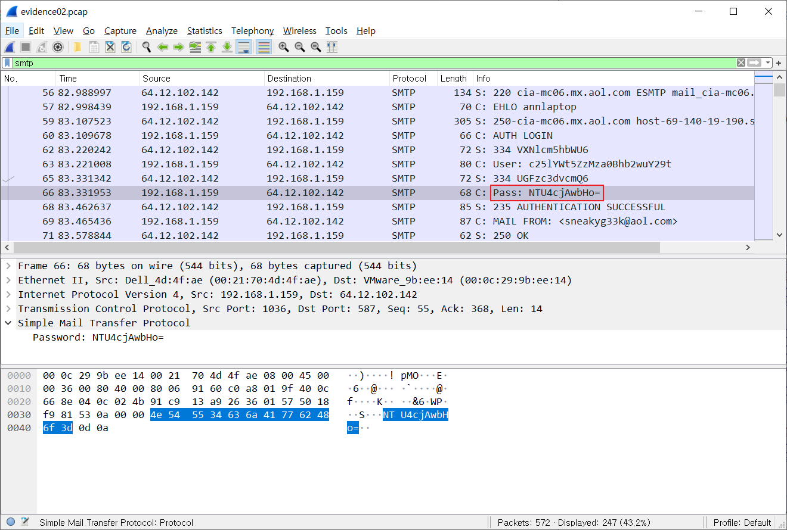

   → Password : NTU4cjAwbHo=

   → Base64 Encoding 추측

    

   2) Base64 Decoding

   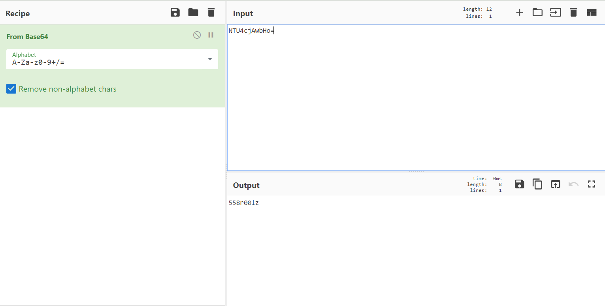

   ⇒ Password : `558r001z`

 

----------

 

#### 3. What is Ann’s secret lover’s email address?

 

1. 파일 분석

   1) 메일 복구

   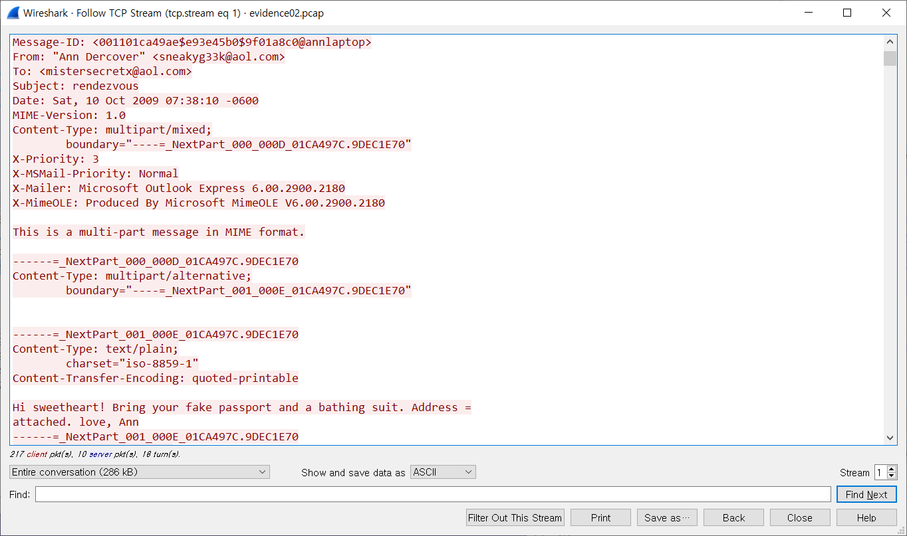

   → TCP Stream : 1번 stream에서 또 하나의 mail 발견

   → Raw 데이터를 EML 파일로 저장

    

   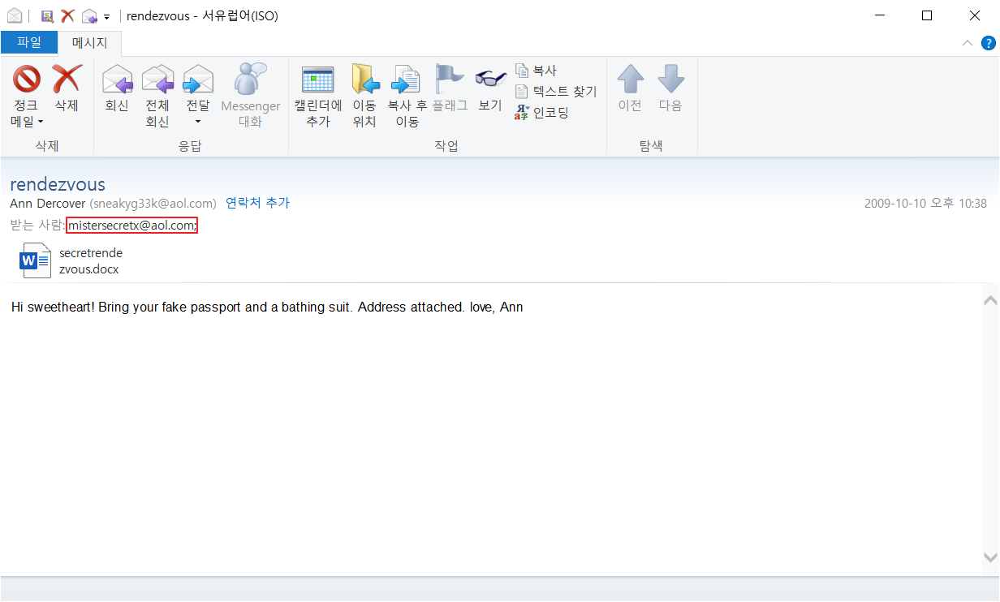

   → sweetheart, love : 이전의 mail보다 친근해 보임
   
   → secret lover에게 보내는 mail로 추측
   
   ⇒ Ann’s secret lover’s email address : `mistersecretx@aol.com`

 

----------

 

#### 4. What two items did Ann tell her secret lover to bring?

 

1. 메일 분석

   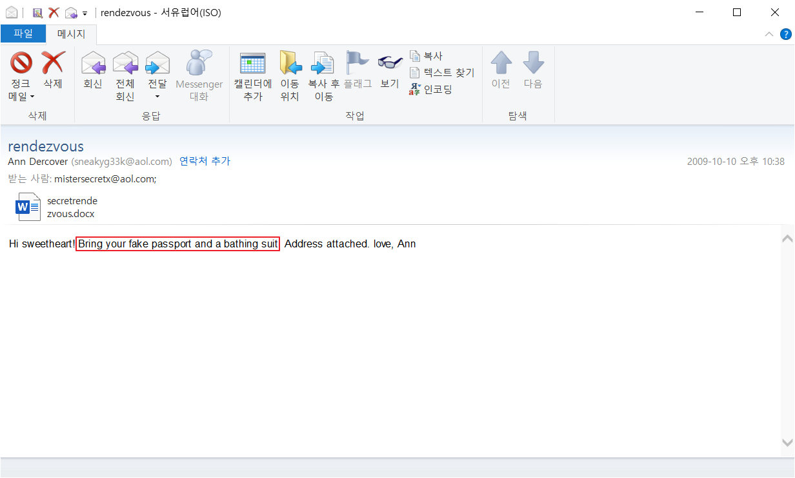

   ⇒ Two items : `fake passport, bathing suit`

 

------

 

#### 5. What is the NAME of the attachment Ann sent to her secret lover?

 

1. 메일 분석

   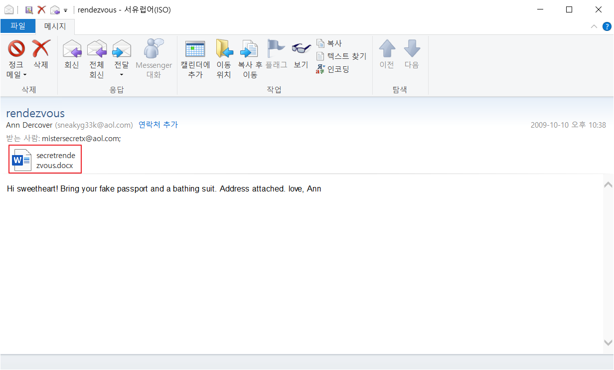
   
   ⇒ Attachment name : `secretrendezvous.docx`

 

----------

 

#### 6. What is the MD5sum of the attachment Ann sent to her secret lover?

 

1. 메일 분석

   1) 첨부파일 저장
   
   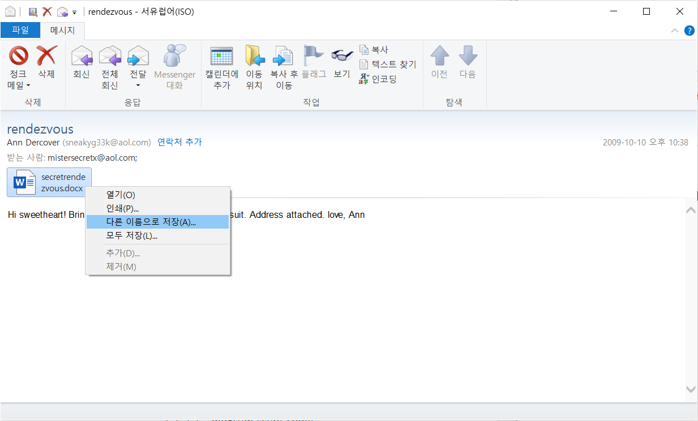
   
    
   
   
   
    
   
   2) 첨부파일 분석
   
   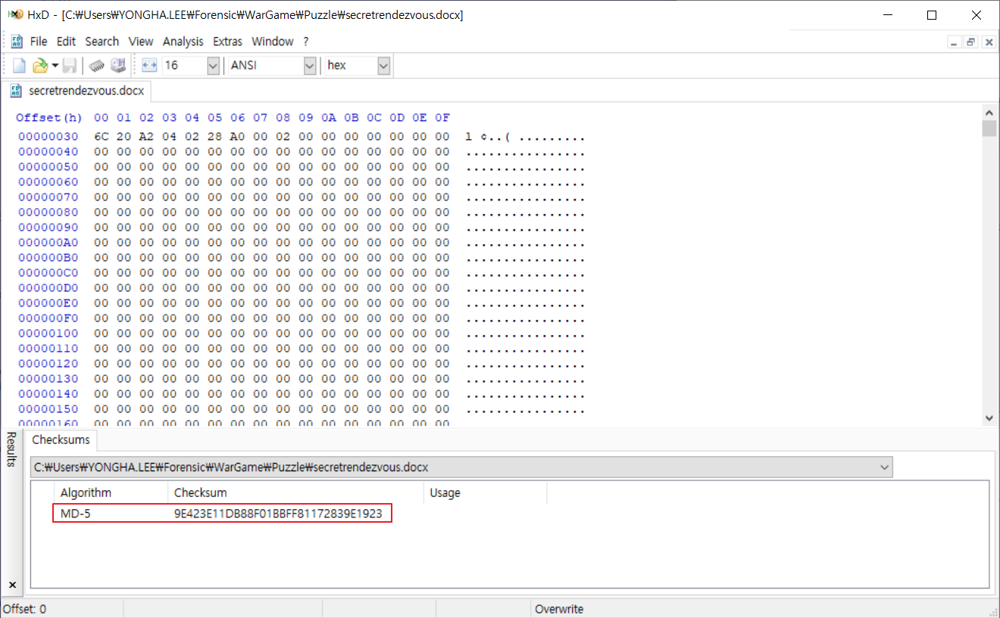
   
   ⇒ MD5sum : `9E423E11DB88F01BBFF81172839E1923`

 

--------

 

#### 7. In what CITY and COUNTRY is their rendez-vous point?

1. 첨부파일 분석

   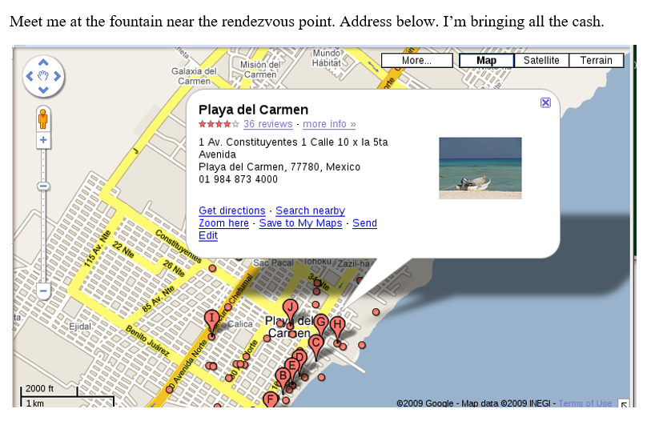

   ⇒ City, Country : `Playa del Carmen, Mexico`

 

------

 

#### 8. What is the MD5sum of the image embedded in the document?

 

1. 첨부파일 분석

   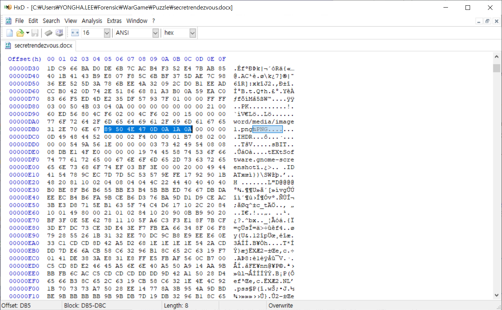

   → PNG의 Header, Footer signature 발견

   	- [89 50 4E 47 0D 0A 1A 0A] ~ [49 45 4E 44 AE 42 60 82]
   
   → PNG 영역을 분리해 PNG 파일로 저장
   
    
   
   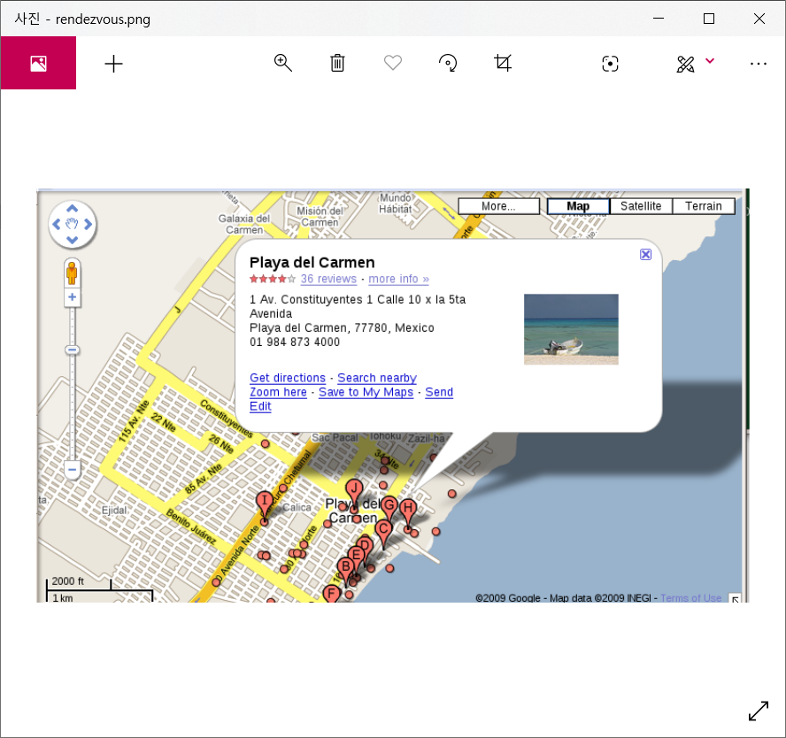

 

2. PNG 파일 분석

   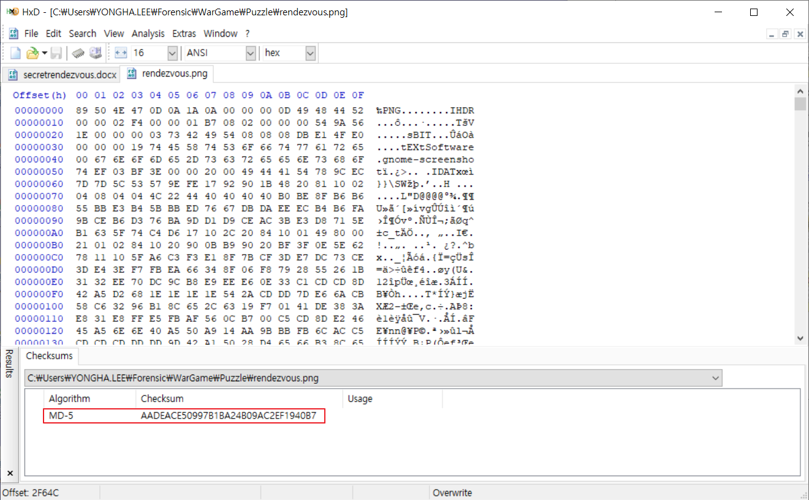

   ⇒ MD5sum : `AADEACE50997B1BA24B09AC2EF1940B7`