## Puzzle #3: Ann's AppleTV

From : http://forensicscontest.com/2009/12/28/anns-appletv

 

1. 문제

   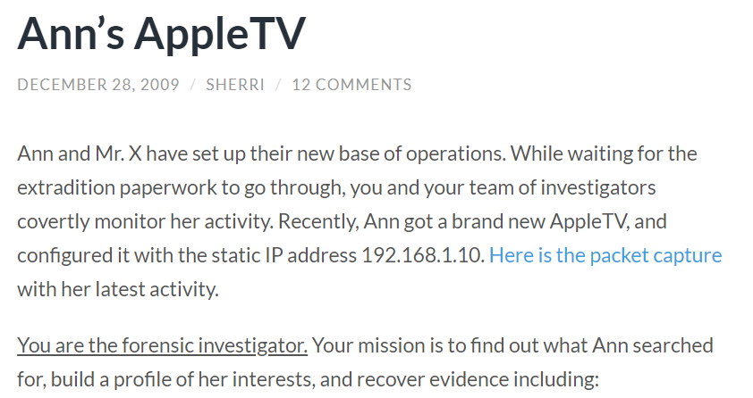
   
   ​	→ 고정 IP : 192.168.1.10

 

2. 파일 다운로드

   

 

--------------

 

#### 1. What is the MAC address of Ann’s AppleTV?

 

1. 파일 분석

   - Wireshark 이용

   1) ip.addr 필터링

   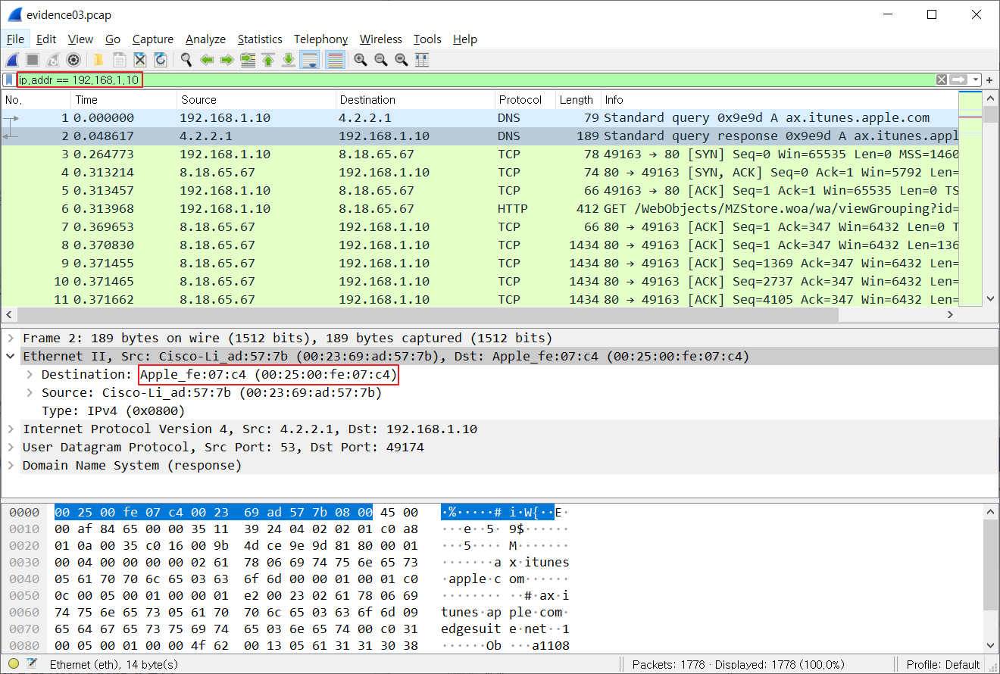

   ⇒ MAC address : `00:25:00:fe:07:c41`

 

----------

 

#### 2. What User-Agent string did Ann’s AppleTV use in HTTP requests?

 

1. User-Agent
- 사용자를 대신해서 인터넷에 접속하는 소프트웨어
   - 인터넷에 접속할 때 사용자에 관한 정보 전송
  - 브라우저, OS(운영체제) 등

 

2. 파일 분석

   1) HTTP stream

   

   ⇒ User-Agent : `AppleTV/2.4`

 

----------

 

#### 3. What were Ann’s first four search terms on the AppleTV (all incremental searches count)?

 

1. 파일 분석

   1) 첫번째 방법 : File - Export Objects - HTTP

   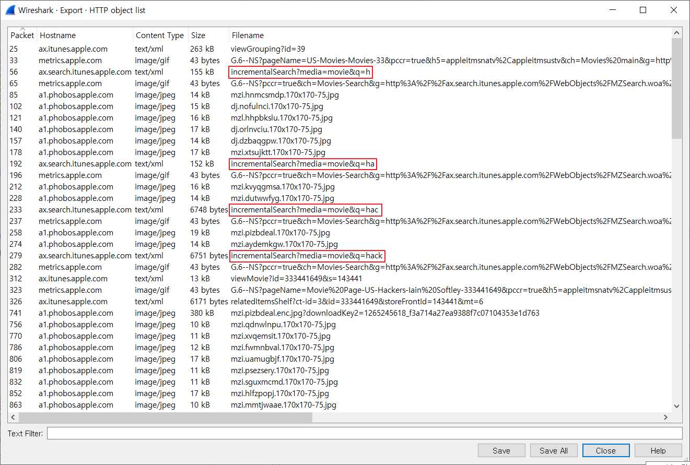

   ⇒ First four search terms : `h, ha, hac, hack`

    

   2) 두번째 방법 : String 검색

   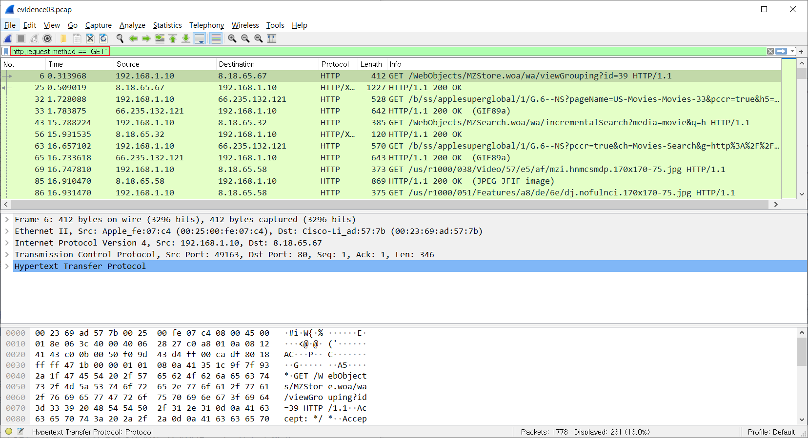

   → http.request.method == "GET"
   
   	- http 요청 방식이 GET인 것
   
    
   
   
   
   → http.request.method == "POST"는 존재하지 않음
   
    
   
   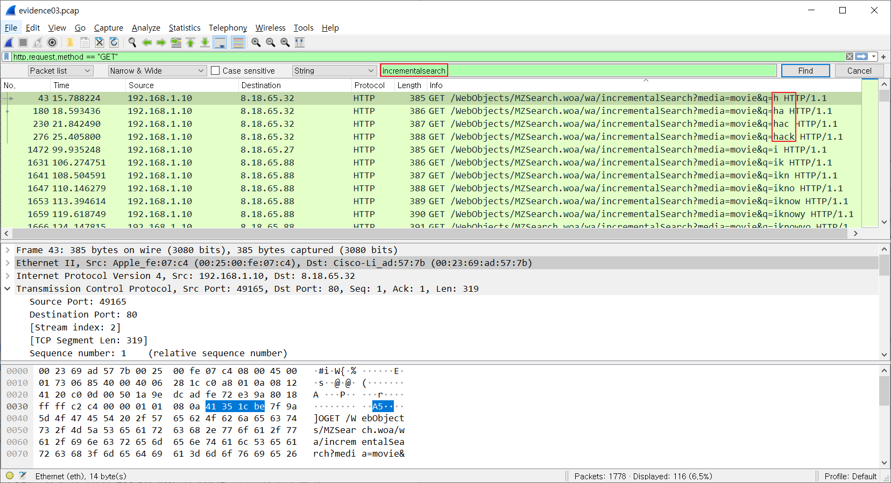
   
   → http.request.method == "GET" 필터링 상태에서 string 'incrementalsearch' 검색
   
   ⇒ First four search terms : `h, ha, hac, hack`

 

----------

 

#### 4. What was the title of the first movie Ann clicked on?

 

1. 파일 분석

   1) HTTP 200 OK

   		- 요청이 성공했음을 나타내는 성공 응답 상태 코드

   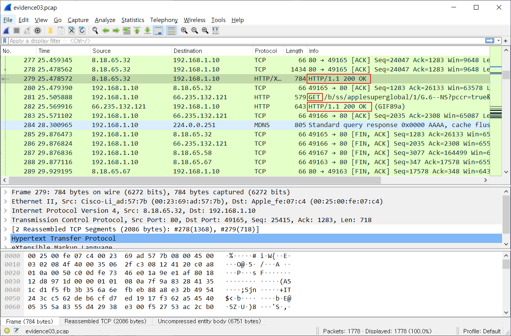

   → 'hack'을 검색한 이후의 패킷에 대해 분석

   → 279 : 'hack' 단어 검색에 대한 HTTP 200 OK, 즉 성공 응답

   → 282 : 281의 GET, 즉 Ann이 클릭 시 발생한 요청에 대한 성공 응답

    

   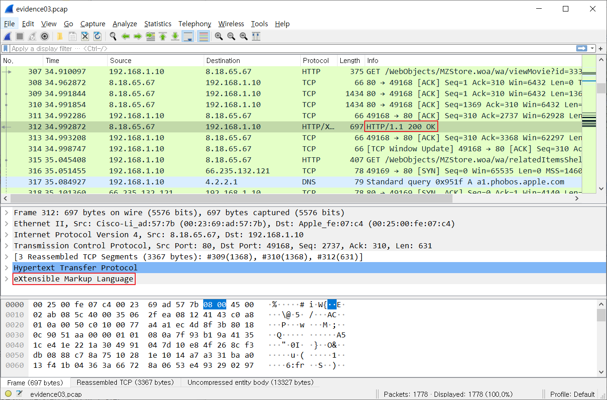

   → 312 : 클릭 내용에 대한 결과 값을 받아오는 요청에 대한 성공 응답

   → eXtensible Markup Language을 통해 XML 코드 확인

   - Copy - as Printable Text

    
   
   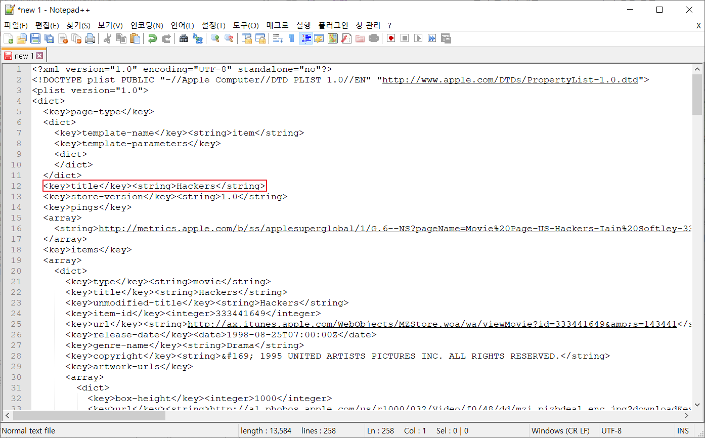
   
   ⇒ Title : `Hackers`

 

------

 

#### 5. What was the full URL to the movie trailer (defined by “preview-url”)?

 

1. XML 분석

   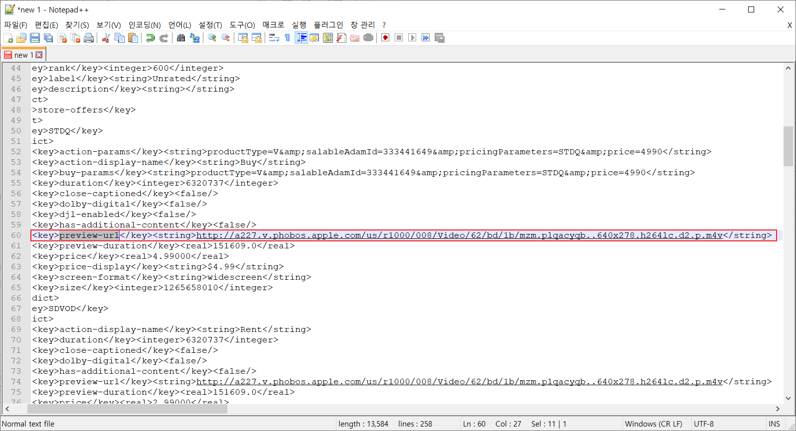
   
   ⇒ URL : `http://a227.v.phobos.apple.com/us/r1000/008/Video/62/bd/1b/mzm.plqacyqb..640x278.h264lc.d2.p.m4v`

 

----------

 

#### 6. What was the title of the second movie Ann clicked on?

 

1. 파일 분석

   1) File - Export Objects - HTTP
   
   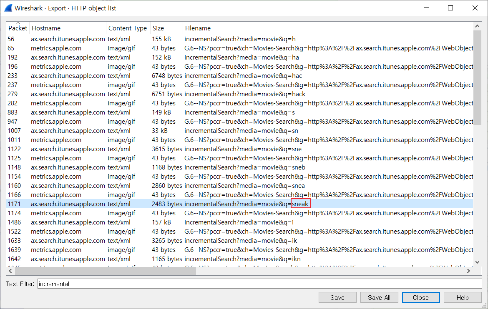
   
   → 두번째 검색 단어 : sneak
   
    
   
   2) String 검색
   
   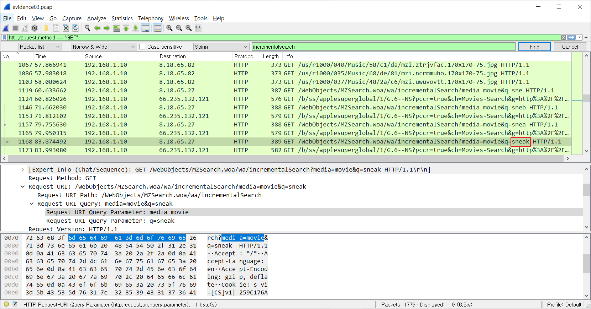
   
   → 1168 패킷에서 sneak 단어 검색
   
    
   
   3) HTTP 200 OK
   
   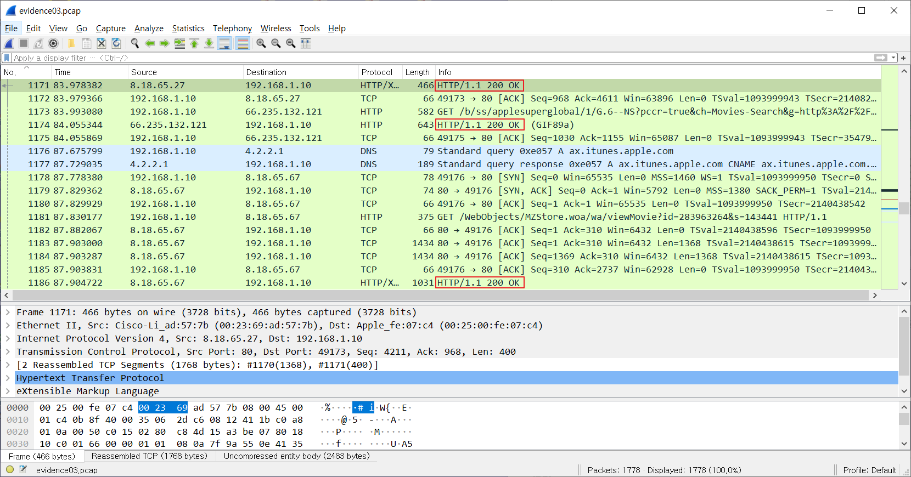
   
   → 1168  이후의 패킷에 대해 분석
   
   → 1171 : 'sneak' 단어 검색에 대한 HTTP 200 OK, 즉 성공 응답
   
   → 1174 : 1173의 GET, 즉 Ann이 클릭 시 발생한 요청에 대한 성공 응답
   
   → 1186 : 클릭 내용에 대한 결과 값을 받아오는 요청에 대한 성공 응답
   
   → eXtensible Markup Language을 통해 XML 코드 확인
   
    
   
   4) XML 분석
   
   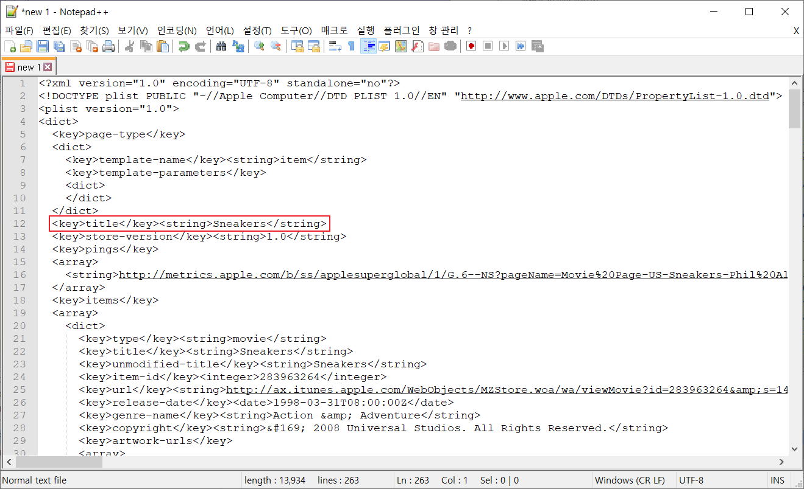
   
   ⇒ Second title : `Sneakers`

 

--------

 

#### 7. What was the price to buy it (defined by “price-display”)?

1. XML 분석

   

   ⇒ Price : `$9.99`

 

------

 

#### 8. What was the last full term Ann searched for?

 

1. 파일 분석

   1) File - Export Objects - HTTP

   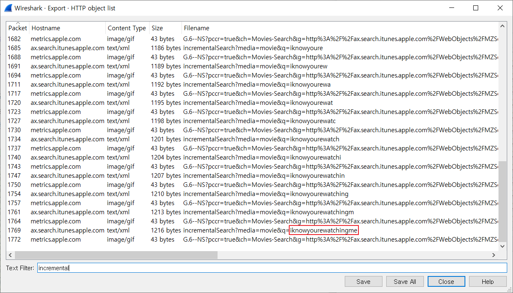

   ⇒ Last term : `iknowyouwatchingme`

