Puzzle #4: The Curious Mr.X

From : http://forensicscontest.com/2010/02/03/puzzle-4-the-curious-mr-x

 

1. 문제

   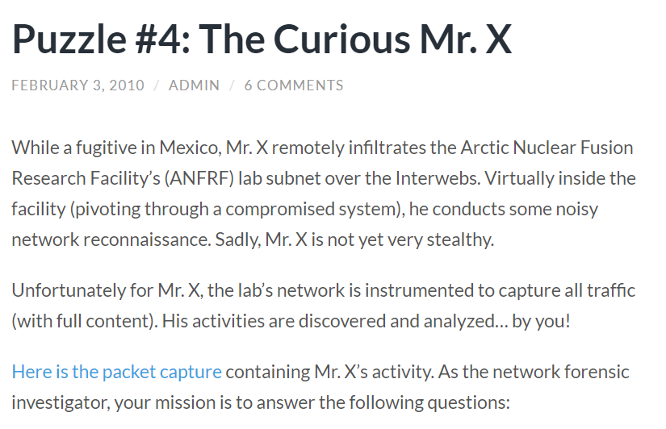
   
   ​	→ 고정 IP : 192.168.1.10

 

2. 파일 다운로드

   

 

--------------

 

#### 개념 이해

1. TCP FLAG

   > Control Flag
   >
   > 논리적인 TCP 연결회선 제어 및 데이터 관리를 위해 사용

   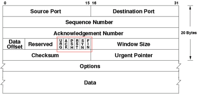

   - SYN(Synchronization) : 연결 요청 플래그
     - 통신 시작 시 세션을 연결하기 위한 플래그
   - ACK(Acknowledgement) : 응답 플래그
     - 송신 측으로부터 패킷을 잘 받았다는 걸 알려주기 위한 플래그
   - FIN(Finish) : 연결 종료 플래그
     - 더 이상 전송할 데이터가 없고 세션 연결을 종료시키겠다는 플래그
   - RST(Reset) : 연결 재설정 플래그
     - 비정상적인 세션을 끊기 위해 연결을 재설정하는 과정
   - PSH(Push) : 넣기 플래그
     - 버퍼가 채워지기를 기다리지 않고 받는 즉시 전달
     - 버퍼링 없이 7 Layer Application Layer의 응용프로그램에게 바로 전달하는 플래그
   - URG(Urgent) : 긴급 데이터 플래그
     - 긴급한 데이터의 우선순위를 다른 데이터의 우선순위를 높여 긴급하게 전달하는 플래그

 

2. Port Scanning

   - TCP SYN (Half-Open)

     - 세션에 대한 로그가 남는 TCP Open 스캔의 단점을 보완하기 위해 나온 기법
     - 연결 설정을 완료하지 않기 때문에 로그를 남기지 않아 추적이 불가능

     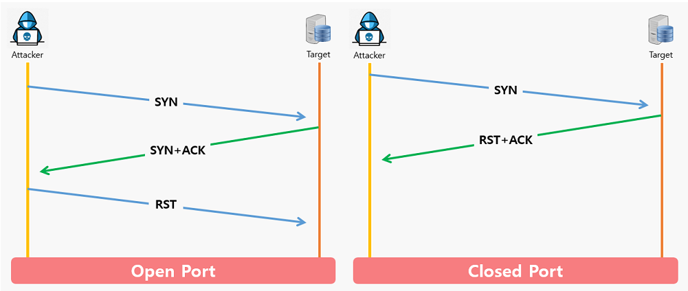

     - 포트가 열린 상태면 타겟으로부터 [SYN + ACK] 응답이 오고, [RST] 패킷을 전송해 연결 강제 종료
     - 포트가 닫힌 상태면 타겟으로부터 [RST + ACK] 응답이 옴

    

   - TCP ACK
     - 방화벽의 필터링 정책을 테스트하기 위한 스캔
     - [ACK] 패킷만을 보내 포트의 열람 확인

    

   - UDP
     - ICMP Unreachable 메시지를 이용하여 UDP  포트의 오픈 여부 확인
     - 포트가 열린 상태면 UDP 응답이 오거나 응답이 없음
     - 포트가 닫힌 상태면 ICMP port unreachable 응답

    

   - TCP Connect (Open)

     - connect() 함수를 사용해서 각 포트별로 접속해서 스캔하는 방식
     - 완전한 TCP 연결을 맺어 신뢰성 있는 결과를 얻을 수 있으나,  속도가 느리고 로그가 남음

     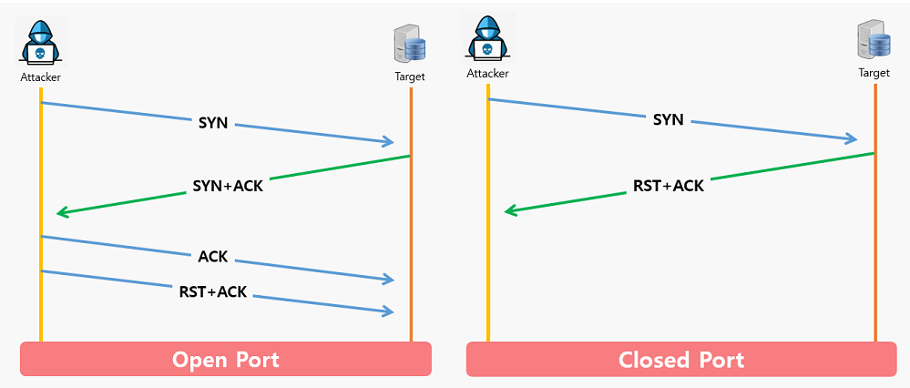

     - 포트가 열린 상태면 [SYN + ACK] 패킷 수신에 대해 ACK 패킷을 전송함으로써 연결을 완료
     - 포트가 닫힌 상태면 [RST + ACK] 응답이 옴

    

   - TCP XMAS

     - 연결되어 있지 않은 포트에 일부 제어비트(FIN, PSH, URG) 또는 전체 제어비트를 설정한 탐지 패킷 전송
     - XMAS라고 이름 붙인 이유는 크리스마스 트리처럼 제어비트를 반짝거리게 설정했다는 의미

     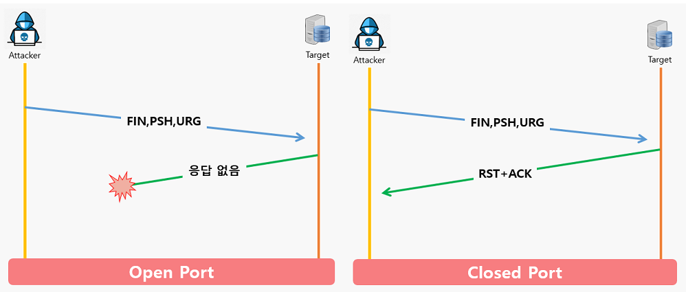

 

-------------------

 

#### 1. What was the IP address of Mr. X’s scanner?

 

1. 파일 분석

   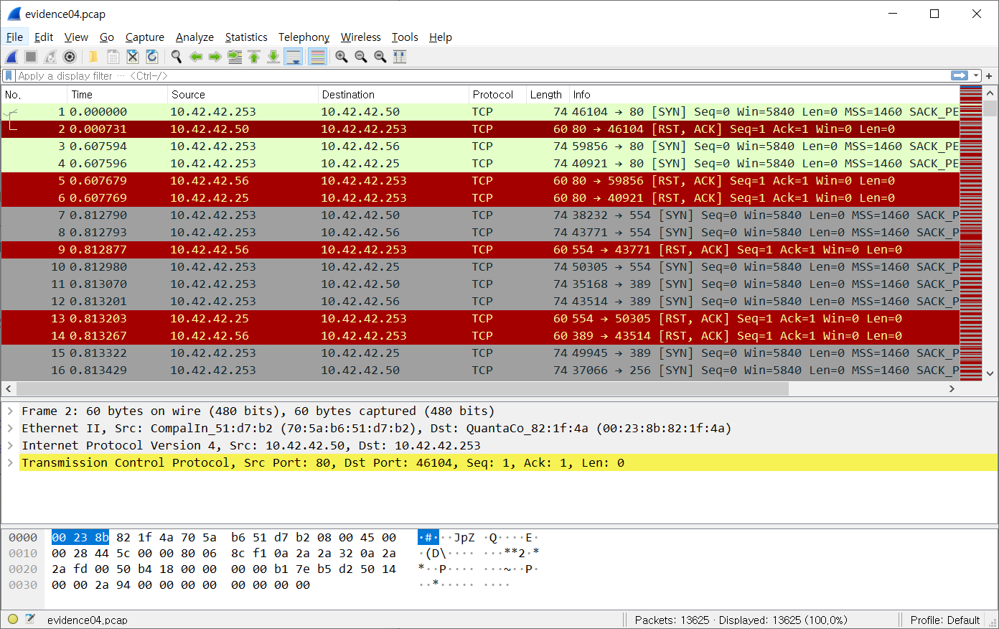

   → [SYN] - [RST, ACK]의 과정 반복

   → TCP Connection 혹은 TCP SYN 기법의 port scanning으로 추측

   ⇒ Mr.X's scanner IP : `10.42.42.253`

 

----------

 

#### 2. For the FIRST port scan that Mr. X conducted, what type of port scan was it? (Note: the scan consisted of many thousands of packets). Pick one : 

#### - TCP SYN

#### - TCP ACK

#### - UDP

#### - TCP Connect

#### -TCP XMAS

#### -TCP RST

 

1. 파일 분석

   1) Source IP 필터링

   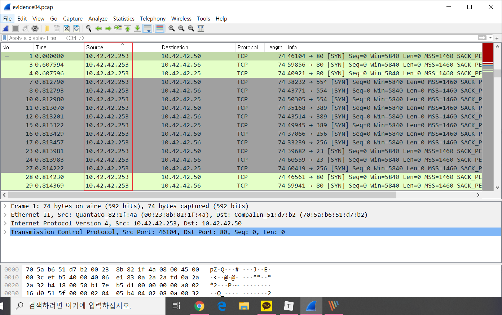

   → Mr.X's scanner IP : `10.42.42.253`

    

   2) 패킷 살펴보기

   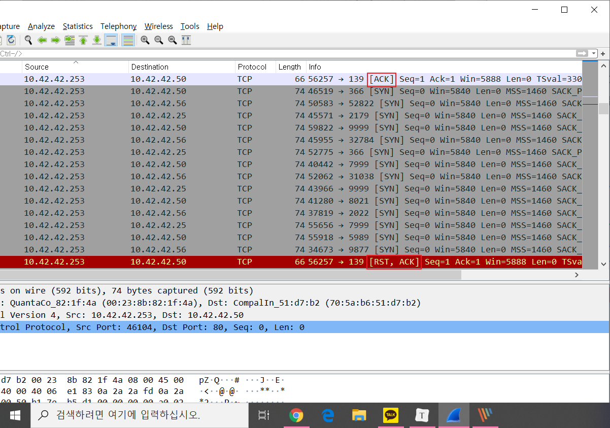

   → [ACK], [RST, ACK] 패킷 전송 확인

   ⇒ First port scan : `TCP Connect`

 

----------

 

#### 3. What were the IP addresses of the targets Mr. X discovered?

 

1. 파일 분석

   1) 첫번째 방법 : Destination IP 확인

   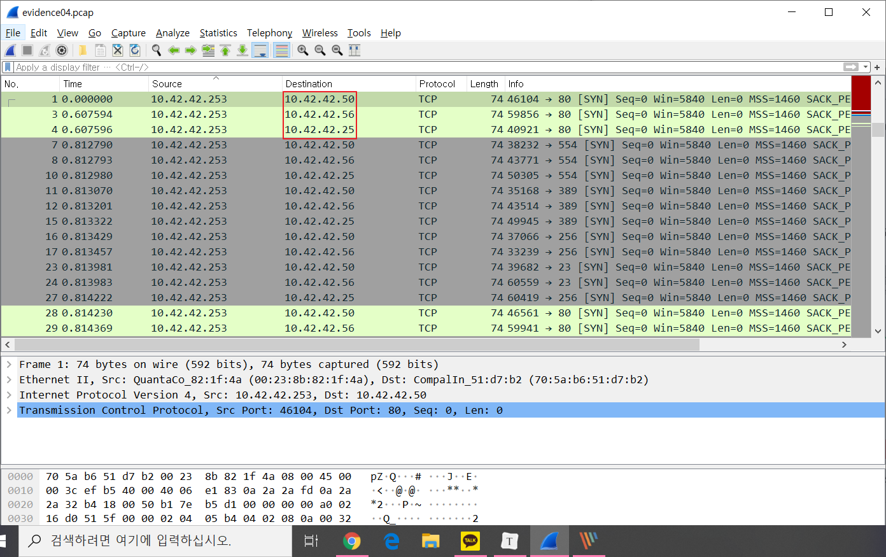

   → 3개의 Destination IP가 반복됨

   ⇒ IP addresses : `10.42.42.50, 10.42.42.56, 10.42.42.25`

    

   2) 두번째 방법 : Statics - ipv4 statics - All address

   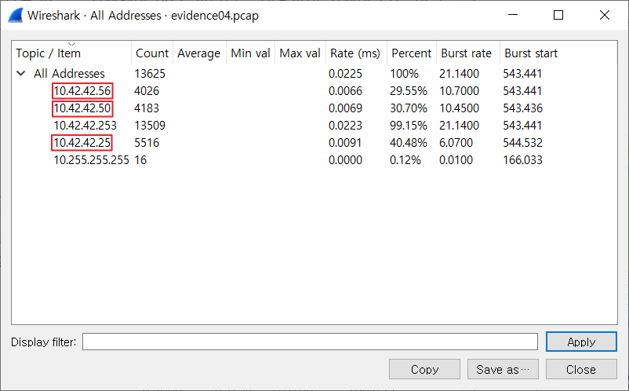
   
   → 10.42.42.253 : X의 IP
   
   → 10.255.255.255 : Broadcast address
   
   ⇒ IP addresses : `10.42.42.56, 10.42.42.50, 10.42.42.25`

 

----------

 

#### 4. What was the MAC address of the Apple system he found?

 

1. 파일 분석

   1) 첫번째 방법 : 패킷 확인

   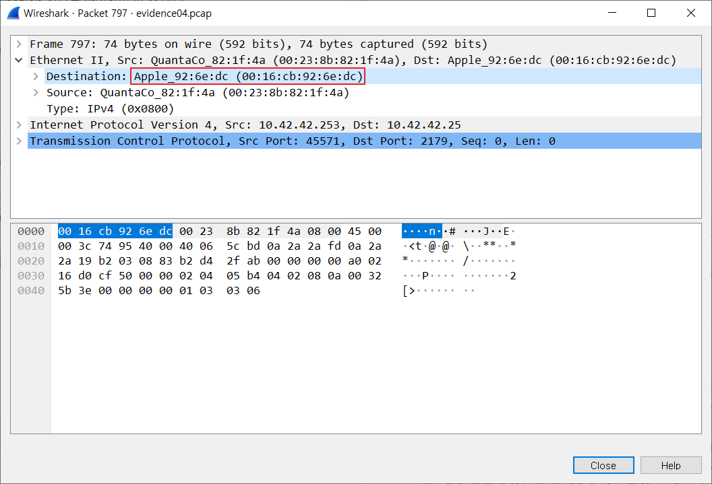

   → 10.42.42.25의 Destination 정보 확인

   ⇒ Apple system MAC address : `00:16:cb:92:6e:dc`

    

   2) 두번째 방법 : String 검색

   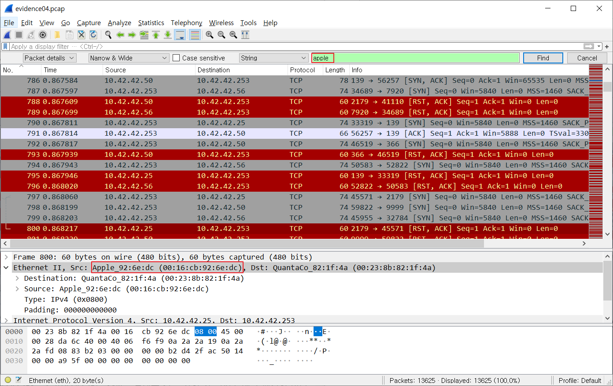

   → Packet details에서 'apple' 검색

   ⇒ MAC address : `00:16:cb:92:6e:dc`

 

------

 

#### 5. What was the IP address of the Windows system he found?

 

1. 파일 분석

   1) ip.src==10.42.42.50 and ip.dst==10.42.42.253 and tcp.flags.syn==1 and tcp.flags.ack==1 필터링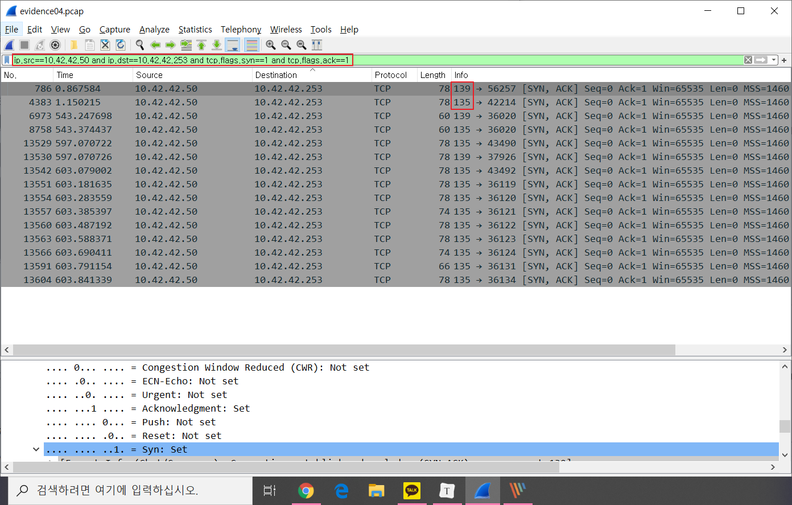

   → 135, 139 Port Open

   → 별도의 설정이 없다면 기본적으로 Open 되어 있는 Windows System Port number

   - 135 - RPC
   - 139 - NetBIOS 세션 서비스

   ⇒ Windows system IP adress : `10.42.42.50`

 

----------

 

#### 6. What TCP ports were open on the Windows system? (Please list the decimal numbers from lowest to highest.)

 

1. 파일 분석

   1) ip.src==10.42.42.50 and ip.dst==10.42.42.253 and tcp.flags.syn==1 and tcp.flags.ack==1 필터링
   
   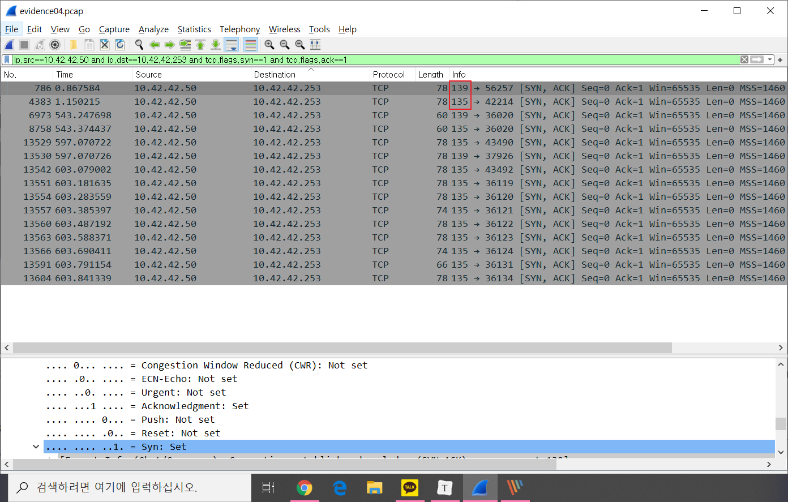
   
   ⇒ Open port : `135, 139`
   
   

 

--------

 

#### 7. What was the name of the tool Mr. X used to port scan? How can you tell? Can you reconstruct the output from the tool, roughly the way Mr. X would have seen it?

⇒ Port scan tool : `nmap`