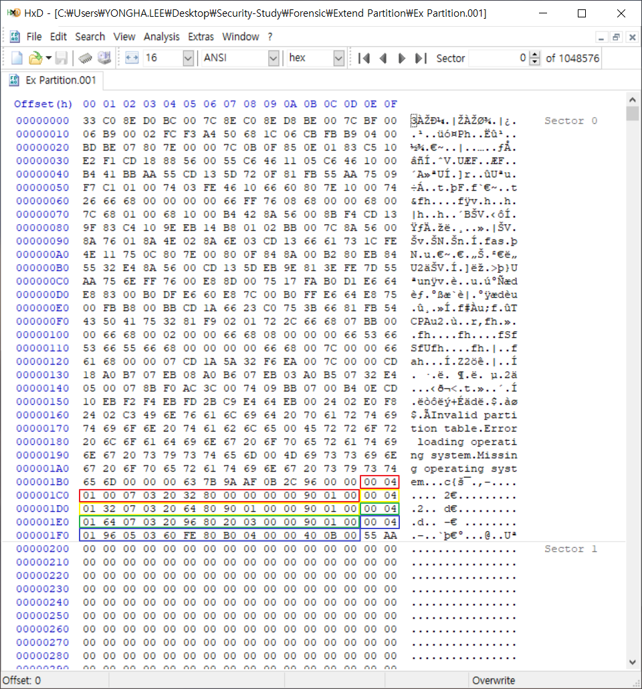
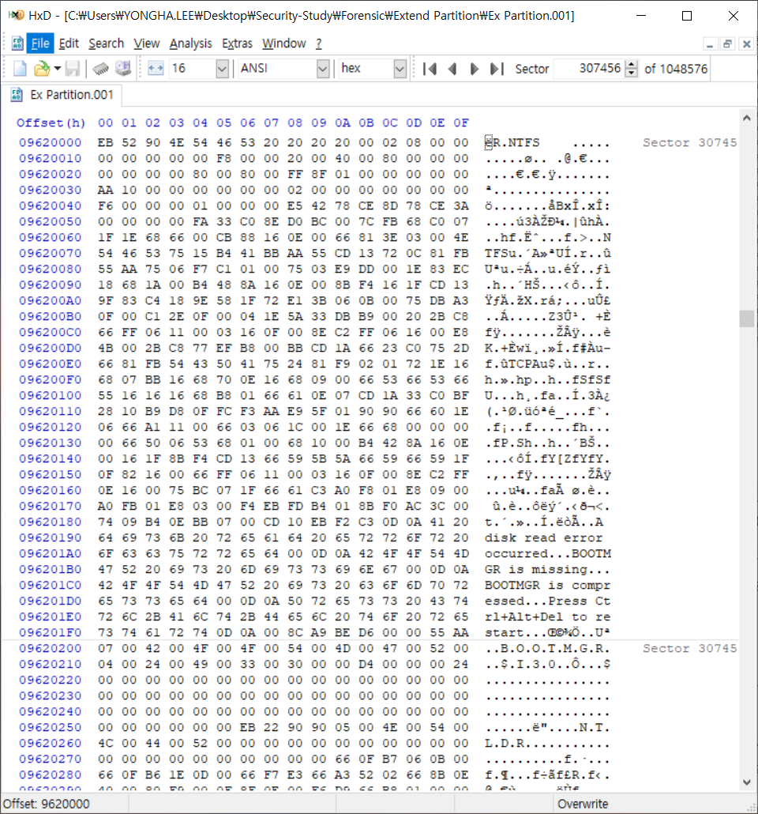
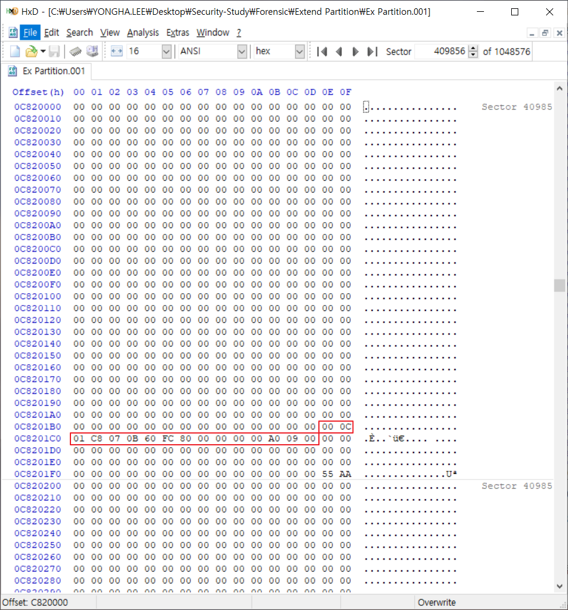

## Extended 파티션

- Extended 파티션 : 확장 파티션, 다중 파티션

- Extended 파티션일 경우 파티션 테이블 구조 및 관리

  

---------------

1. GUI 형태로 파티션 상태 확인

   

   ⇒ 5개의 파티션 존재

2. 파티션 테이블 확인

   

   → 마지막(BLUE) 파티션(4) 정보 확인

   - 0x05 : 확장 파티션

   - [80 B0 04 00] : 파티션 시작 주소 (LBA 주소 지정 방식)

   

3. 확장 파티션(4)이 존재하는 섹터로의 이동

   

   → [80 B0 04 00] = 0004B080 : 307328 Sector

   → 부트코드 영역은 모두 0으로 덮여 있음 : 서브 MBR

   → 첫 번째 파티션(4) 정보 확인

   - 0x07 : NTFS 파일 시스템
   - [80 00 00 00] : 파티션 시작 주소 (LBA 주소 지정 방식)

   → 두 번째 파티션(5) 정보 확인

   - 0x05 : 확장 파티션
   - [80 90 01 00] : 파티션 시작 주소 (LBA 주소 지정 방식)

   

4. 4번째 파티션이 존재하는 섹터로의 이동

   

   → [80 00 00 00] = 00000080 : 128

   → 307456 = 307328(파티션 시작 주소) + 128(첫 번째 파티션 시작 주소)

5. 확장 파티션(5)이 존재하는 섹터로의 이동

   
   
   → [80 90 01 00] = 00019080 : 102528
   
   → 409856 = 307328(파티션 시작 주소) + 102528(두 번째 파티션 시작 주소)
   
   → 첫 번째 파티션 정보 확인
   
   - 0x07 : NTFS 파일 시스템
   
   - [80 00 00 00] : 파티션 시작 주소 (LBA 주소 지정 방식)
   
   
   
6. 5번째 파티션이 존재하는 섹터로의 이동

   

   → [80 00 00 00] = 00000080 : 128

   → 409984 = 409856(파티션 시작 주소) + 128(첫 번째 파티션 시작 주소)

