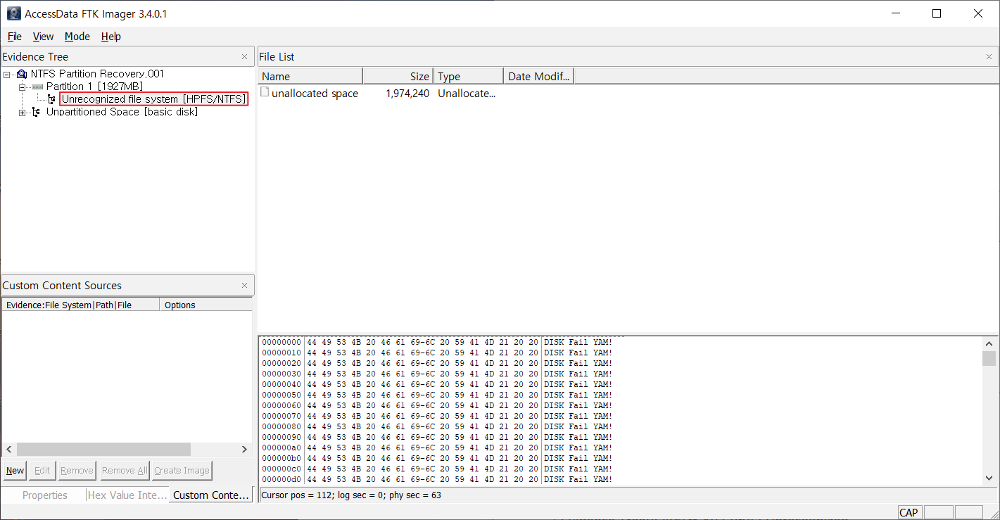
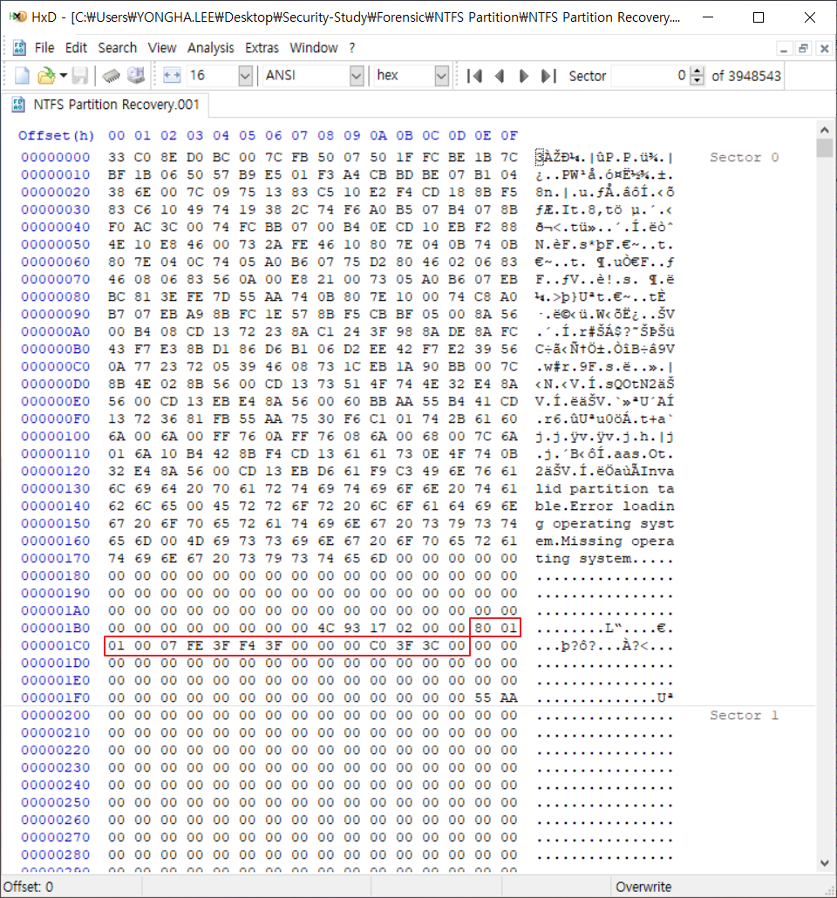
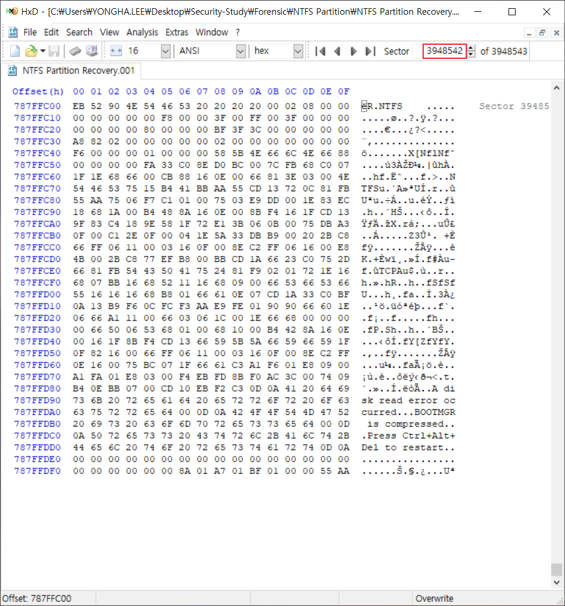

## NTFS 파티션 복구

   

- 손상된 NTFS 파티션 복구
- 해당 파티션 정보는 가지고 있으나, 해당 파티션의 시작 부분이 손상되었을 경우

   

---------------

   

1. GUI 형태로 파티션 상태 확인

   

   → Evidence Tree의 파티션 정보 확인 : Unrecognized

   ⇒ 파티션 정보 손상

   

2. 파티션 테이블 확인

   

   → 파티션 테이블에 하나의 파티션 정보 존재

   → 0x80 : Boot Flag. 부팅 가능한 파티션

   → 0x07 : NTFS의 파일시스템

   → [3F 00 00 00] : 파티션 시작 주소 (LBA 주소 지정 방식)

   → [C0 3F 3C 00] : 파티션의 총 섹터 개수

      

3. 파티션이 존재하는 섹터로의 이동

   

   → [3F 00 00 00] = 0000003F : 63 Sector

   ⇒ 파티션 시작 부분(BR) 손상

      

4. 파티션 정보 백업본 확인

   - NTFS 파일시스템 : 파티션 정보의 제일 마지막 섹터에 파티션 시작 정보(BR)의 백업본 존재

   

   → [C0 3F 3C 00] = 003C3FC0 : 3948480

   → 3948542 = 63(파티션 시작 주소) + 3948480(총 섹터 개수) - 1(MBR 섹터)
   
   ​	→ MBR 섹터가 공통적으로 해당하므로 1개의 섹터를 빼줘야 함
   
   ⇒ 정상적인 BR 백업본 존재 확인

   

5. BR 수정

   

   

6. 복구 여부 확인

   

   → Evidence Tree의 파티션 정보 확인

   ⇒ 파티션 정보 정상적으로 복구

