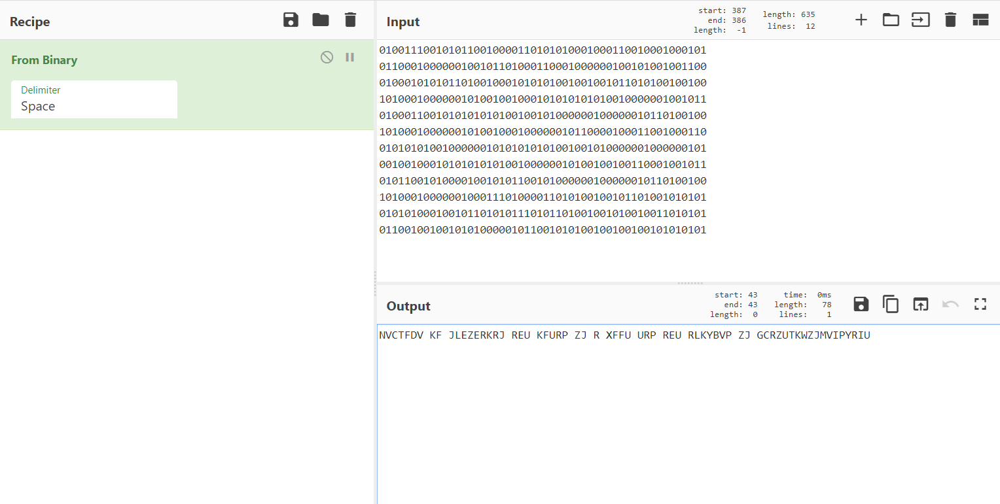
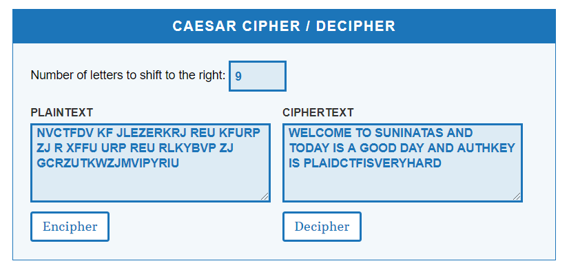

## Challenge 19

 

1. 문제

   

 

2. Binary → String Decode

   

 

3. 카이사르 암호(Caesar Cipher) 사용

   - 간단한 치환 암호의 일종
   - 암호화하고자 하는 내용을 알파벳별로 일정한 거리만큼 밀어서 다른 알파벳으로 치환하는 방식

   

   ​	→ 알파벳을 오른쪽 순서로 9만큼 밀어 치환

   ​	⇒ AuthKey : `PLAIDCTFISVERYHARD`
