## Challenge 28

 

1. 문제

   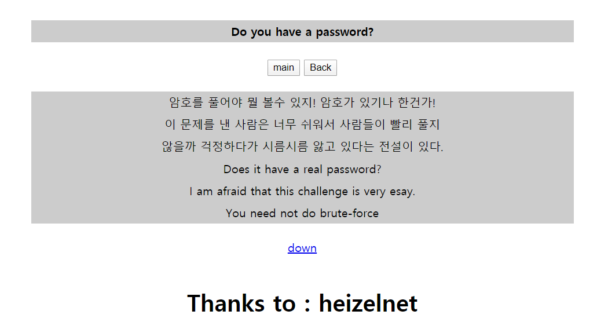

   ​		→ 암호가 없는데 암호를 입력하라고 함

   ​		⇒ ZIP 포맷을 이용해 암호 메세지가 뜨도록 변형을 주었을 것

 

2. 파일 다운로드

   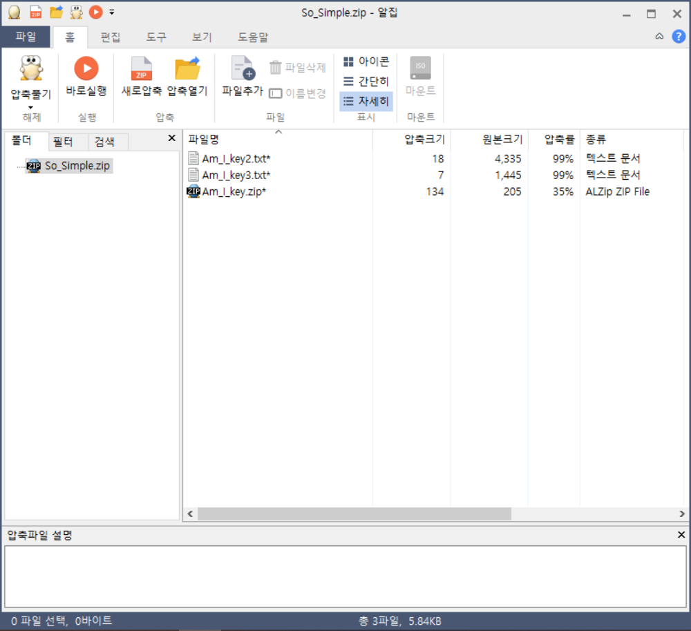

    

   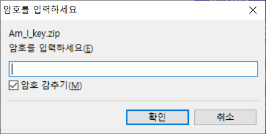

   ​							→ 파일에 암호가 걸려 있어 압축 해제 불가능

 

3. ZIP 파일 분석

   - ZIP 구조

     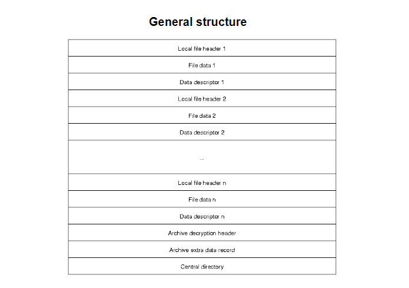

     ​						→ local file header + file data + data descriptor가 반복

     ​						→ 마지막에 Central directory 위치

      

     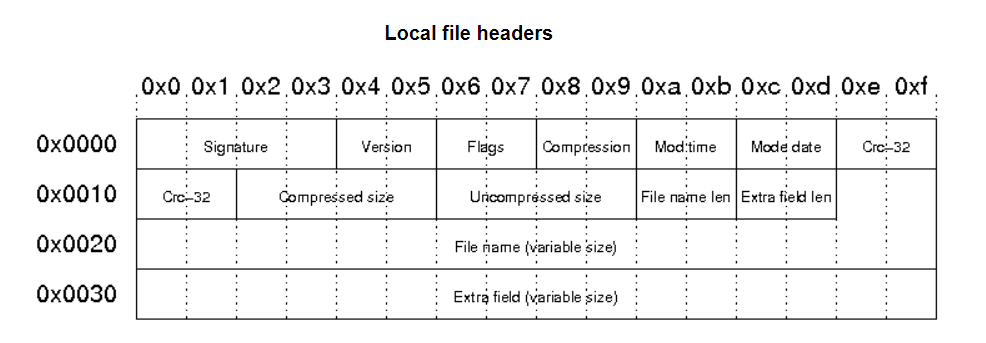

     ​		→ Local file header의 Signature : [50 4B 03 04]

     ​		→ Flag

     ​										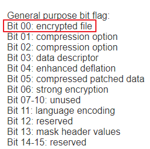

     ​											→ Bit 00 : 암호화된 파일 의미

      

     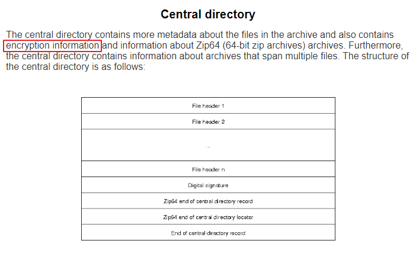

     ​								→ Central directory에 ZIP 안 파일들의 암호화 정보가 들어있음

      

     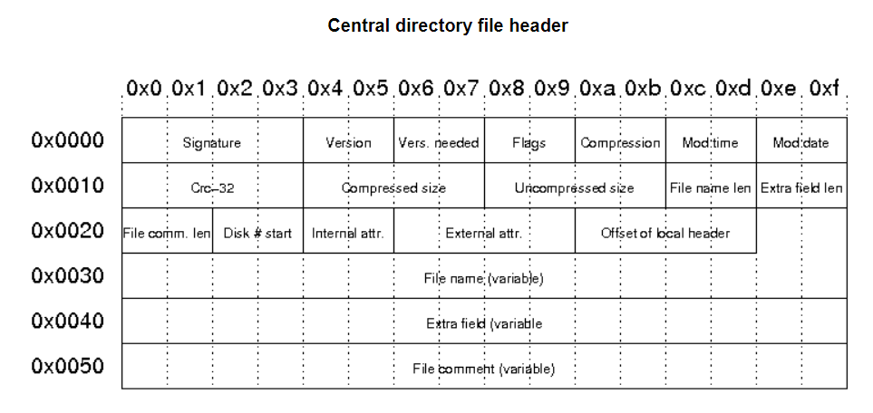

     ​		→ Central directory file header의 Signature : [50 4B 01 02]

     ​		→ Flag

     ​										

     ​											→ Bit 00 : 암호화된 파일 의미

     

    

4. ZIP 파일 hex 수정

   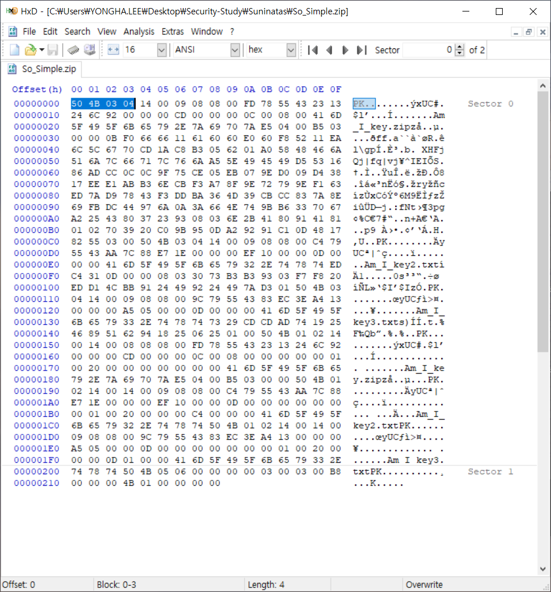

   → Local file header : 3개 존재

    

   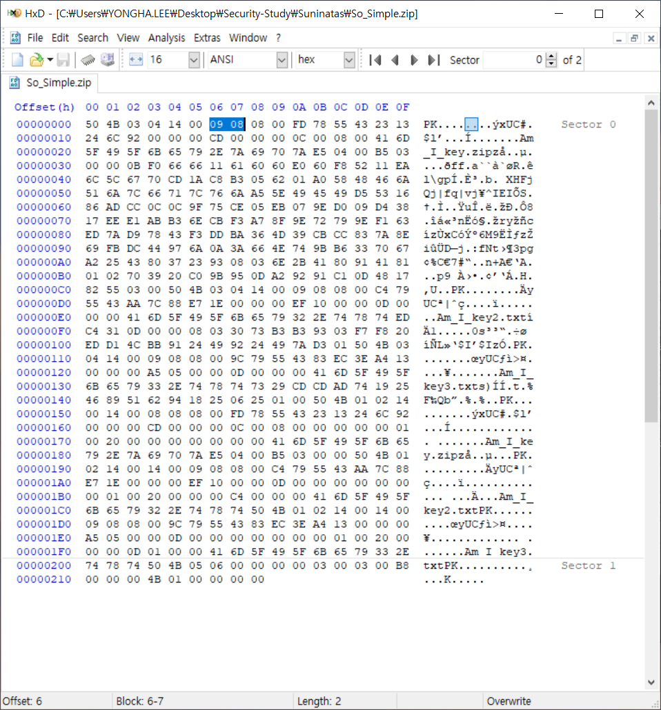

    → 현재 Flag : [09 08]

   - [09 08] = 00001001 00001000

   - Bit 00을 0으로 set (little endian)

     ⇒ 00001000 00001000 = [08 08]

    

   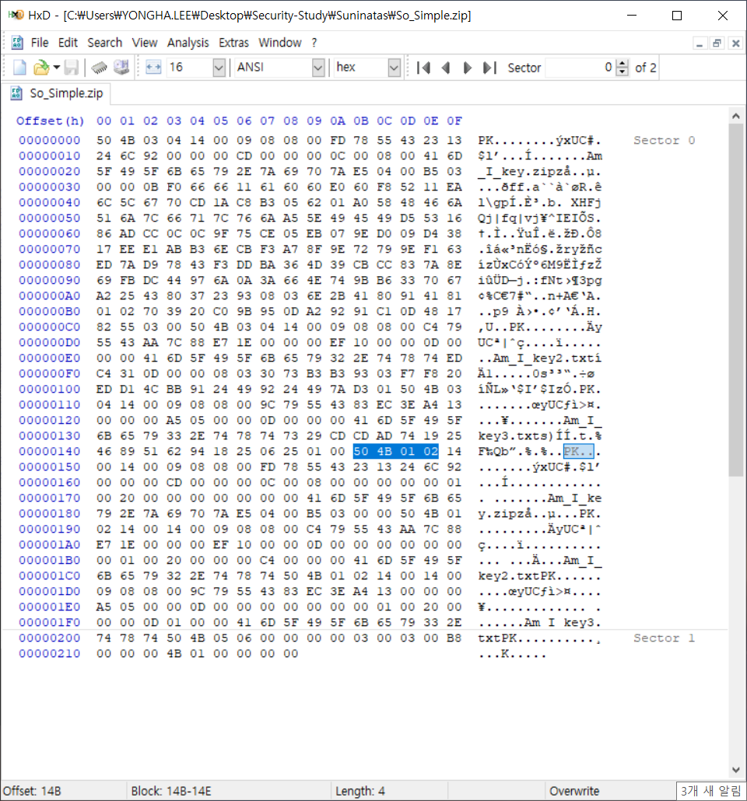

   → Central directory file header: 3개 존재

    

   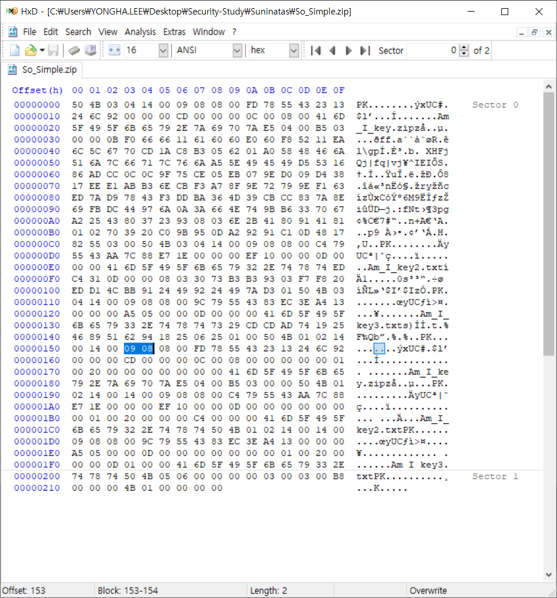

   → 현재 Flag : [09 08]

   - [09 08] = 00001001 00001000

   - Bit 00을 0으로 set (little endian)

     ⇒ 00001000 00001000 = [08 08]

 

5. ZIP 파일 압축 해제

   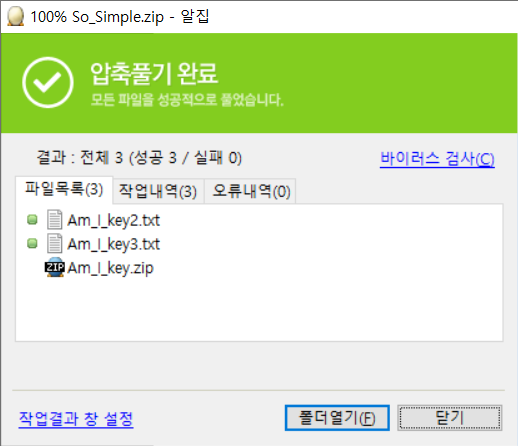

   ​					→ 암호 없이 압축 해제

 

6. AuthKey 확인

   1) Am_I_key2.txt	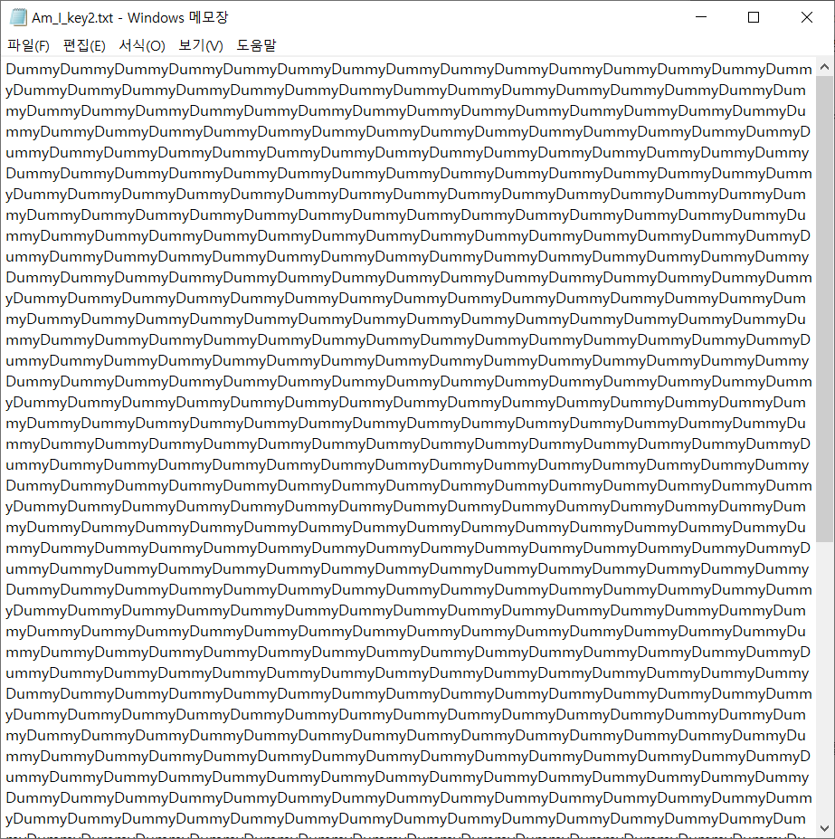

    

   2) Am_I_key3.txt

   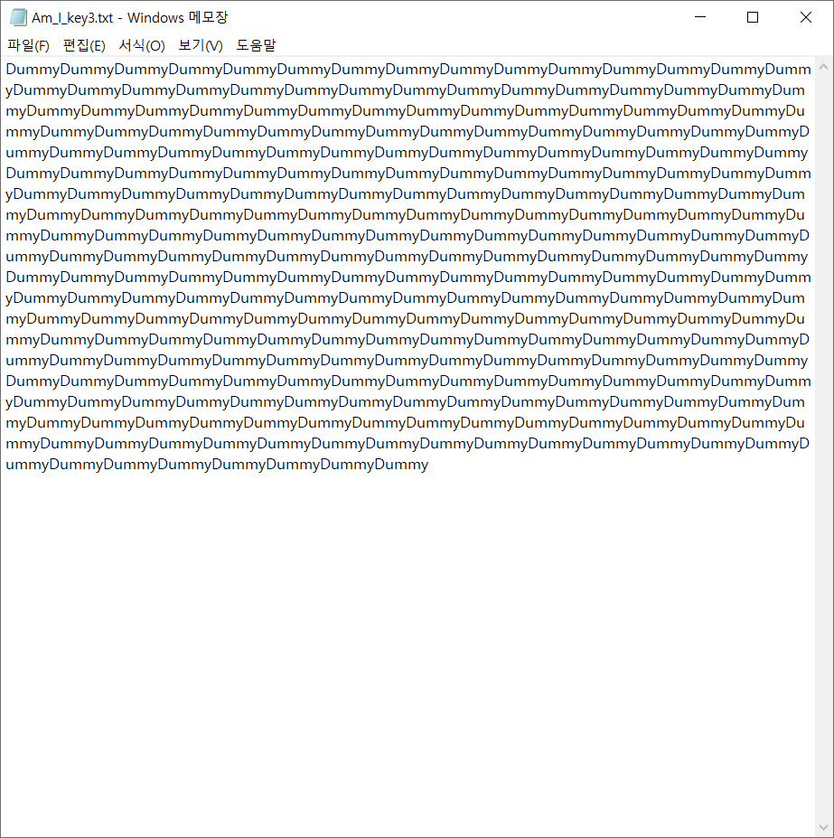

    

   3) Am_I_key.zip - There_is_key.txt

   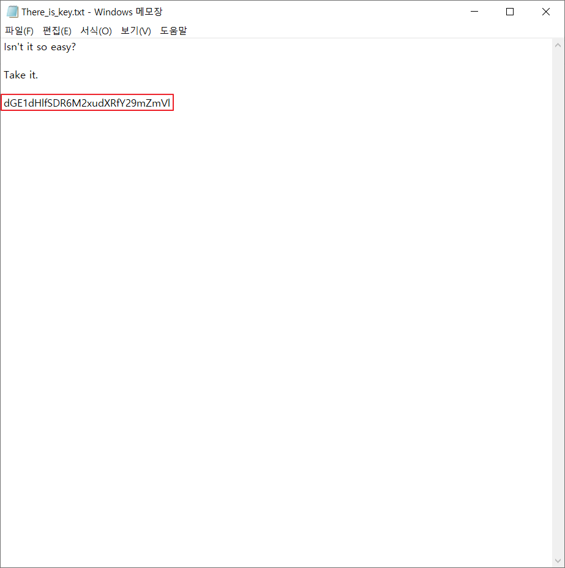

   → Base64 복호화

   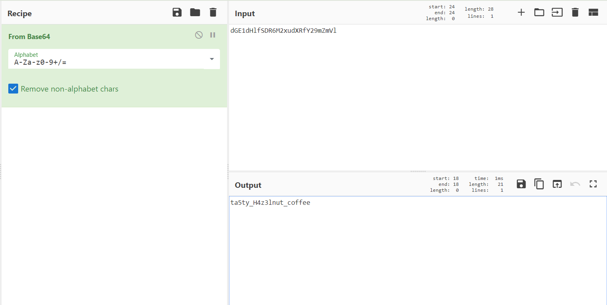

   ⇒ AuthKey : `ta5ty_H4z3lnut_coffee`

