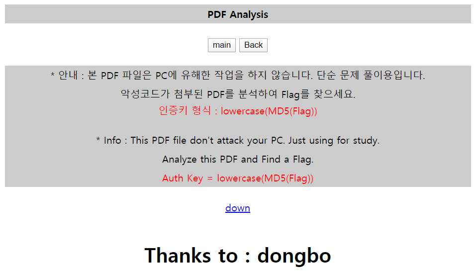
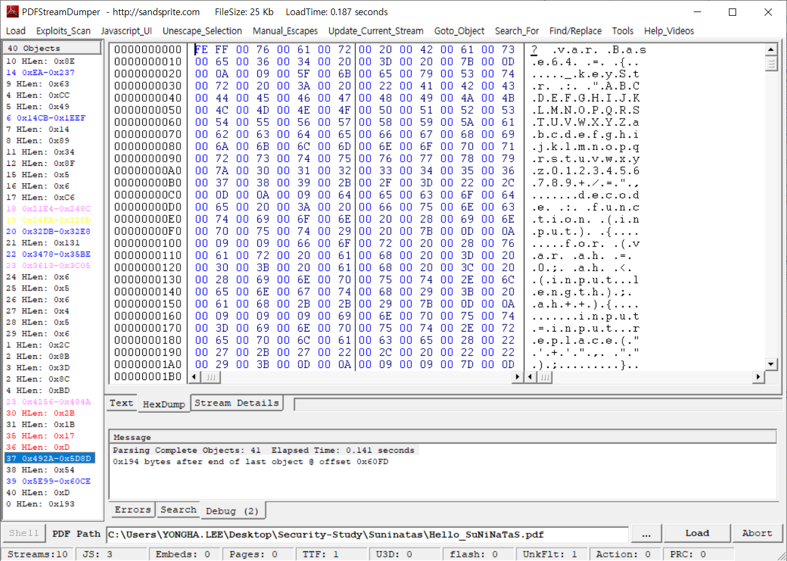
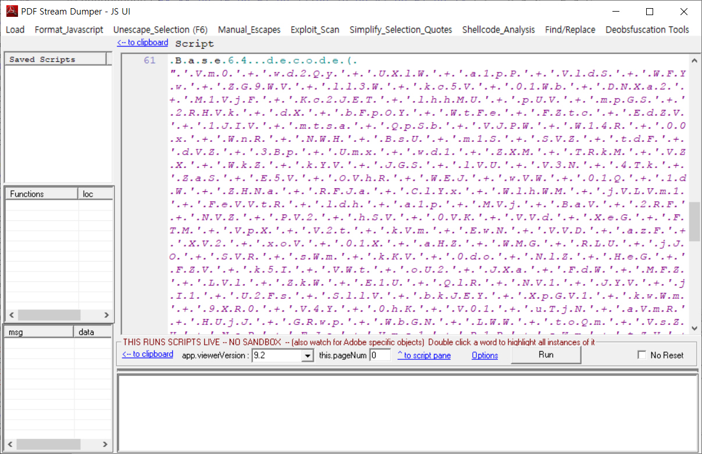
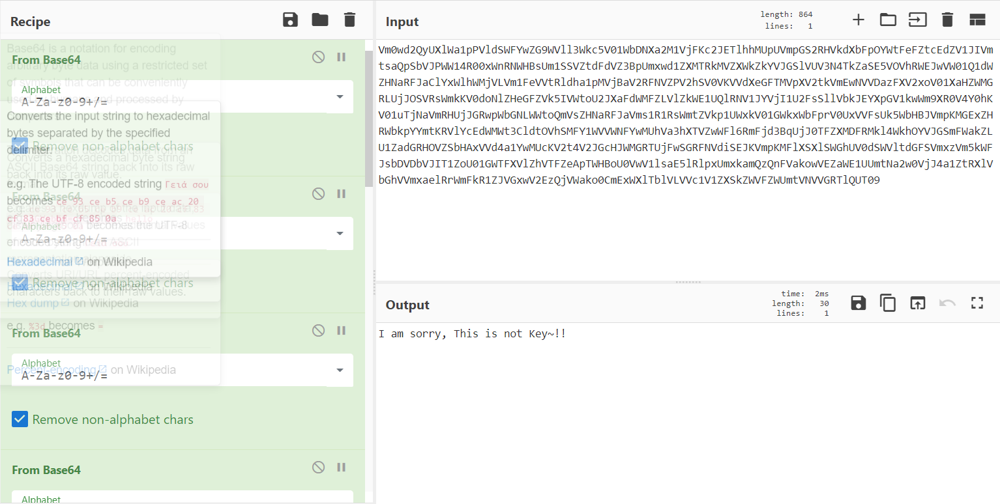
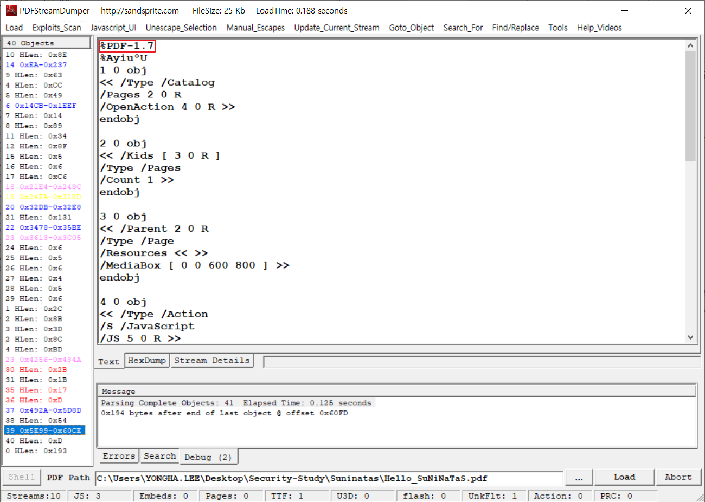
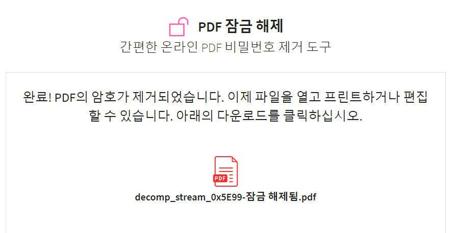
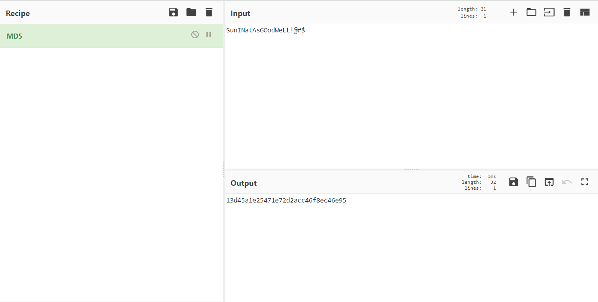

## Challenge 31

 

1. 문제

   

 

2. 파일 다운로드

   

   ​	→ PDF 파일 다운로드

 

3. 파일 분석

   - PDF Steam Dumper 이용

     > 난독화 PDF 분석 도구
>
     > 모든 오브젝트 및 파일 오프셋, 헤더 등 스트림 상세 내역 분석 가능

      
     
     1) 자바스크립트 변환	
     
     
     
     → 37번 오브젝트에서 자바스크립트 발견
     
      
     
     
     
     → PDF Stream Dumper의 기능인 Javascript_UI(JS UI) 기능을 이용해 자바스크립트 포맷으로 변환
     
      
     
     
     
     → Base64로 11번 Decoding을 실행
     
     ⇒ 키가 아님
     
      
     
     2) PDF 파일 추출
     
     
     
     → 39번 오브젝트에서 PDF 헤더 발견 : PDF 1.7 사양을 사용함
     
      
     
     - PDF 파일 구조
     
       
     
     ​										→ Header : PDF의 시그니처와 PDF 사양의 버전을 정의
     
     ​										→ Body : 실제 내용을 포함하는 오브젝트들로 구성
     
     ​										→ Cross-reference table : 다른 오브젝트에 빠르게 엑세스하기 위한 PDF 뷰어용 테이블
     
     ​										→ Trailer : PDF 파일의 기타 메타 정보를 정의
     
      
     
     
     
     → Save Decompressed Stream 기능을 이용해 PDF 파일 추출

​			 

4. 추출된 PDF 파일 분석

   

   ​	 

   	

   → 잠금되어 있음

    

   

   ​	→ https://smallpdf.com/kr 이용해 PDF 파일 잠금 해제

    

   

   ⇒ Flag : SunINatAsGOodWeLL!@#$

 

-----------------

 

#### 인증키 구하기

 

lowercase(MD5(Flag))

→ MD5(SunINatAsGOodWeLL!@#$)

→ lowercase(13d45a1e25471e72d2acc46f8ec46e95)

⇒ AuthKey : `13d45a1e25471e72d2acc46f8ec46e95`

