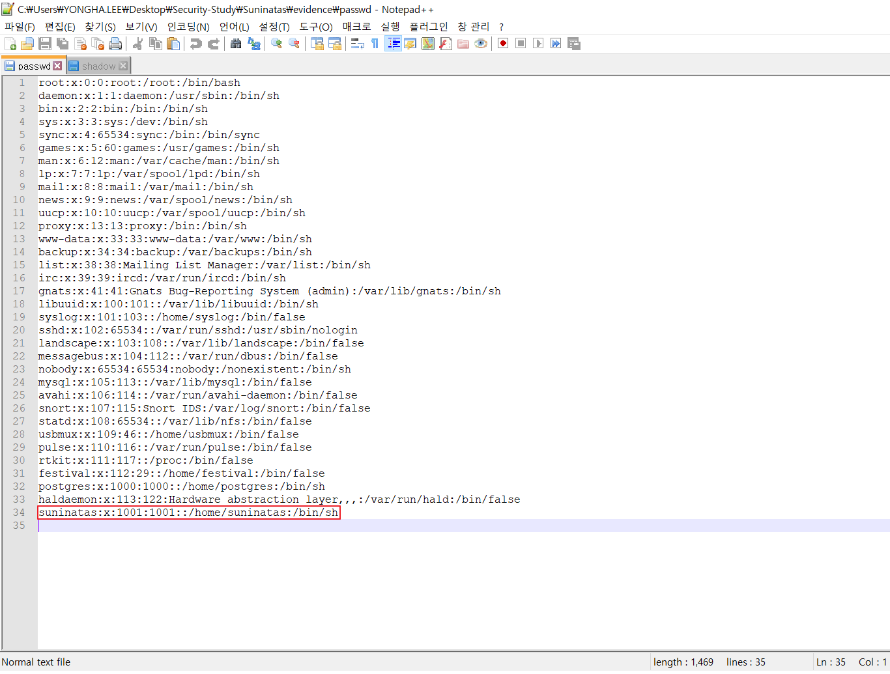
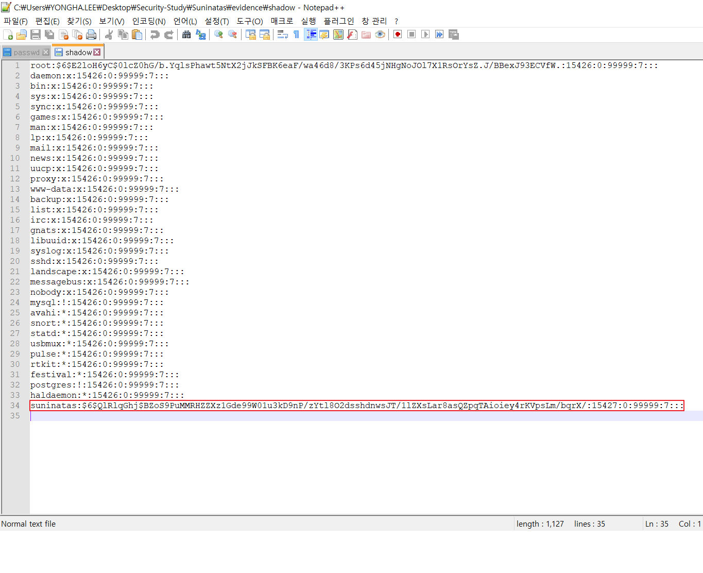
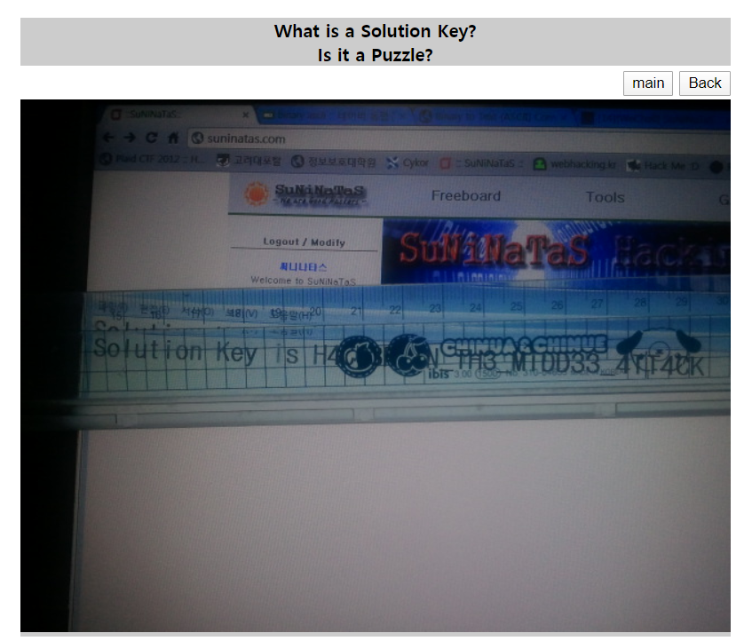
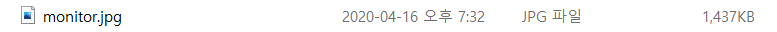
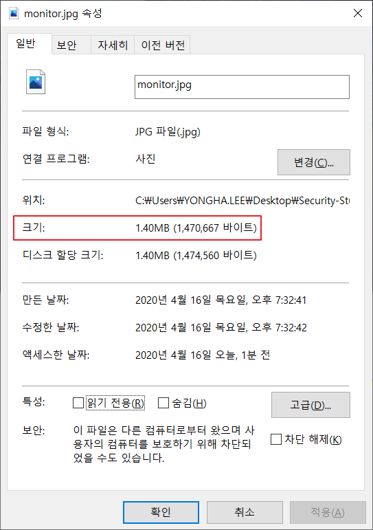
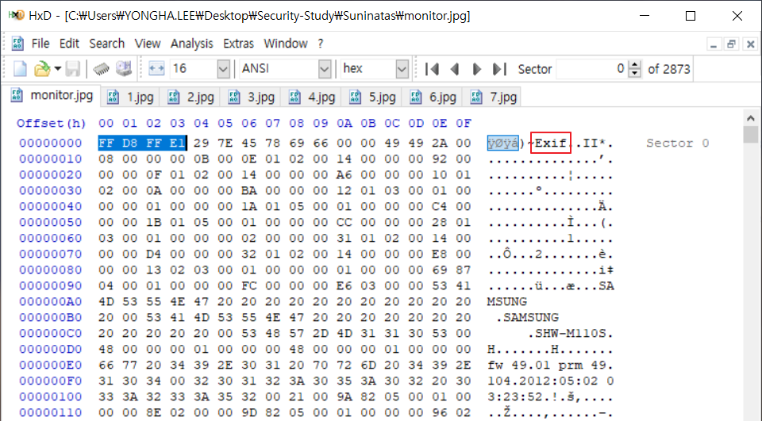
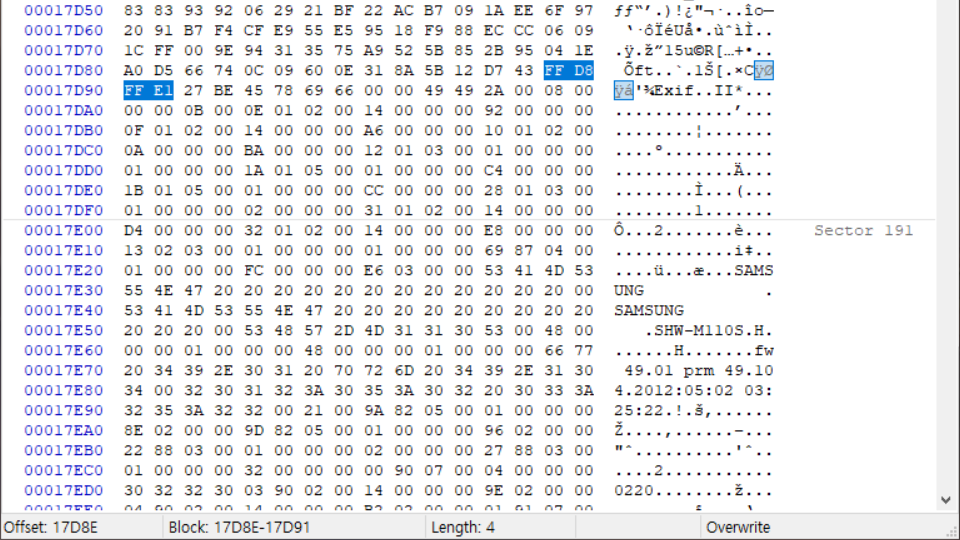
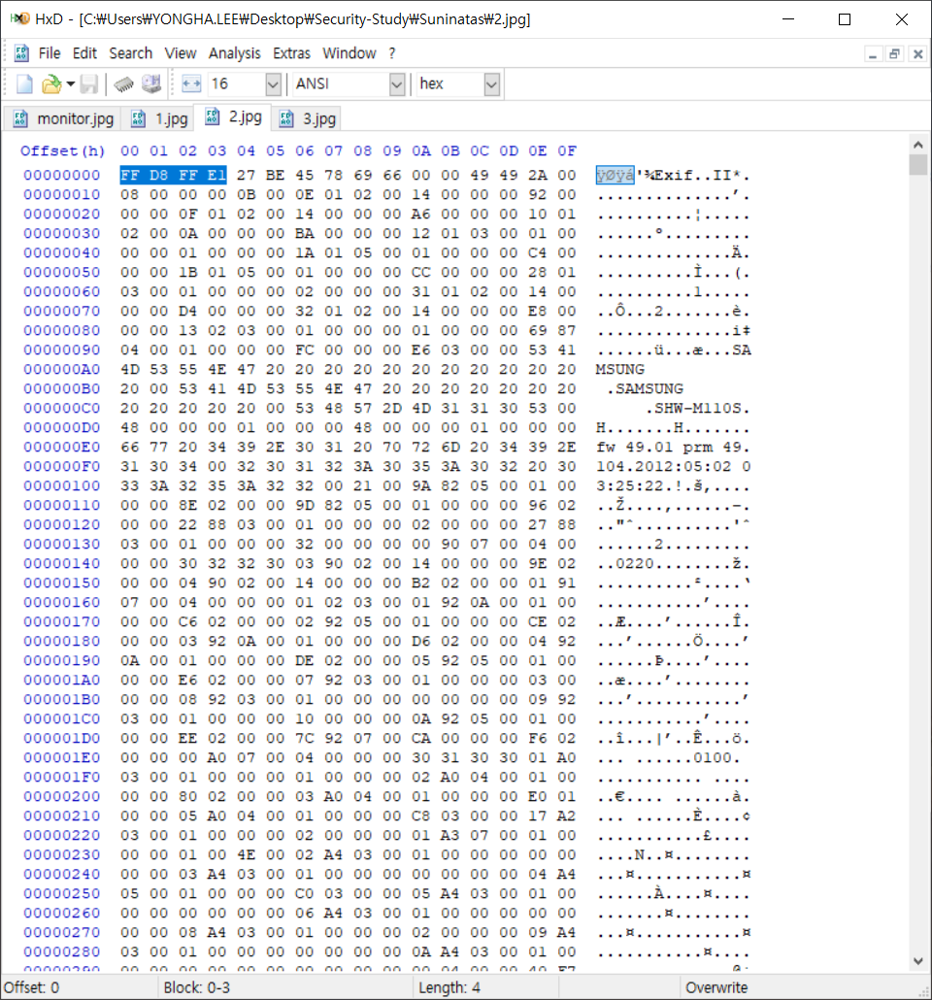
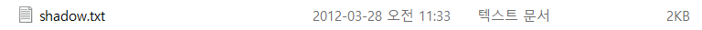
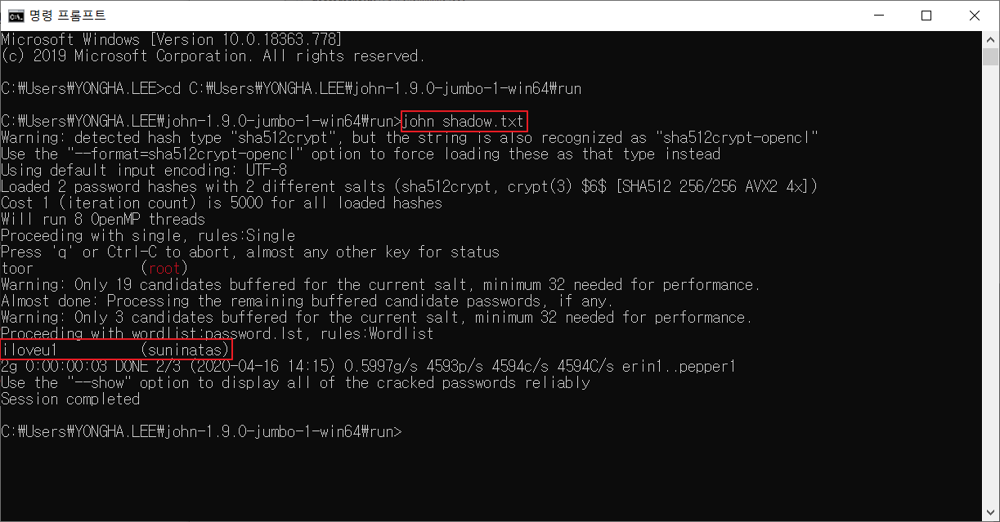

## Game 14

 

1. 문제

   

 

2. 파일 다운로드

   

 

3. 파일 분석

   - Notepad++ editor 이용

     1) passwd

     

      

     2) shadow

     ## Game 21

 

1. 문제

   

 

2. 이미지 파일 다운로드

   

 

3. 이미지 파일 분석

   
   
​				→ JPG 파일임에도 파일의 크기가 비정상적으로 큼
   
 
   
- JPEG(Joint Photographic Experts Group) : 정지 화상(사진)을 위해서 만들어진 손실 압축 방법 표준
   
     - .jpg, .jpeg 등의 확장자 사용
     - 높은 압축률로 인해 웹 상에서 사진 등의 화상을 보관하고 전송하는 데 가장 널리 사용되는 파일 형식
   
     | File Type | Header Signature (hex) | Footer Signature (hex) |
     | :-------: | :--------------------: | :--------------------: |
     | JPEG/JFIF |      FF D8 FF E0       |         FF D9          |
     | JPEG/EXIF |      FF D8 FF E1       |         FF D9          |
   
    

4. HEX 분석

   - JPEG/EXIF 형식의 파일이므로, 헤더 시그니처인 [FF D8 FF E1] 검색

   

   

   → 이외에도 여러 곳에서 헤더 시그니처 발견

   ⇒ 여러 장의 JPEG 파일이 한 장의 JPEG 파일로 겹쳐져 있음

 

5. File Carving (파일 카빙)

   - 헤더 시그니처를 기준으로 끊어 각각 JPEG 파일로 저장

     1) 1.jpg

     

      

     2) 2.jpg

     

      

     3) 3.jpg

     

     ⇒ 이 3장의 JPEG 파일이 반복해서 생성됨

 

6. AuthKey 확인

   1) 1.jpg

   

    

   2) 2.jpg

   ​	

    

   3) 3.jpg

   ​	

   ​	⇒ AuthKey : `H4CC3R_IN_TH3_MIDD33_4TT4CK`

 

4. Password Cracking (패스워크 크래킹)

   - John the Ripper 이용

     > Unix 계열 password crack tool

 

         1) 크래킹할 파일(shadow)을 txt 파일로 만들기

	

 

         2) john.exe 이용해 패스워크 크래킹

 

⇒ AuthKey : `iloveu1`	

