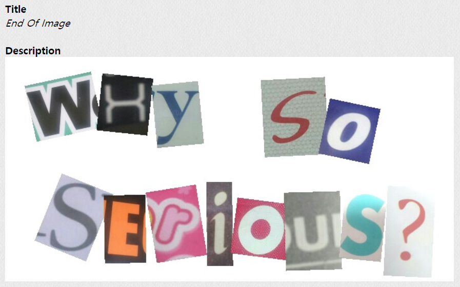
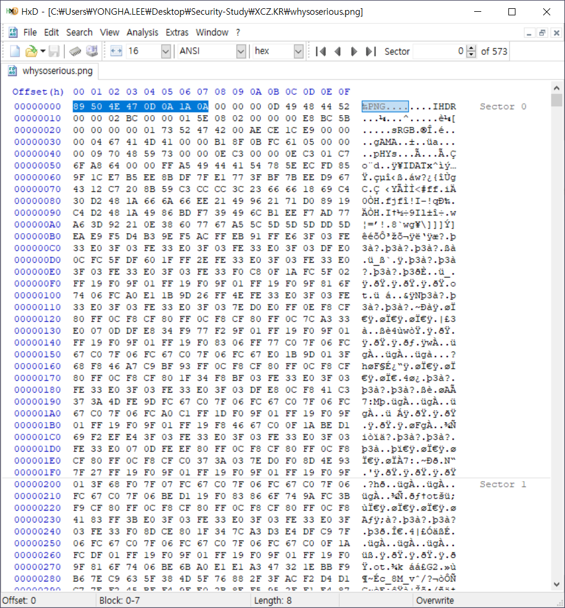
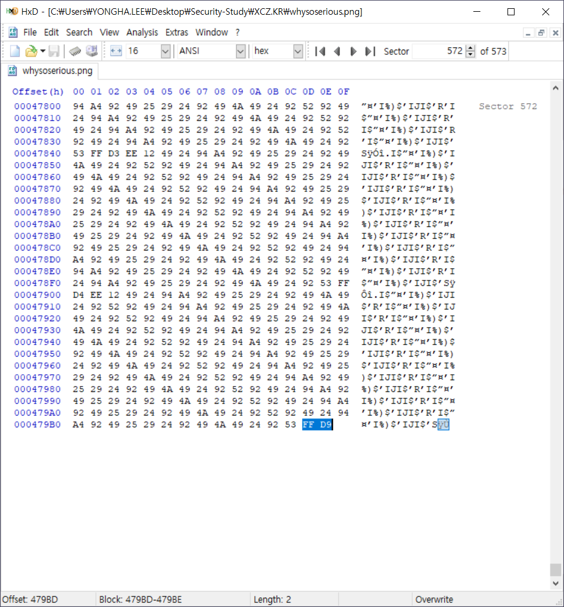
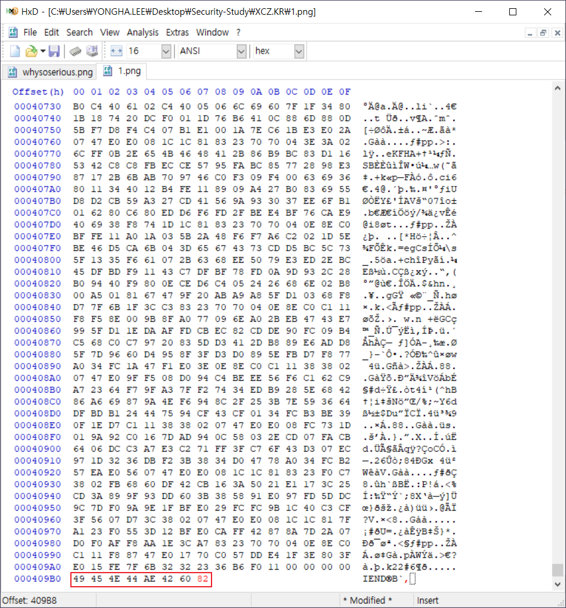
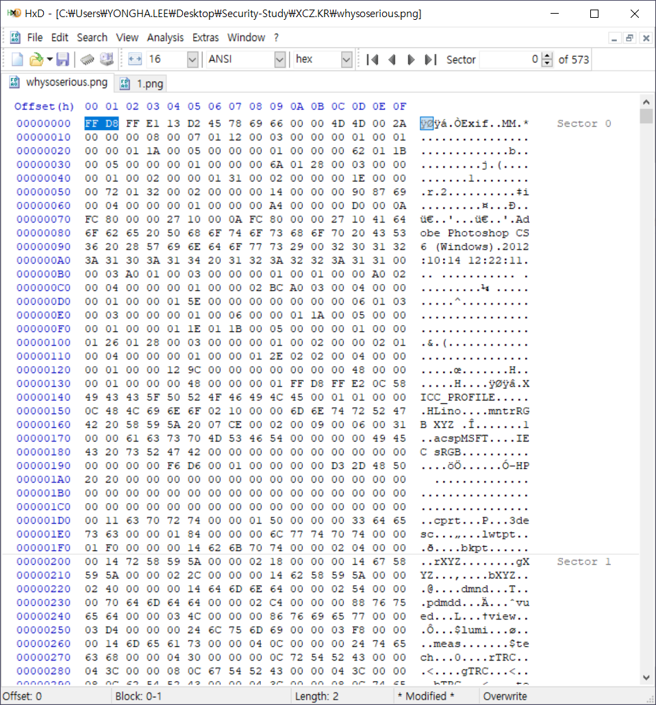

## PROB1 : End Of Image

 

1. 문제

   

 

2. 이미지 분석

   1) 시그니처 확인

   ​	

   → [89 50 4E 47 0D 0A 1A 0A] : PNG Header signature

    

   

   → [FF D9] : JPG Footer signature

   ⇒ PNG와 JPG 파일이 합쳐져 있음

 

3. File Carving

   1) PNG

   ​	

   → [49 45 4E 44 AE 42 60 82] : PNG Footer signature

   ⇒ Footer signature의 일부를 찾아 완성해 1.png 파일로 분리

    

   2) JPG

   ​	

   → 1.png를 분리하고 남은 부분

   → [FF D8] : JPG Header signature

   ⇒ 2.jpg로 저장

 

4. 파일 확인

   1) 1.png

   

    

   2) 2.jpg

   ​	

   ⇒ AuthKey : `JOg-dragonKER`