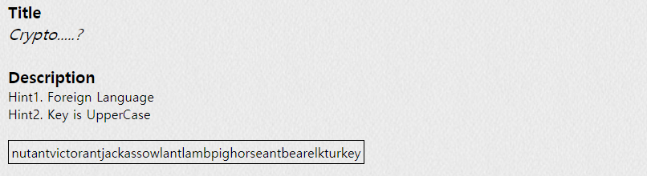
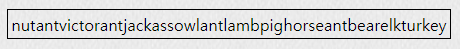

## PROB14 : Crypto.....?

 

1. 문제

   

 

2. 암호 분석

   

   ​			→ 중간중간 낯익은 단어가 보임 (ant, pig, horse, bear, turkey 등)

​					⇒ nut ant victor ant jackass owl ant lamb pig horse ant bear elk turkey

 

3. Navajo Code

   

   ​		→ 앞글자만 따면 됨

   ​		⇒ AuthKey : `NAVAJOALPHABET`