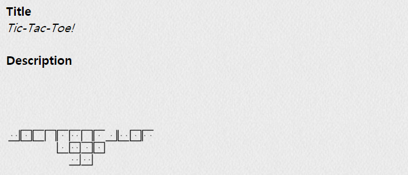
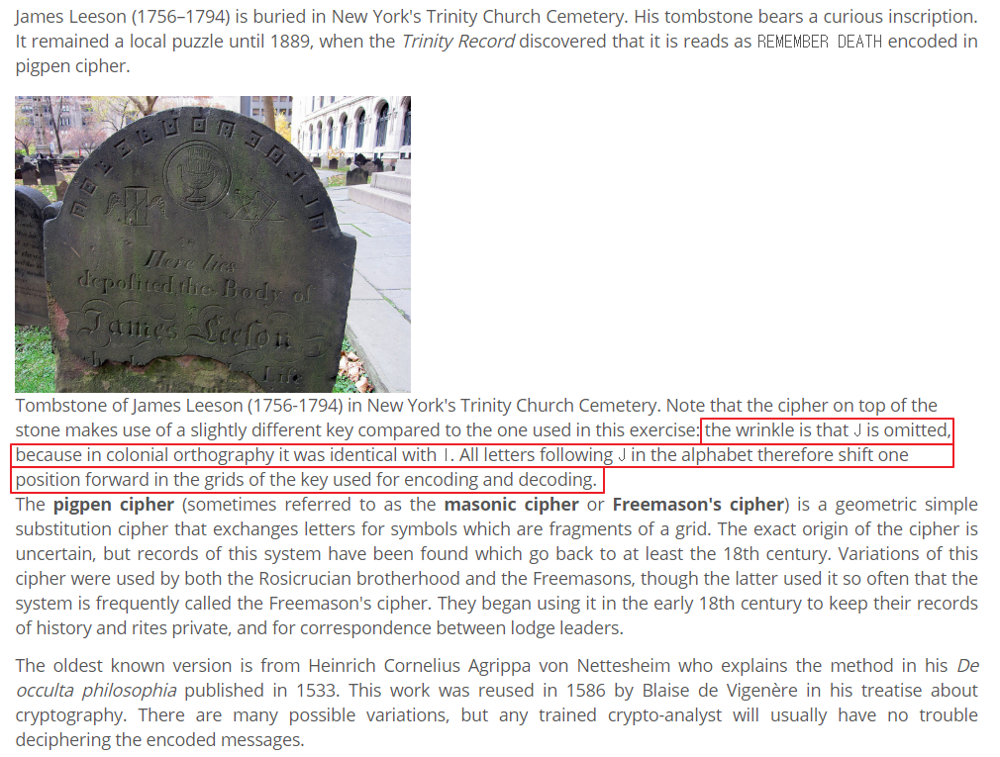
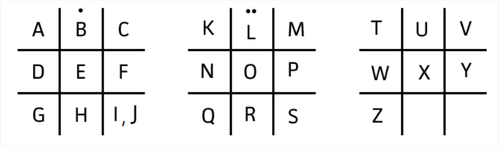

## PROB15 : Tic-Tac-Toe!

 

1. 문제

   

 

2. Pigpen Cipher

   - https://www.spoj.com/problems/PROG0505/

   
   
   → 그 시대에는 J와 I의 철자법이 동일해서 J가 생략되어 있음. 따라서 알파벳에서 J를 따르는 모든 문자는 인코딩 및 디코딩에 사용되는 키의 그리드에서 하나만큼 위치를 앞으로 이동시켜야 함
   
    
   
   

 

3. Decoding

   ​		→ KEY I(J)S I(J)AMESCODEKK

   ​		⇒ AuthKey : `JAMESCODEKK`