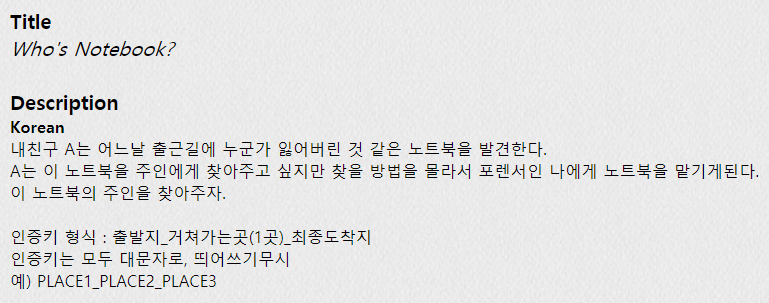
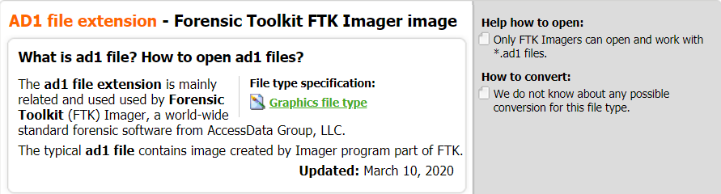
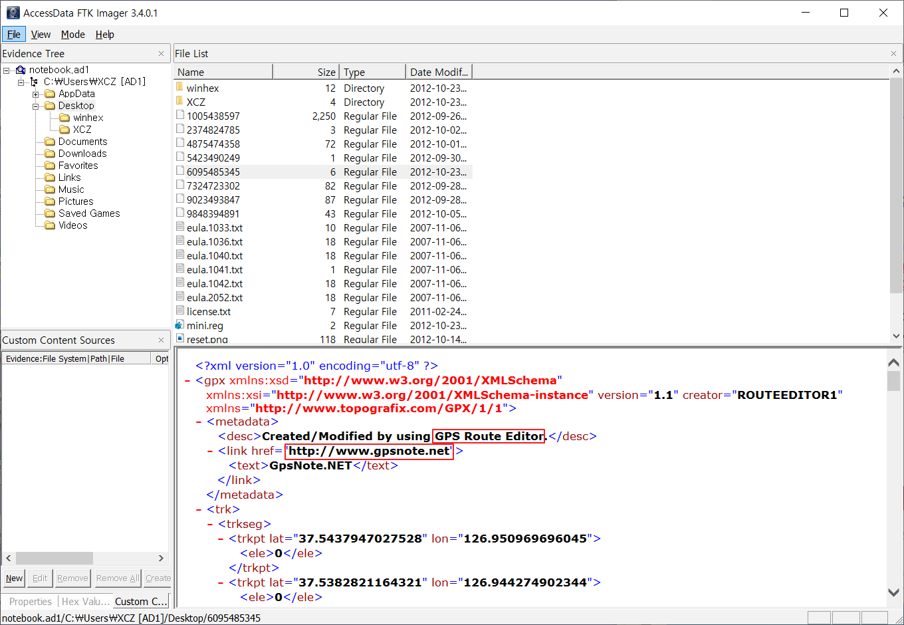
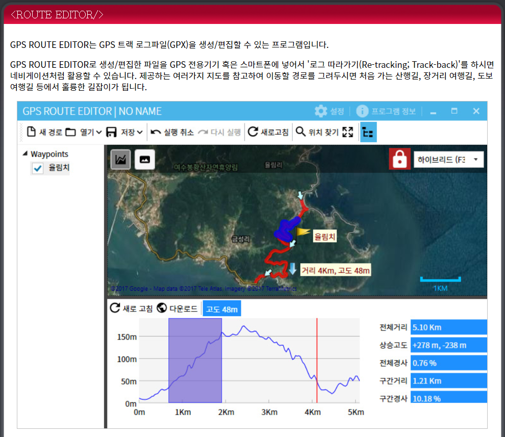
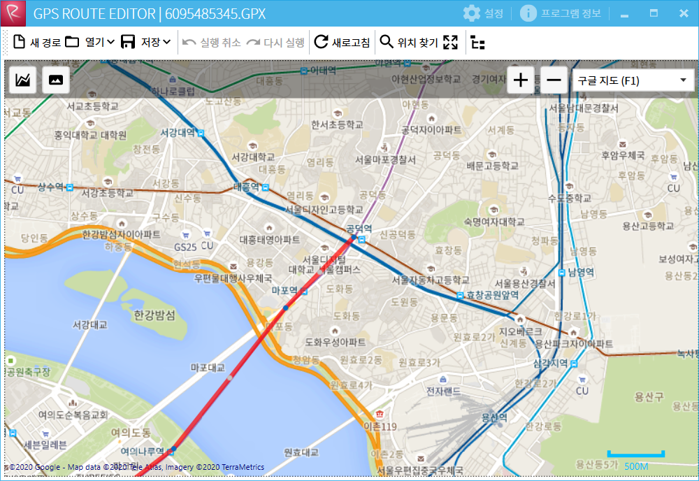

## PROB22 : Who's Notebook?

 

1. 문제

   

 

2. 파일 다운로드

   

 

3. 파일 분석

   1) 확장자 찾기

   	→ [41 44 53 45 47 4D 45 4E 54 45 44 46 49 4C 45] : AD1 확장자의 시그니처

   ​	 

   - AD1

     

     ​	→ FTK Imager로 디스크 덤프 작업을 할 때 생성되는 파일의 확장자

    

   

   ​	⇒  확장자 수정

    

   2) notebook.ad1 파일 분석

   

   ​	→ GPS 관련 파일 발견

    

   

   ​	→ www.gpsnote.net 접속

   ​	⇒ GPS ROUTE EDITOR 다운로드

    

   3) 파일 추출

   - FTK Imager의 Export Files 기능을 이용해 GPS 관련 파일 추출

     

     ​	→ GPS ROUTE EDITOR가 GPX 확장자 파일을 지원

    

   4) 추출한 파일 분석

   ​	

   ​	→ 빨간 선이 이동한 경로를 나타냄

   ​	⇒ 공덕역 → 김포국제공항 → 동부렌트카

   ​		(지도가 바뀐듯. 과거엔 PLACE3, 즉 도착지가 7-ELEVEN)

   ​		⇒ 공덕역 → 김포국제공항 → 7-ELEVEN

 

-------------------

 

#### 인증키 구하기

 

PLACE1_PLACE2_PLACE3

⇒ AuthKey : `GONGDEOK_GIMPOINTERNATIONALAIRPORT_7-ELEVEN`

​	
