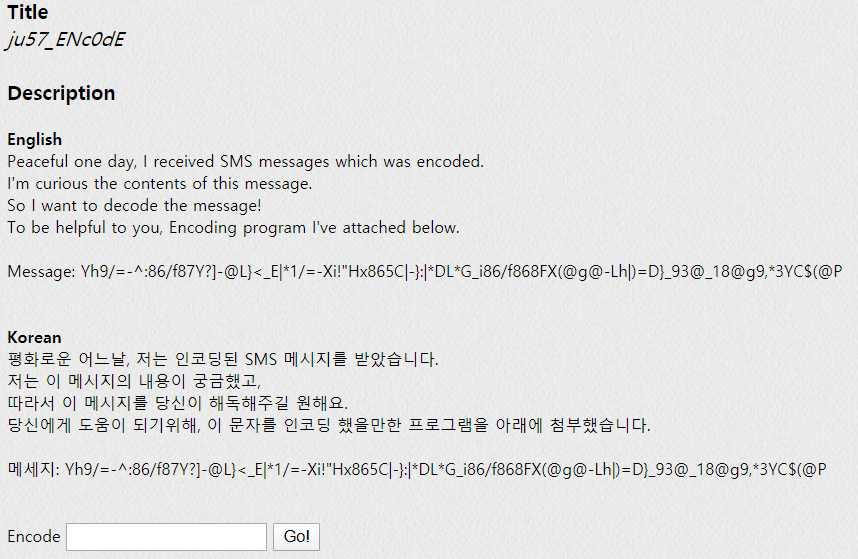
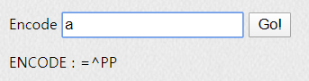

## PROB26 : ju57_ENc0dE

 

1. 문제

   

 

2. 프로그램 Test

   

   → 패딩이 `=`이 아닌 `P`로 나옴
   
   ⇒ Base64과 비슷한 구조의 알고리즘이지만, 테이블이 따로 구성되어 있을 것으로 추측

 

3. Decoding

   - Python으로 Brute Force 알고리즘 구현
   
     [Github Link]https://github.com/Lee-YongHa/Forensic-Tool/blob/master/BruteForce/BruteForce_PROB26.py
   
      → Yh9/=-^:86/f87Y?]-@L}<_E|*1/=-Xi!"Hx865C|-}:|*DL*G_i86/f868FX(@g@-Lh|)=D}_93@_18@g9,*3YC$(@P
   
      → Great! is this very easy..? anyway, Key is b45351x7yF0uRC1PH3RcH4n93
   
      ⇒ AuthKey`b45351x7yF0uRC1PH3RcH4n93`
