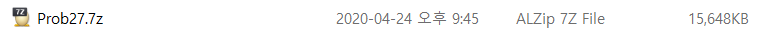
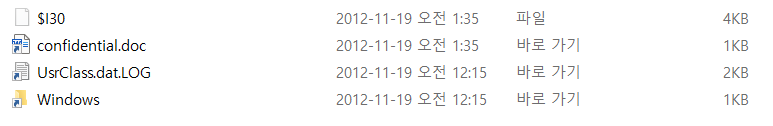
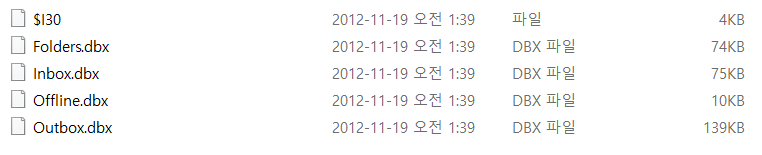
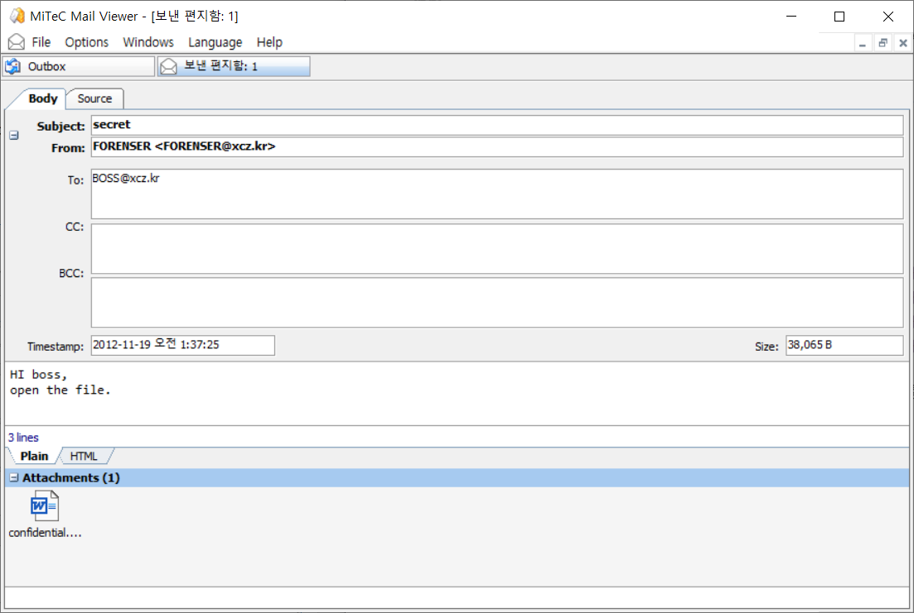
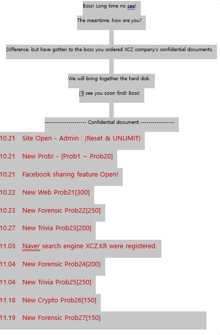
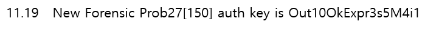

## PROB27 : XCZ Company Hacking Incident

 

1. 문제

   

 

2. 파일 다운로드

   
   
   ​	 
   
   1) Prob27.7z 파일 압축 해제

 

3. 파일 분석

   1) XCZ/Recent 폴더 분석

   

   ​	→ confidential.doc : 기밀 파일로 의심되는 파일 발견

    

   2) XCZ/Local Settings/Application Data/Identities/{711FB31B-9466-40FA-864A-847B752DD815}/Microsoft 폴더 분석
   
   
   
   ​	→ Outlook : Microsoft의 전자 메일 프로그램
   
   ​	⇒ 외부 유출 과정에서 사용됐을 것으로 의심
   
   ​	 
   
   
   
   ​	→ dbx : Outlook Express에 의해 생성 된 폴더에 주어진 확장자. 특정 사서함에 대한 전자 메일 메시지를 포함
   
    
   
   3) dbx 파일 분석
   
   - MiTeC Mail View 이용
   
     - Outlook Express Recovery Toolbox
   
     
   
     → Folders.dbx, Offline.dbx 파일은 열리지 않음. Inbox.dbx에는 메일이 존재하지 않음
   
     → Outbox.dbx에 BOSS에게 보낸 메일 존재. confidential.doc 파일이 첨부되어 있음
   
    
   
   4) confidential.doc 파일 분석
   
   
   
   → 마지막 줄에 보이지 않는(글씨 색이 투명인) 글이 존재
   
    
   
   
   
   → 글씨 색을 바꿔주면 키가 보임
   
   ⇒ AuthKey : `Out10OkExpr3s5M4i1`