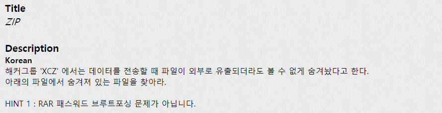
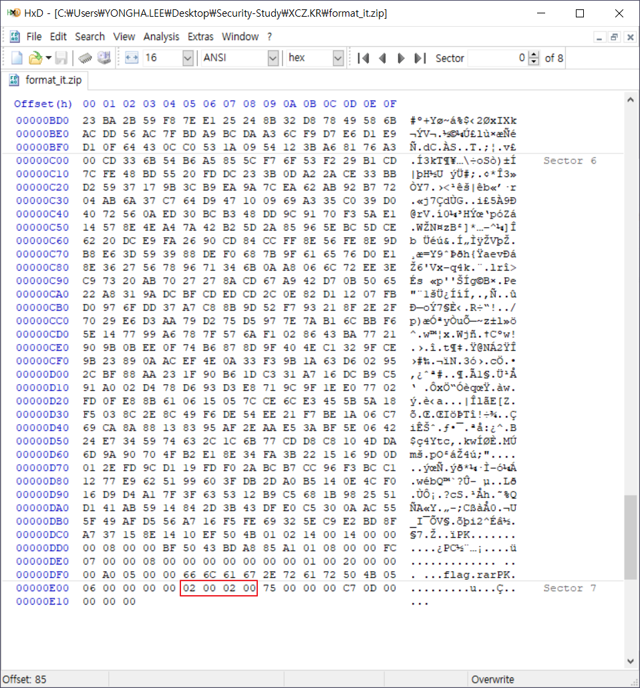
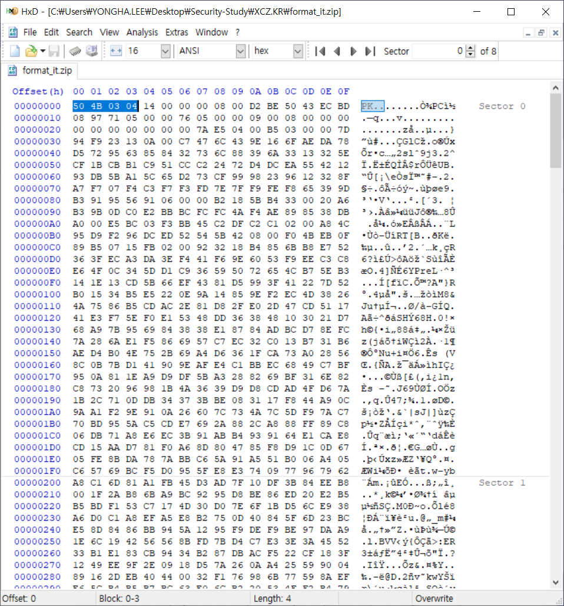
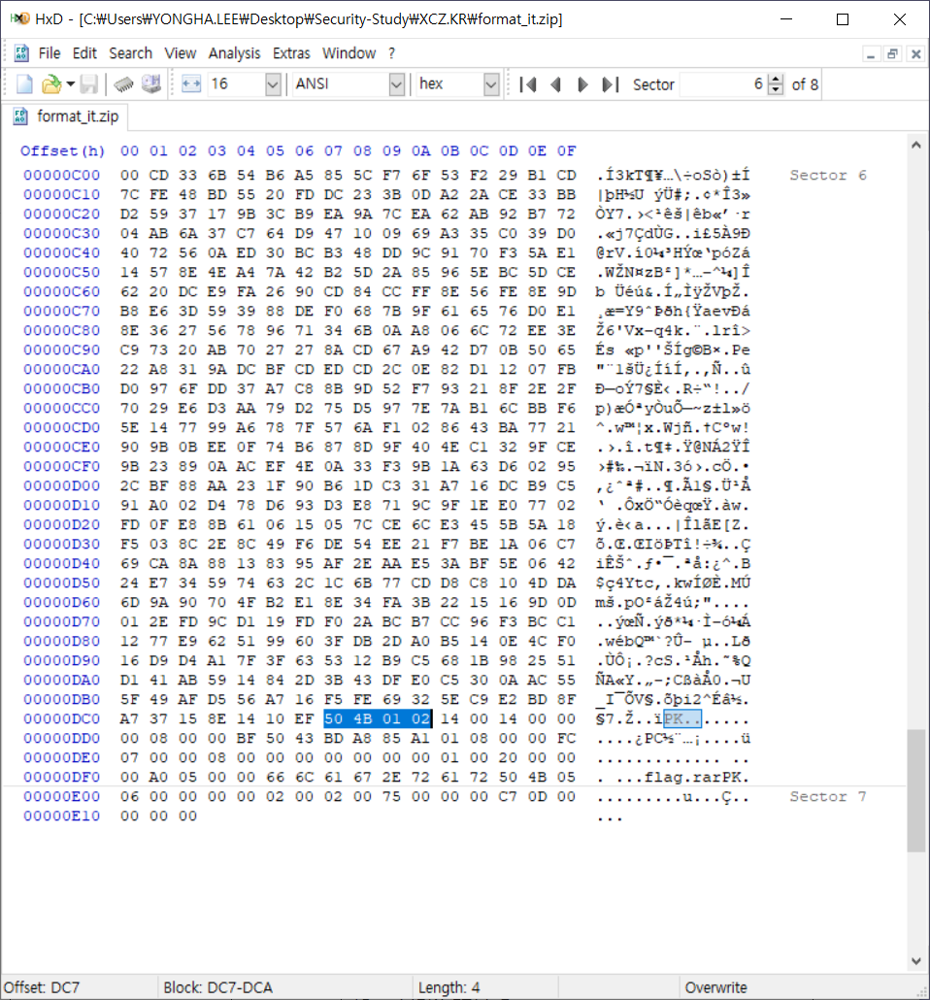
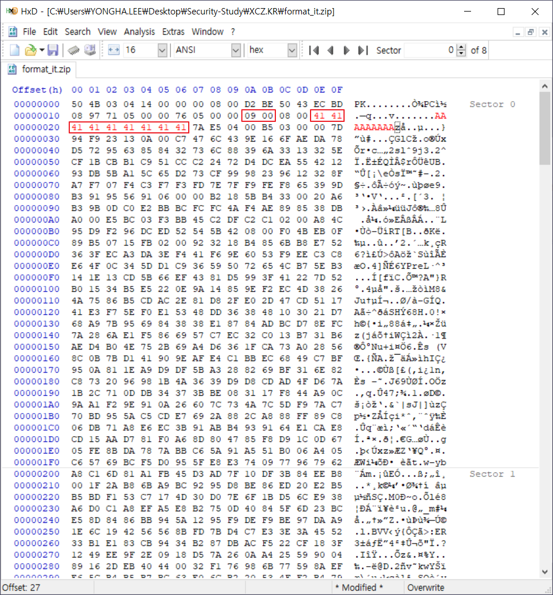
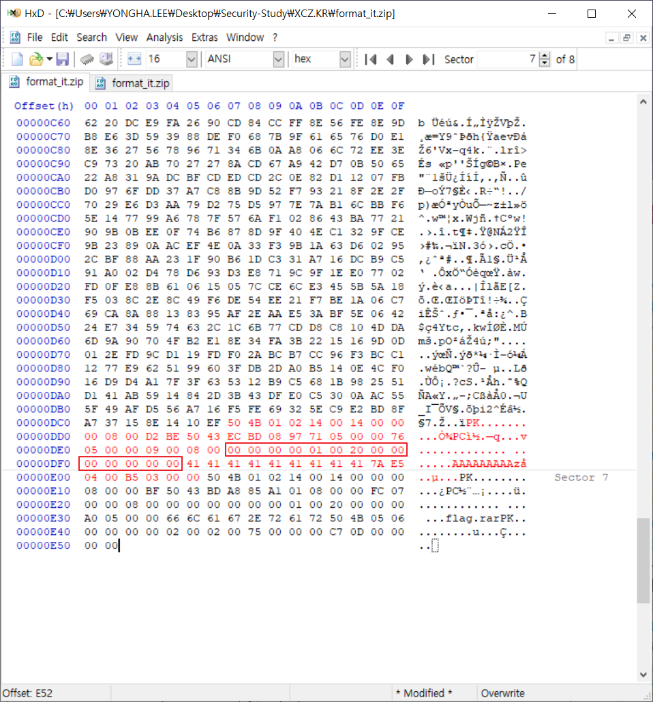
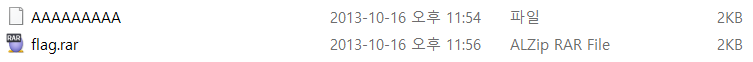
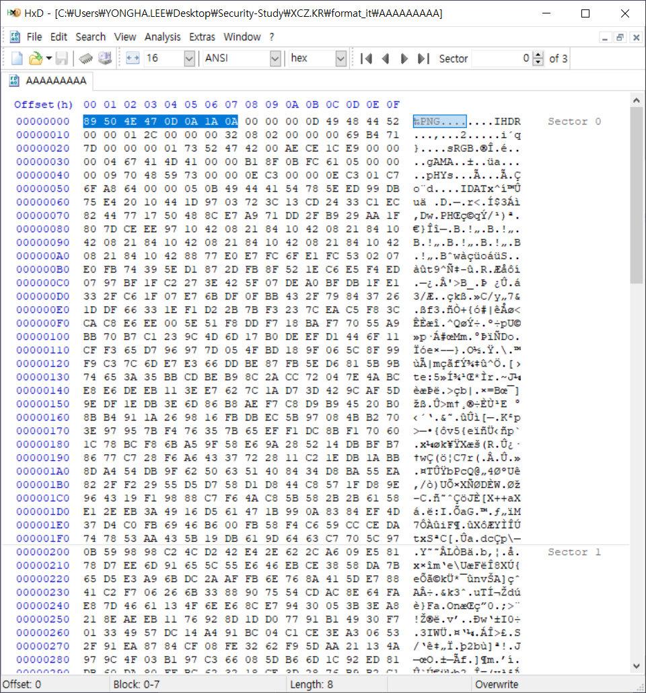
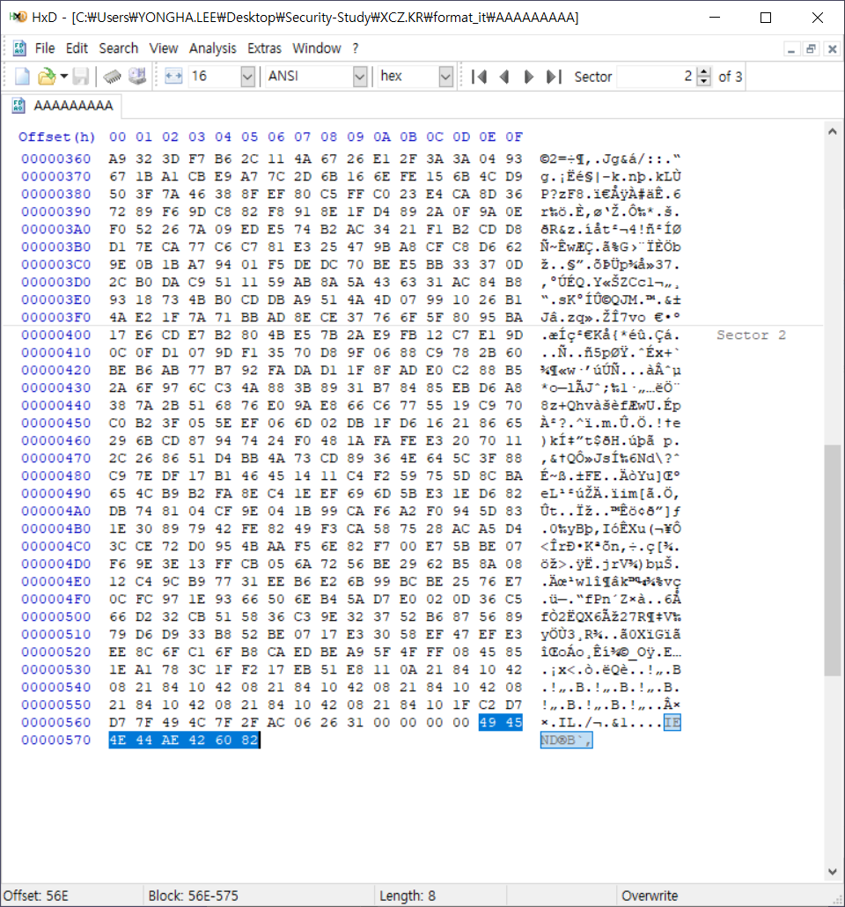
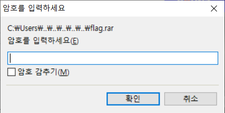

## PROB35 : ZIP

1. 문제

   

 

2. 파일 다운로드

   

 

3. 파일 분석

   1) End of Central Directory Record

   

   ​	→ 압축 파일 내 파일 개수 : 2

    

   2) Local File Header

   

   ​	→ [50 4B 03 04] : 시그니처 검색. Local File Header 2개 존재

   ​	⇒ 첫 번째 Local File Header 손상 : File name 없음

    

   3) Central Directory

   

   ​	→ [50 4B 01 02] : 시그니처 검색. Central Directory File Header 1개 존재

   ​	⇒ Central Directory File Header 손상

 

4. Local File Header 복구

   

   ​	→ File Name Length : 9

   ​	⇒ 9만큼 File Name을 만듦

 

5. Central Directory File Header 복구

   

   ​	→ [00 00 00 00 01 00 20 00 00 00 00 00 00 00] 

   ​				: File comment length + Disk * start + Internal attr + External attr + Relative offset of local header

 

6. 복구한 ZIP 파일 압축 해제

   

 

7. AAAAAAAAA 파일 분석

   1) 확장자 찾기

   

   ​	→ [89 50 4E 47 0D 0A 10 0A] : PNG 파일 Header signature

    

   

   ​	→ [49 45 4E 44 AE 42 60 82] : PNG 파일 Footer signature

    

   2) 파일 확인

   ​	

 

8. flag.rar 파일 분석

   1) 압축 해제

   ​	

   ​	→ AAAAAAAAA.png 에서 얻은 pw로 압축 해제

    

   2) flag.png 파일 확인

   ​	

   ​	⇒ AuthKey : `z1p_1t_f0rmat_1t`

