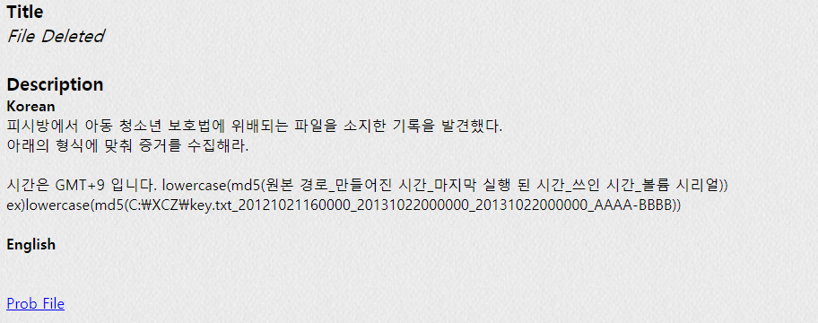
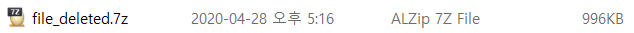
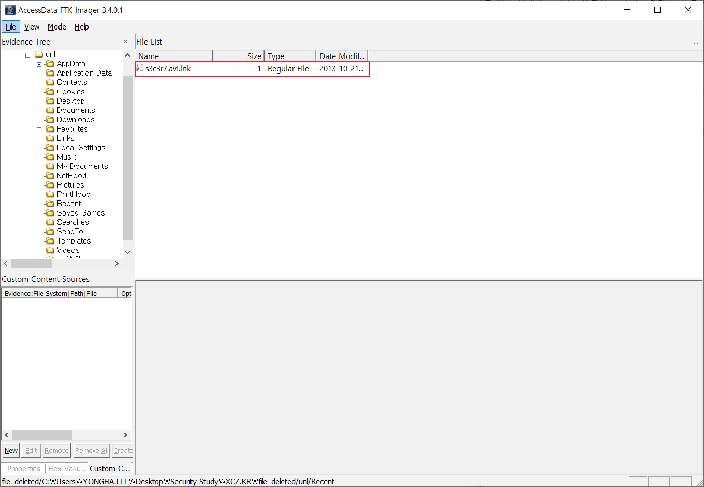
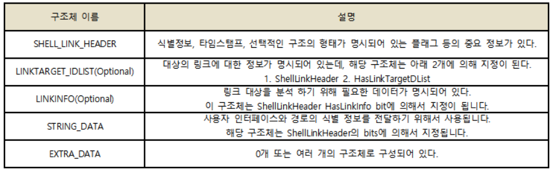
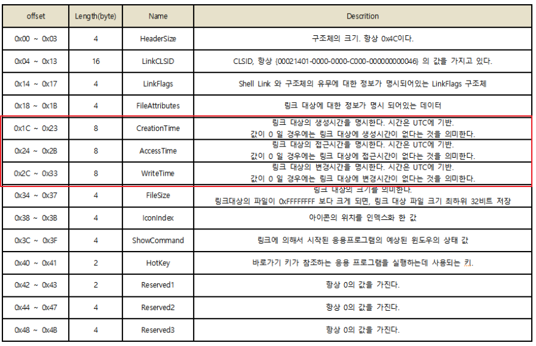
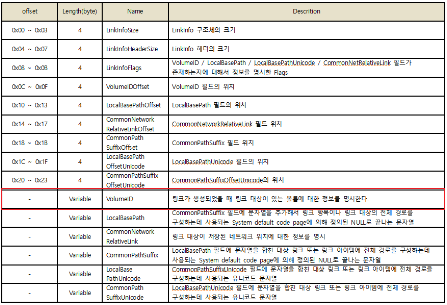
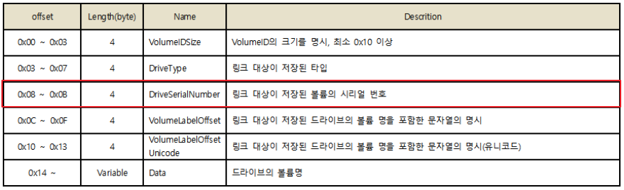
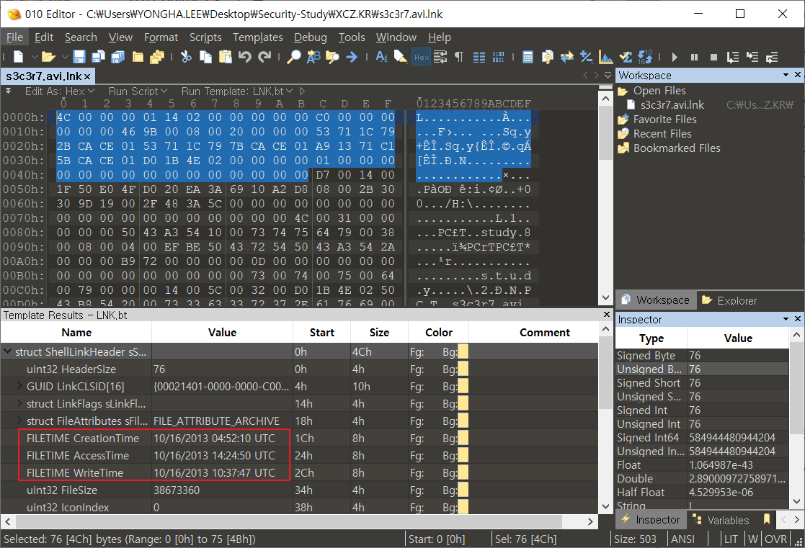
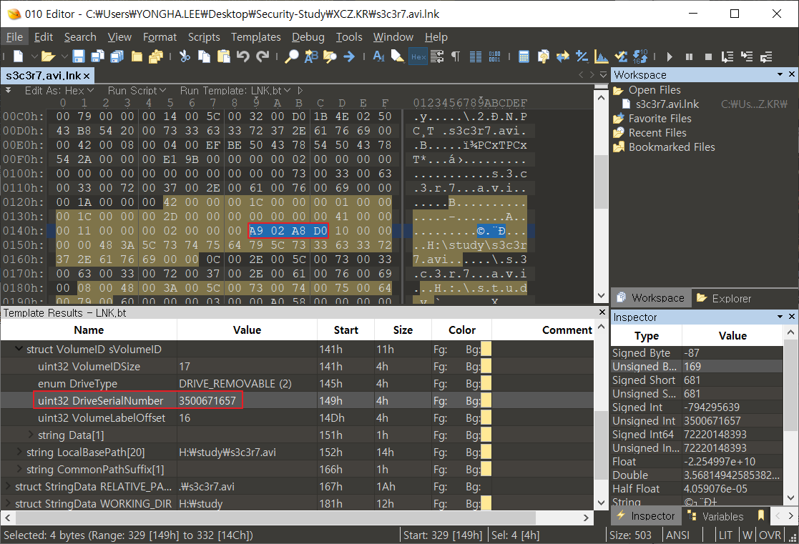
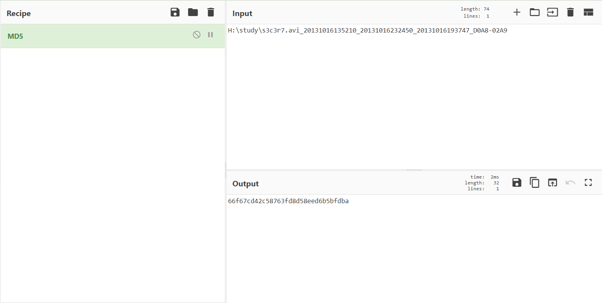

## PROB36 : File Deleted

 

1. 문제

   

 

2. 파일 다운로드

   
   
   ​	 
   
   1) file_deleted.7z 파일 압축 해제
   
   

 

3. 파일 분석

   1) Recent(최근 파일) 분석

   

   → s3c37t.avi.lnk : 수상한 동영상 파일 발견

   ⇒ 해당 파일 추출

    
   
   2) s3c3r7.avi 분석
   
   ​	
   
   ​		→ 파일 속성으로 원본 파일의 경로 획득
   
   ​		⇒ 원본 경로 : H:\study\s3c3r7.avi
   
    

4. LNK

   > 링크 파일. 윈도우 운영체제에서 바로가기를 생성하는데 사용되는 포맷

   1) LNK File Format

   

   ​	 

   2) SHELL_LINK_HEADER 구조

   ​	

4) LINKINFO 구조

 

- VolumeID 구조

  

 

5. s3c3r7.avi.lnk 파일 분석

   - 010 Editor 이용

   1) SHELL_LINK_HEADER 분석

   

   ⇒ 만들어진 시간 : 20131016135210 (GMT+9 적용)

   ⇒ 마지막 실행된 시간 : 20131016232450 (GMT+9 적용)

   ⇒ 쓰인 시간 : 20131016193747 (GMT+9 적용)

    

   2) LINKINFO - VolumeID 분석

   

   ⇒ 볼륨 시리얼 : D0A8-02A9

 

------

 

#### 인증키 구하기

 

lowercase(md5(원본 경로\_만들어진 시간\_마지막 실행된 시간\_쓰인 시간\_볼륨 시리얼))

→ H:\study\s3c3r7.avi_20131016135210_20131016232450_20131016193747_D0A8-02A9

→ md5(H:\study\s3c3r7.avi_20131016135210_20131016232450_20131016193747_D0A8-02A9)

→ lowercase(66f67cd42c58763fd8d58eed6b5bfdba)

⇒ AuthKey : `66f67cd42c58763fd8d58eed6b5bfdba`

